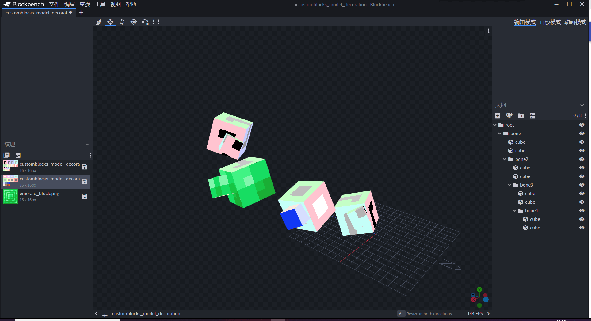

--- 
front: https://mc.163.com/dev/mcmanual/mc-dev/assets/img/15.3d934fc7.png 
hard: Getting Started 
time: 5 minutes 
--- 
# Community Development Tools 

After introducing the official development tools of the Chinese version, there are many community development tools in Minecraft. 

Here we will introduce some common community development tools. 

## SnowStorm 

SnowStorm is a Microsoft version of the particle effects editor. 

Currently there are [web version](https://snowstorm.app/) and VSCode plug-in version available. 

 

## Chunker 

Chunker is a tool for converting Bedrock Edition and Java Edition archives. 

Address: [click me](https://chunker.app/) 

## BlockBench 

BlockBench can easily make Bedrock Edition models.

Official website: [click here](https://www.blockbench.net/) 

 

