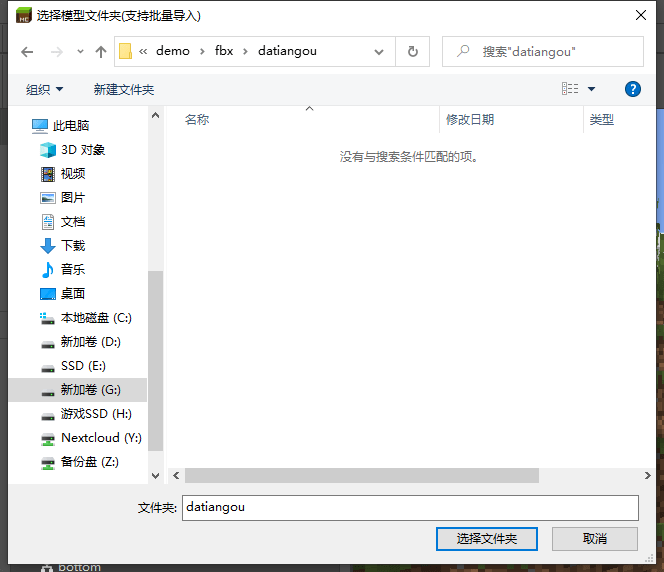
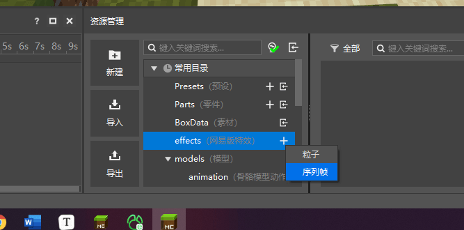

--- 
front: 
hard: Getting Started 
time: 15 minutes 
--- 
# Homework 

## Quiz 

1. Which of the following editors is not an editor in the Minecraft Development Workbench: 

A. Blueprint Editor 

B. Preset Editor 

C. Map Editor 

D. Level Editor 

2. The function of the community tool Chunker is: 

A. Make Java Edition maps 

B. Make Bedrock Edition maps 

C. Convert between Bedrock Edition and Java Edition archives 

D. Editor for drawing terrain 

3. The map editor can copy buildings from one archive to another 

A. True 

B. False 

4. What kind of special effects can't be made by the special effects editor 

A. Netease version particles 

B. Netease version sequence frames 

C. Microsoft version particles 

5. Netease version special effects can only be attached to the skeleton model 

A. True 

B. False 

## Practice 

In practice, you need to import the skeleton model yourself, make a sequence frame special effect, and attach it to the specified model. 

### Operation steps 

First download the material package [link](https://x19.gdl.netease.com/demo.zip). And unzip it to a folder. 

Then create a blank additional package, switch to the special effect editor, and click the import model button. 

 

Select the folder `./demo/fbx/datiangou` 

 

Just confirm the pop-up interface. 

Then switch the model to datiangou, and you can see the imported model. 

 

Now start making the sequence frame effect. 

In the resource management, find `effects (NetEase version special effects)`, click the plus sign to create a new one, and fill in the name `snow` 

 

Then copy the contents of the sfx in the demo folder to the `resource_pack/textures/sfxs` folder of the current component 

 

In the property window on the right, replace the texture with the image just copied 

 

Then the special effect is configured. Now you just need to bind the special effect to the model, and you're done! 

First find `effects (NetEase version special effects)` in the resource management, there should be a `snow.json`. 

Drag this `snow.json` to the `head` of the left bone attachment point 

 

After dragging, the NetEase version of the special effects is attached to the bone model. 

