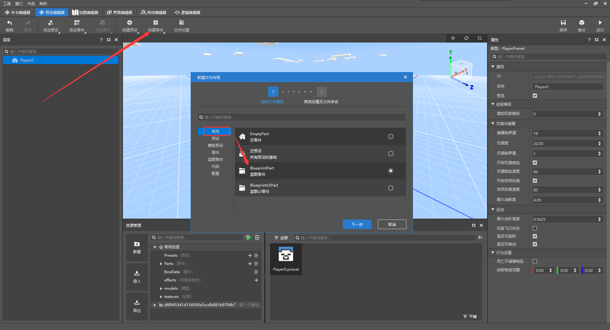
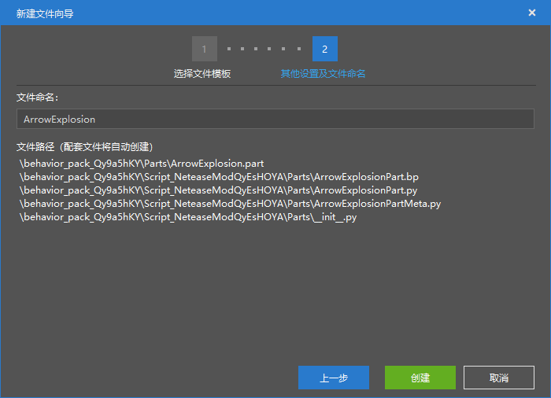

--- 
front: https://mc.163.com/dev/mcmanual/mc-dev/assets/img/06.90697108.png 
hard: Advanced 
time: 10 minutes 
--- 
# Create and edit presets 

<iframe src="https://cc.163.com/act/m/daily/iframeplayer/?id=62ce56336b13db499d06212f" width="800" height="600" allow="fullscreen"/> 

In this chapter, we will use the level editor, preset editor, and logic editor to guide everyone to independently create a small mod-explosive arrows. 

First, we create a blank add-on package and switch to the level editor. 

 

Then in the resource management interface, find the directory `Presets`, click the plus sign on the right, and create a new player preset.

A player preset is an automatically loaded preset. There can only be one player preset in each world. 

After clicking, a window for setting the preset name will pop up. Just click OK here. 

After creation, it will automatically jump to the preset editor. 

In the preset editor, click Create Part, then select Common, Blueprint Part. 

 

Click Next, and you can give this blueprint a name in the Name window. For example, our blueprint implements the function of the explosion arrow, so name it `ArrowExplosion`, and then click Create. 

 

After creation, you can go to the Common Directory of Resource Management, click `Parts`, and you can see the part directory we just created. Click to see the corresponding file. 

 

The first one in the picture is a part file, which can be dragged to the preset for binding. The second one is a blueprint file, which can be edited in the logic editor. 

 

Drag it to the preset of `Player0` to complete the binding of the parts and the preset. 

Then we switch back to the level editor, and you can see that there is already a player preset of Player0 on the stage, and the blueprint part we just bound is already displayed in the parts. 

Click on the blueprint part, and you can see the type of `ArrowExplosionPart` in the property window on the right, and you can confirm that this is the blueprint part we just created. 

 

So far, the settings of the level editor and preset editor are all completed, and the study of the logic editor will begin below.