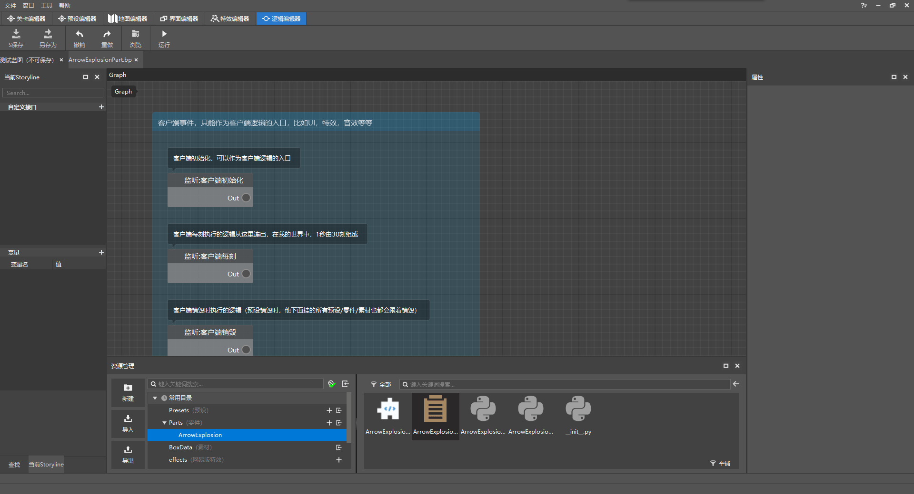
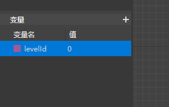
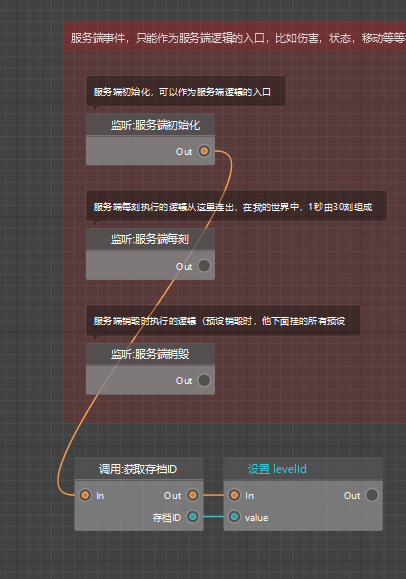
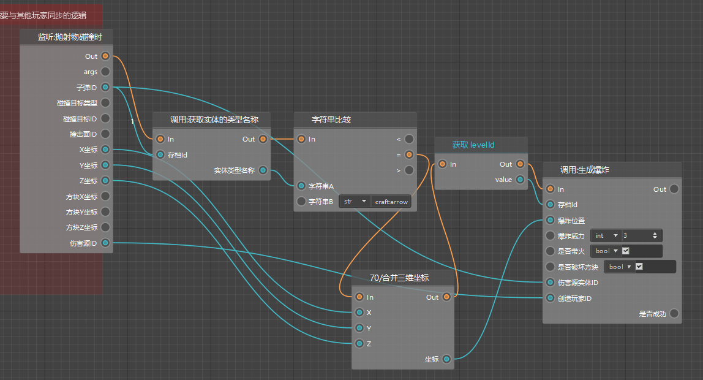

--- 
front: https://mc.163.com/dev/mcmanual/mc-dev/assets/img/07.f83b4752.png 
hard: Advanced 
time: 25 minutes 
selection: true 
--- 
# Basics of Logic Editor 

In this section, we will introduce the basic operation logic of the logic editor. 

## Basic Operations 

Continue with the content of the previous section. In the resource management window, find the blueprint file of the part `ArrowExplosion` and double-click to open it. 

You can open the logic editor and open the blueprint file. 

 

Drag the left mouse button in the Graph window to select the logic object. 

Right-click on the logic object to open the operation menu, and right-click in the blank space to open the menu for creating nodes. Press and hold the right button and drag to move the view of the logic editor. 

Scroll the mouse wheel to zoom the Graph window. 

## Concept explanation 

In the newly created blueprint file, you can find that the existing logic is mainly divided into two parts, namely server events and client events. 

 

 

At the same time, there are 3 nodes corresponding to both server and client events 

- Initialization 
- Every tick 
- Destruction 

Initialization and destruction are easy to understand. They will be executed when the server or client is started/shutdown respectively. 

Every tick refers to the logic executed by the server or client at every tick. In my world, there are 30 ticks in 1 second. It can be simply understood that the logic after this node at every tick will be executed 30 times per second in the game. 

> Why is the code divided into server and client? 
> 
> Because in a single-player game in my world, the server and client are started at the same time. 
> 
> The server is responsible for the logical operations of the game, such as redstone, damage, etc. 
>

> The client is only responsible for the operation of the visual part of the game, such as rendering, special effects, interface, etc. 
> 
> Therefore, when writing logic, you must pay attention to the scope of use of the node. You cannot call the client code on the server, nor can you call the server code on the client. 

The 6 nodes just mentioned are usually used as the head of all nodes, that is, the entry of the program. 

And in the above figure, there is an Out port after each node, which is called the output port. Connecting the output port and the input port represents the connection order between the nodes, thus forming a logical relationship. 

## Logic Writing 

### Idea Analysis 

In addition, listening events can also be used as the entry of the program, such as the explosion arrow we are about to make. 

The implementation of the explosive arrow is as follows: 

1. Listen to the projectile collision event 
2. Determine whether the projectile is an arrow 
3. Get coordinates and dimension related parameters 
4. Delete the arrow entity 
5. Generate an explosion at the corresponding coordinates and dimensions 

The entrance to our module is **Listen to the projectile collision event**, that is, only when this event is listened to, our logic will continue to run. 

After analyzing the operation logic, we have to create the logic editor step by step. 

### Getting started 

First, right-click in the blank space, enter projectile in the search box, find `Listen to server events: ProjectileDoHitEffectEvent (when projectile collides)`, and click to create a node. 

> Why do you know to search for projectiles right away? 
> 
> Before developing, we can first determine whether the events or interfaces we need to monitor can be found in the API documentation, 
> 
> Then determine the description of the event or interface, and enter keywords in the logic editor for search to facilitate creation. 
> 
> API document link: [click me](https://mc.163.com/dev/apidocs.html) 

 

After creation, you can see that there are many parameter output ports behind this node, and each port corresponds to the specific value when this event is triggered. 

We can bring these values into the next node, complete certain calculations, and finally realize the logical function of the module. 

 

After monitoring is completed, we need to determine whether the entity corresponding to the bullet ID is a bow and arrow. Similarly, right-click the new node, search and select `GetEngineTypeStr (get the type name of the entity)` 

 

After the creation is completed, you can see that there is an input port of `Entity Id` on the left side of this node, and an output port of entity name on the right side. 

 

Through the operation of this node, the bullet ID can be used to obtain the corresponding entity type name to determine whether it is an arrow. 

We need to connect the archive ID and the bullet ID, and connect the Out of the previous node with the In of this node. 

> The line between Out and In is orange, called the execution line. 
> 
> Only when the two nodes are connected using the execution line will the next node connected to it be triggered after the previous node is executed. 
> 
> The line between the bullet ID and the archive ID is blue, called the data line. 
> 
> It represents the transmission of data, not the execution order. 

 

After getting the entity type name, we need to determine whether this name is an arrow, that is, `minecraft:arrow`. 

Continue to add nodes and perform string comparison. 

 

After creation, fill in the corresponding parameters and connect the nodes. The effect is as shown in the figure. 

 

Then we create a node to generate an explosion and fill in the parameters for it. The explosion power is set to 3, and the fire is checked to destroy the blocks. 

 

Except for the archive ID parameter, most parameters are very easy to understand. So what is the archive ID? 

The archive ID is used to distinguish archives. Generally, it needs to be obtained when the server or client is initialized. 

We can use the interface `Get Archive ID` after initialization to obtain the archive ID. 

 

At the same time, we need to create a levelId variable and call it when needed. Click the + sign in the variable window on the left and enter the variable name levelId. 

 

Assign `levelId` after obtaining the archive ID 

 

Then create the remaining nodes and connect them according to the connection method shown in the figure. 

 

Finally, you need to destroy the arrow entity. Note that you must select the **server interface** instead of the client interface. 

> If you do not destroy the arrow entity, after the explosion occurs, the arrow entity will fall down and continue to trigger events, thus continuing to explode. 
> 
> If you are interested, you can try not to add a node to destroy the entity and see the effect. 

The connection effect is shown in the figure 

 

### Test 

After completing the editing of the blueprint file, we click the run button to enter the game test. 

 

You can see that the arrow is shot out and explodes after it falls to the ground. 

Then our explosive arrow is made. 

