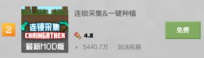

--- 
front: 
hard: Getting Started 
time: 15 minutes 
--- 
# Selling Points Pictures and Selling Points Videos 
After the module is completed, if you want it to be better known by the public, you must package the module. 

If an excellent module is not well packaged for promotion, its awareness may not be better than a module with better packaging but not as high quality. 

Therefore, the packaging of the work is particularly important. 

<iframe src="https://cc.163.com/act/m/daily/iframeplayer/?id=62ce5956a240f794f8c2c857" width="800" height="600" allow="fullscreen"/> 

## Materials 

When publishing a module on the developer platform, developers will be required to provide the following promotional materials: 

- Resource name 
- Detailed introduction 
- Banner image*1 
- Icon*1 
- POS machine image*1 
- Carousel image*3 
- (Optional) Video cover 
- (Optional) Video 

### Resource name & icon 

The resource name is easy to understand. All the resources we see in the game client and resource center have their resource names below the icons. 

Compared with a line of black text, the icon will attract more attention from players. The content on the icon should not only reflect the general content of the gameplay, but also have a striking font color combination, so that players can find your component at first glance among many components. Not only that, you can also design an icon style that is unique to you and create a brand image, so that players can easily recognize that this is your work and associate it with your other excellent works. 

Here we randomly selected the works of two developers. It is not difficult to find that all their works have the same icon style, which allows people to see at a glance that they are all made by the same author. 

 

 

### Detailed introduction 

After attracting players to click into the details page from the component center, we can use the pictures and texts on the details page to let players have a deeper understanding of this module, so as to decide whether to buy or download it. 

You can upload 10 pictures in the detailed introduction. Developers need to reasonably design promotional posters, or use a combination of pictures and texts to introduce the content and precautions of this module. 

### Banner picture 

The banner image is a homepage carousel image, which will be displayed on the homepage recommendation of the resource center after the application for the recommendation position is approved. 

Because the stay time on each page of the carousel image is limited, the number of words needs to be as small as possible so that players can see the content of the gameplay in a short time. At the same time, it must be eye-catching enough. 

### Carousel image 

The carousel image refers to the image that will scroll after clicking on the game details page. 

The image here can roughly introduce the features of the module, so that players can get a rough idea of the module's special gameplay without reading the detailed information below. 

Give players a deeper impression in a short time. 

### Pos machine image 

Pos machine image appears in the pop-up window after clicking the purchase button. 

Generally, you can write "Thank you for your purchase" or "Thank you for your experience" here. 

### Video cover & video 

The video will also be displayed on the work details page. 

It is the first position in the carousel. The video cover will be displayed before the video is played, and the video will be played after clicking the play button. The size is limited to 200M. 

The video can demonstrate the gameplay and features of the module. Let players experience the usage of the module more effectively before purchasing. 

Because it is impossible for all players to watch the video in full, the most attractive part of the module can be put in the front for display through editing. 

**If it is a paid module, you must upload a video** 

## Analysis of excellent works 

Here we will select a module with the highest ranking on the free ranking list and analyze its packaging. 

See why this module can hit the top of the ranking list under such packaging. 

 

This is the module ranked first in the free ranking list. 

First look at its title, which introduces the main functions of this module very simply and clearly. It is also a tool-type module, which is a rigid demand. 

In the icon, the word indicating the gameplay is in the center of the picture, and the font is relatively large, which allows people to clearly see the main functions of the module.

Looking at its component details page, you can see that the carousel clearly displays the functions of the component and appropriately explains its linkage with other modules. 

 

At the same time, the introduction to its functions in its detailed information is also very beautiful, with both pictures and texts. 

The text is appropriately highlighted so that players can quickly extract important information from a large amount of text. 

 

From this, it can be seen that if an excellent work wants to be known by everyone, the gameplay content is very important, but without a good packaging, it may not be discovered by the public. 

