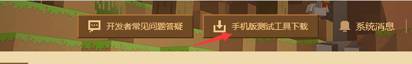
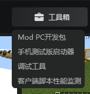

--- 
front: https://mc.163.com/dev/mcmanual/mc-dev/assets/img/03.599c9375.png 
hard: Getting Started 
time: 10 minutes 
--- 
# Submission and use of Kaiping 

In this section, we will introduce how to use the developer platform to submit works, as well as the use of some tools in the developer platform. 

Developer platform address: [click me](https://mcdev.webapp.163.com/#/login) 

## Submission 

Log in to the developer platform homepage and click on the right side to publish new resources to start publishing works. 

 

Select the mobile version of the work in the pop-up window, and then you can enter the work information filling interface. 

Here we fill in the name of the work, pricing and other information in turn. The items with * are required. Select `add on` for the payment type. 

 

After filling in, you need to upload the module resources. Select `add on` for the resource category, and you can select the subcategory according to the content of your module. 

 

Next, you need to find the resource file of our module and compress it and upload it. 

Enter the developer workbench, find the module we need to publish, right-click, click `Export`, and select the save path. 

Then click `+` in the developer platform to upload resources and select the zip just exported. 

After uploading, fill in the introduction in the details and upload the pictures mentioned in the previous section. 

After uploading, click Save, you can see our module in the work management, click Submit for review, and you can wait for the review to pass before putting the module on the shelves! 

 

## Self-test 

Sometimes the inconsistency between the computer environment and the mobile phone environment will cause the module to fail to run on the mobile phone. At this time, we need to conduct a self-test on the mobile phone. 

Click the **Self-test** button on the uploaded module, wait for the machine to review it, and then you can test it on the mobile phone test terminal. 

 

Then scan the code on your phone to download the mobile phone test client. 

Use the developer account to log in to the game, you can find your own module in the resource center, and you can experience it on your phone after downloading.

If there is a problem during the experience, you can connect your phone to the same LAN as your computer and find the LAN IP on your phone. 

 

For example, my IP here is `192.168.10.104`, then find the debugging tool in the developer workbench->work library->toolbox. 

 

Then open the Minecraft beta client on your phone. 

After opening the debugging tool, click `Client IP connection` and enter the IP just found 

 

If it is the first time to connect to the mobile client, you must ensure that the Minecraft beta is open. If it is not open, enter the IP again to connect again. 

 

After the connection is successful, you can see the test log. After entering the game, the debugging information and error information in the module will be reflected in the log. 

## Feedback 

After the module is launched, players can use the feedback function in the game to provide feedback. You can view the player's feedback in the developer platform, work management-> player feedback management. 

 

## Revenue View 

After the work is launched, you can view the revenue situation in the developer platform, revenue management. 

At the same time, the monthly revenue settlement information will also be displayed here. Developers need to submit relevant information and apply for settlement after opening the settlement every month. 

 

## Data Analysis 

Here you can use the developer platform to visualize the sales of your work in the form of a line chart. 

You can see the data of new purchases, revenue, points, and daily activity. 

 

## Collaborative member management 

When the module is not developed by one person, you need to use the writing member management to add a developer sub-account. 

In this way, each development member can log in to their own developer sub-account to use the developer workbench. You can also use the sub-account to log in to the Minecraft beta client to test resources. 

You can also use the developer workbench for multi-person testing, which is a necessary function for team development.

