# Start configuring gameplay functions

In this section, we will guide you to create a simple entity and understand the basic configuration functions of items and blocks.

<iframe src="https://cc.163.com/act/m/daily/iframeplayer/?id=632862a66b13db499d094757" width="800" height="600" allow="fullscreen"/>

## Entity

After learning the basic gameplay tutorial, I believe everyone must have a basic understanding of entities. Then for an entity, its AI and behavior are crucial. Next, we will guide you to create and configure a simple entity.

First, after opening the Minecraft development workbench, create a blank add-on package, and then enter the editor.

In the level editor, click the New button, find the entity in the Configuration category, and click Next.

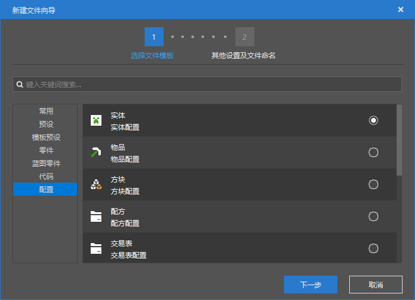

In the data template, we select a zombie template and name it `custom_zombie` as an example.

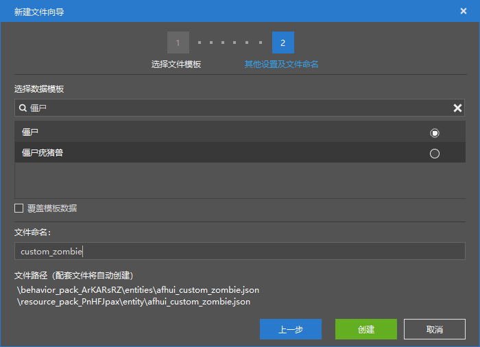

Then in the property panel on the right, you can see the various properties of this new custom zombie.

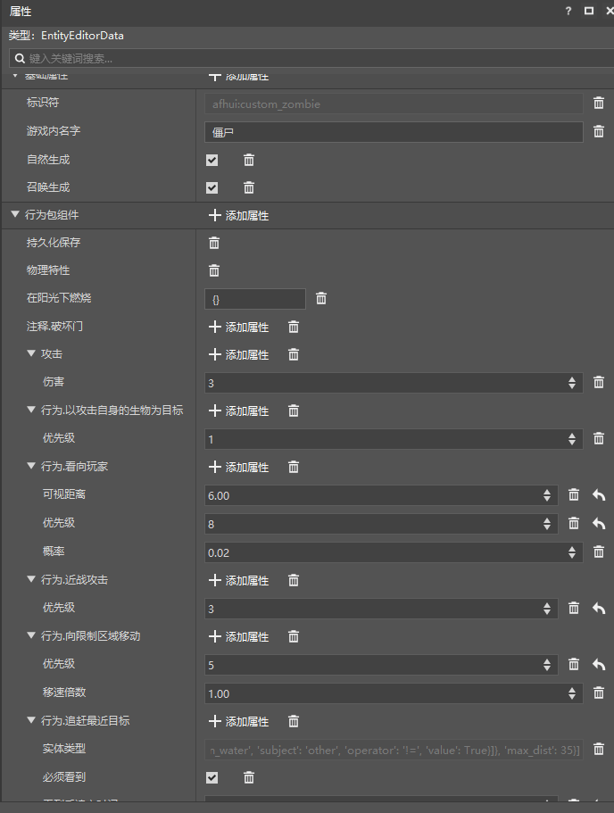

Let's take a look at all the properties of this custom zombie. You can see that there are three major categories of properties for an entity to configure in the editor. They are

- Basic properties
- Behavior package components
- Resource package components

### Basic properties

In the basic properties, you can see the identifier of our custom entity. This cannot be modified in the editor, but we can use the summon command in the game with the identifier to summon the entity of the custom zombie we configured.

At the same time, you can also configure the in-game name here, that is, the name it displays in the game. For example, in the figure below, we change it to `Custom Zombie`, so if we are killed by this zombie in the game, the death message will show Custom Zombie.

The checkboxes behind Natural Generation and Summon Generation represent whether this entity is allowed to be generated in this way. Move the mouse over the name of the attribute, and if there is a comment, the comment of this attribute will be displayed, as shown in the figure below.

> Can be generated using /summon

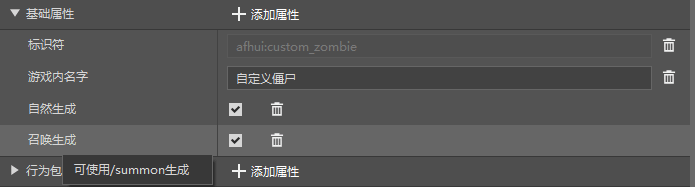

### Behavior Pack Components

Here we need to introduce a concept. All add-on packs for the Bedrock Edition of Minecraft are divided into two packages: behavior packs and resource packs. As the name implies, behavior packs are packages that define behaviors, while resource packs are mainly artistic resources such as pictures, audio, and models.

Therefore, our behavior pack component is mainly responsible for configuring some definitions of the behavior logic of this entity, such as whether this zombie will catch fire, how much health it has, how much attack power it has, how it attacks, and so on.

Click the `Add Attribute` button on the right side of the behavior pack component to select and add some available behavior attributes that are not in the current entity.

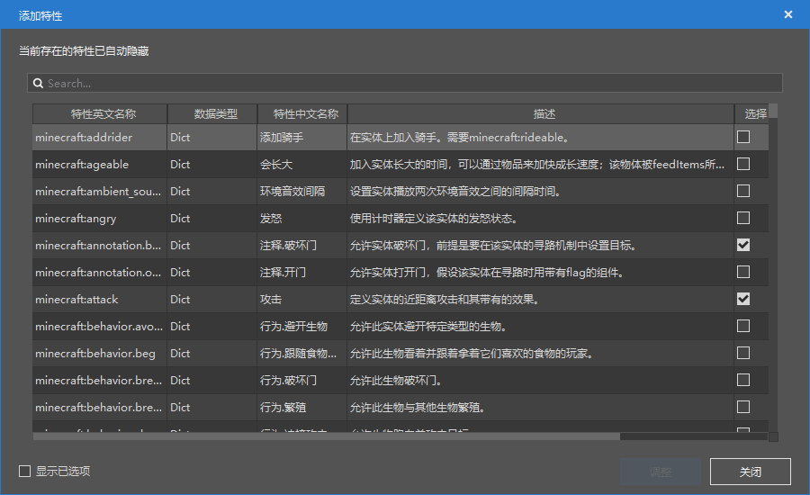

In the pop-up window of adding attributes, you can clearly see the English name, data type, Chinese name, and description of the feature. We can find the attributes we want to add or delete here, and click the adjustment button in the lower right corner to adjust the entity behavior.

> Careful students may have discovered the data type column
>
> So most of the data types here are Dict, what does it mean?
>
> Dict is a dictionary, which can be understood as a mapping, indicating that this configuration item has many sub-parameters that can be set.
>
> There are many data types. Here are some basic data types and their popular explanations for reference
>
> | Data Type | Definition |
> | :------: | :-----------------: |
> | Bool | Boolean value (true/false, yes/no) |
> | Int | Integer (1,2,100) |
> | Float | Real number (3.1415,0.0001) |
> | Str | Text (Hello, my world) |

At the same time, we can also search for keywords in the `Search...` window, such as searching for `burning in the sun`.

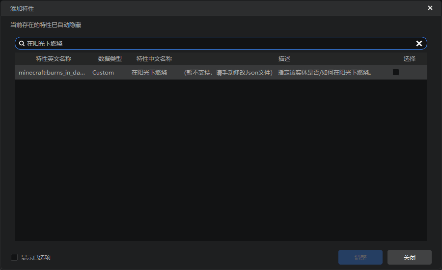

Next, we can try to modify the behavior so that this zombie does not burn in the sun.

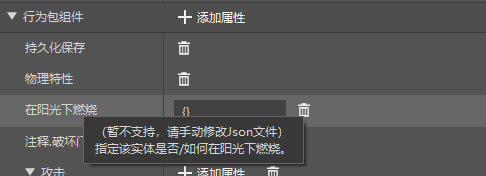

Find the attribute of burning in the sun, hover the mouse over this word, and you can see the specific meaning of this attribute. Although it does not support editing, we can delete it. Click the trash can icon on the right to delete this attribute. After deleting it, we enter the game to check the effect.

After entering the game, we have two ways to generate this custom monster, one is to use the summon command, and the other is to use the spawn egg.

Find the identifier of our custom entity in the editor, for example, mine is `afhui:custom_zombie`, just enter `/summon afhui:custom_zombie` in the game

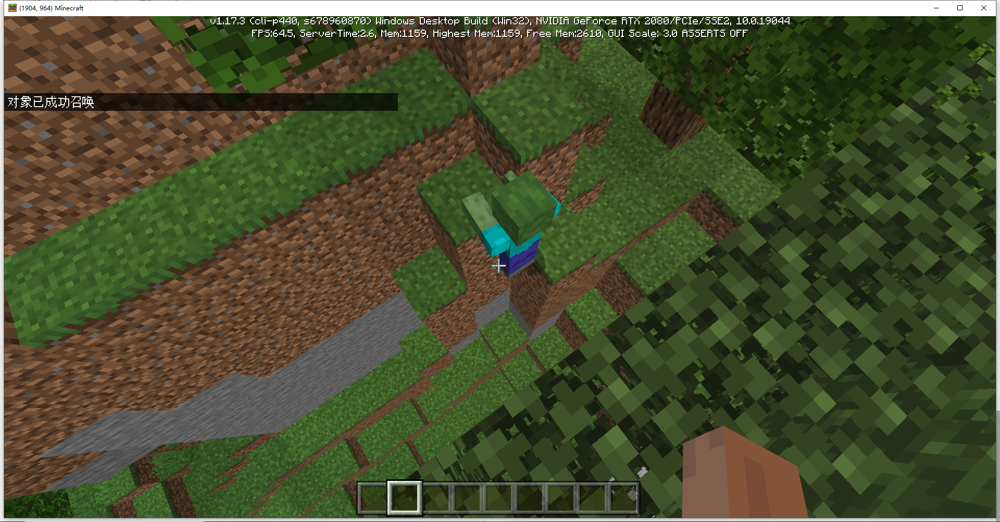

You can see that our custom zombie is successfully summoned and will not burn in the sun.

You can also use the spawn egg to generate this creature. In the spawn egg category of the creative inventory, find the spawn egg containing the entity identifier and use it like the original spawn egg.

(Because we did not configure the corresponding item name for this spawn egg, the item name displayed here is a long string of English)

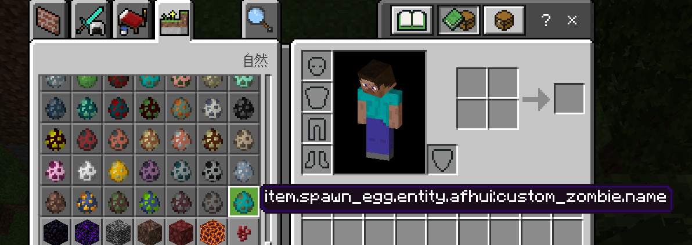

### Resource Pack Component

The resource pack component defines the model and texture of this entity, and can switch the entity's model and texture to the model we want.

## Item

The general steps for creating an item are the same as those for an entity.

Click the New button, find the item in the Configuration category, and click Next. Select a data template or an empty template, enter a name and create it.

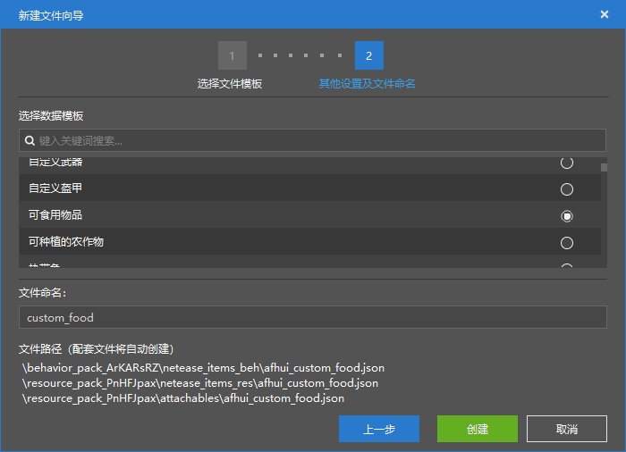

For example, here is an edible item, then enter a name and create it.

After creation, the attributes of the item and the entity are roughly divided into basic attributes, resource pack components, and behavior pack components. However, the item has an additional armor wearable attribute, which is used to configure the animation, model, texture and other functions of the armor. The operation method is basically the same as that of the entity.

Here we make an enhanced apple that restores 10 points of satiety and has a life-enhancing effect as an example.

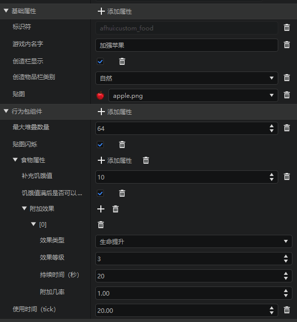

Configure according to the above picture, and you can find our enhanced apple after entering the game. After eating, it can replenish 10 hunger points and give the potion effect of life enhancement.

## Block

Also click the configuration category in the new creation and select the block. Here we can select the data template we want and enter the name to create it.

For example, we can create a glowing block as a demonstration.

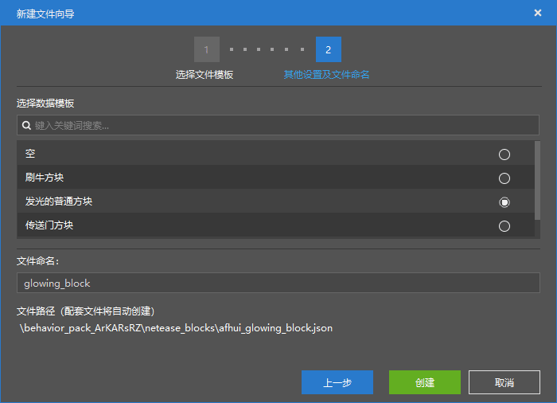

In the property bar, we can set various properties of this custom block.

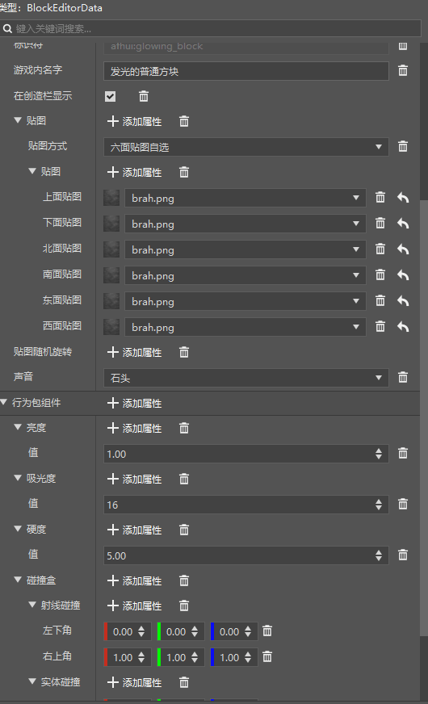

The property that determines whether this block will glow is its brightness property.

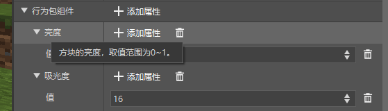

Move the mouse to the brightness label to see the relevant instructions. The brightness value of the block can be between 0-1.

It is not difficult to guess that the larger this value, the greater the brightness. We modify this value and enter the game to verify our guess.

- Brightness 0.1

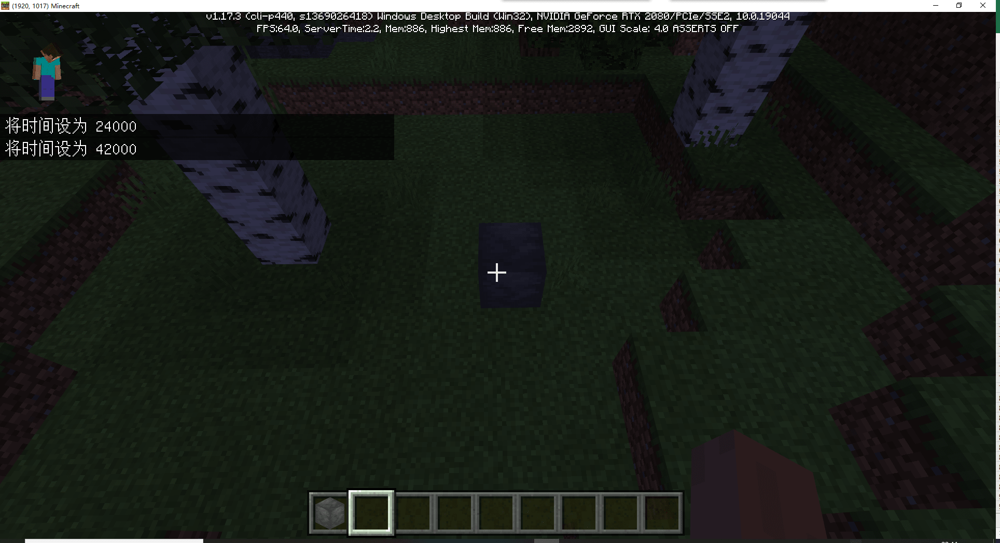

- Brightness 1.0

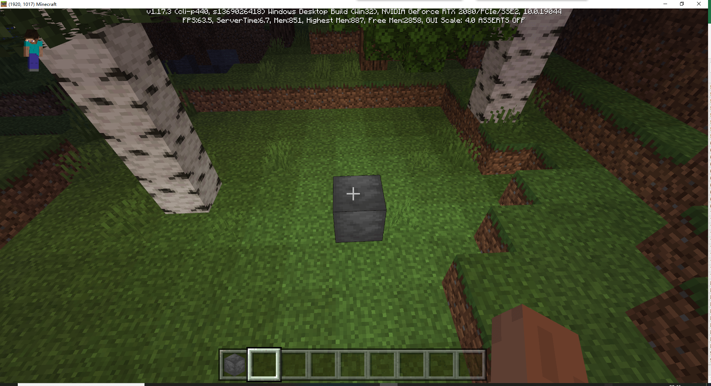

After learning how to configure entities, items, and blocks, I believe everyone can see that the use of the editor for editing various game modes is similar. As long as you have a certain understanding of the game, you can easily add game content.
