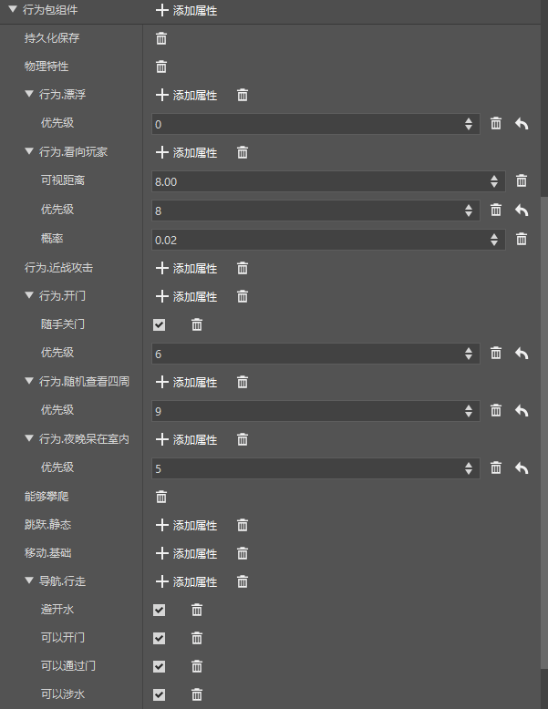
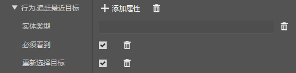
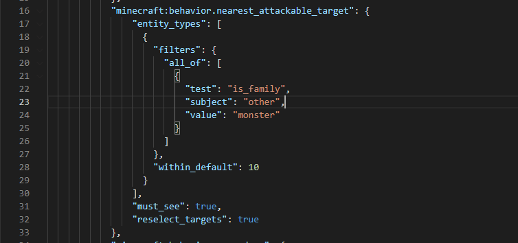
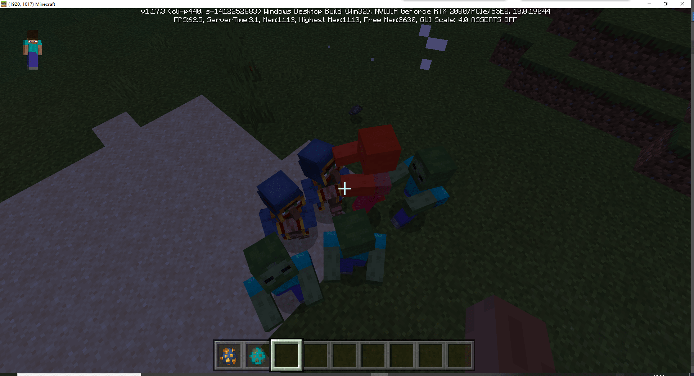

# Homework for Functional Play

After learning the basic functions of entity editing, let's try to make a new wandering merchant with the ability to protect himself!

First, create an empty entity and name it. Here we call it `merchant`.

After the creation is completed, since the editor currently does not have a wandering merchant template, we need to find the json file corresponding to this entity and edit it manually. Find the wandering merchant file from the original game file and replace the template.


First edit the resource file, click the open file button behind the resource package Json of this entity, and open the file with a text editor.

Then copy the content below into the file, replace it and save it. It should be noted that the `afhui:merchant` below should be replaced with the name before you replace it.

```json
{
  "format_version": "1.8.0",
  "minecraft:client_entity": {
    "description": {
      "identifier": "afhui:merchant",
      "materials": {
        "default": "wandering_trader"
      },
      "textures": {
        "default": "textures/entity/wandering_trader"
      },
      "geometry": {
        "default": "geometry.villager_v2"
      },
      "scripts": {
        "scale": "0.9375"
      },
      "animations": {
        "general": "animation.villager.general",
        "look_at_target": "animation.common.look_at_target",
        "move": "animation.villager.move"
      },
      "animation_controllers": [
        { "general": "controller.animation.villager.general" },
        { "move": "controller.animation.villager.move" }
      ],
      "render_controllers": [ "controller.render.wandering_trader" ],
      "spawn_egg": {
        "texture": "spawn_egg_wandering_trader"
      }

}
}
}
```

Next, we add some basic properties to this entity



Then we can set its attack power, add an attack property, and set the damage to 10.


However, with this configuration, it will not protect itself, so we also need to add a behavior of `Behavior. Chase the nearest target` and configure it according to the picture. The entity type editor does not support editing yet, so we need to manually open json for editing.



In the configuration file column, find the behavior package Json, click Open File, and change the item `entity_types` to the content below.

> This entity type means to select all entities whose entity race is monster
>
> Here we only understand it. If you want to learn the specific syntax, you can refer to [Bedrock Edition Wiki](https://bedrock.dev/zh/docs/stable/Entities#Filters) or the original file
>
> The original file can be found in the `MCStudioDownload\game\MinecraftPE_Netease\version\data\` file
>
> The MCStudioDownload folder is in the root directory of a hard disk on the computer, you can find it yourself.

```
"entity_types": [
{
"filters": {
"all_of": [
{
"test": "is_family",
"subject": "other",
"value": "monster"
}
]
},
"within_default": 10
}
],
```

The modified json file is as follows



After saving, click Run to enter the game and test it.




As you can see, the wandering merchant we released can now actively attack all hostile creatures.
