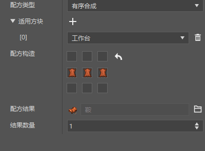
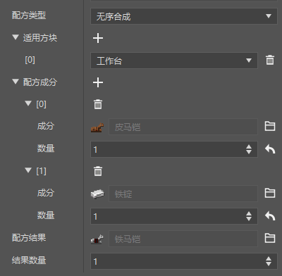
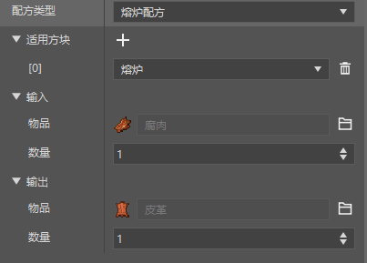
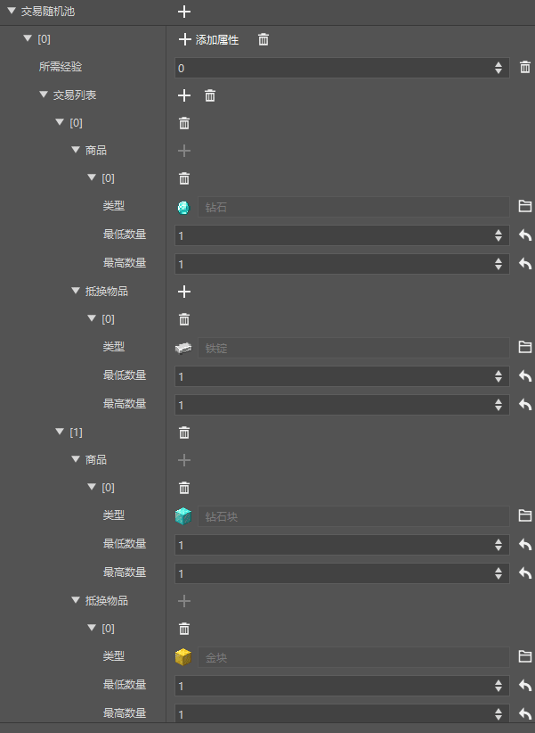
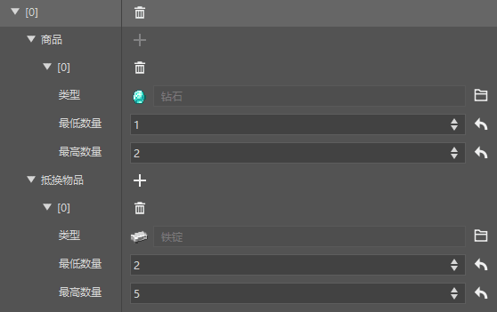
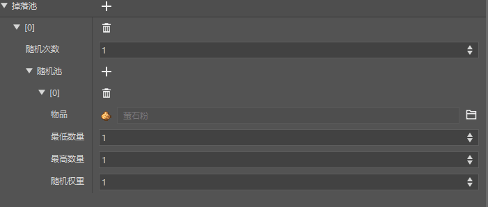
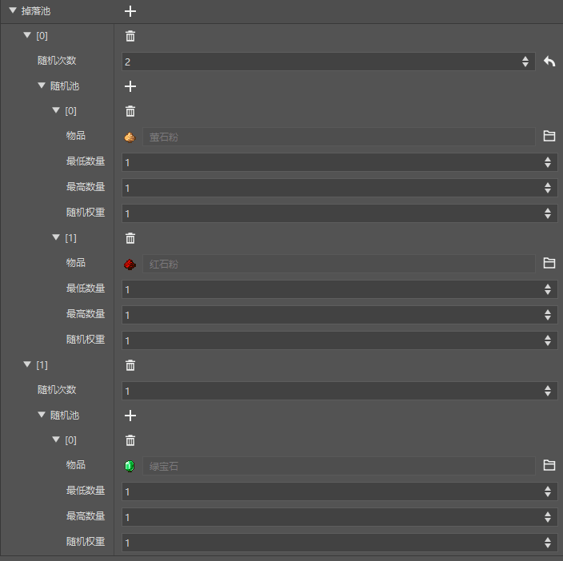

# Start configuring economic functions

In this chapter, we will introduce how to configure the game's economic functions - recipes, transactions, and loot tables.

<iframe src="https://cc.163.com/act/m/daily/iframeplayer/?id=6328633de6c041f2578ca7e8" width="800" height="600" allow="fullscreen"/>

## Recipe

Creating a recipe is very simple. Find the configuration in the new creation, recipe, and select the template to create it.

There are 3 types of recipes, namely: ordered synthesis, disordered synthesis, and furnace recipes. They have different uses.

### Ordered synthesis

Ordered synthesis means using specified materials in the synthesis column to create a synthesis recipe of a specified shape.

For example, the synthesis of a box requires 8 wooden boards in a circle.

For example, this is a custom recipe for synthesizing a saddle, which requires 3 leathers to be placed in a row for synthesis.

### Unordered synthesis

Unordered synthesis refers to the synthesis of materials without specifying the order of placement.

For example, in the original version, the synthesis of a book only requires 3 papers and one leather, regardless of their arrangement.

For example, here you can specify a leather horse armor and an iron ingot to synthesize an iron horse armor, regardless of how they are placed in the workbench.

At the same time, the applicable blocks can also be selected as cartography tables and stone cutters, specifying which blocks this recipe can take effect on.

### Furnace recipe

Furnace recipe refers to a recipe that is synthesized by burning.

For example, the logs in the original version are burned into charcoal.

For example, here is a recipe for using a furnace to burn rotten meat into leather.

The usage of applicable blocks is the same as disordered synthesis. For example, if we only choose the furnace here, then this recipe cannot be effective in the smoker, blast furnace and campfire.

## Trading

Trading is a very interesting way to play in Minecraft. Let's take a look at how to customize a trading table.

Also in New->Configuration, find the trading table.

Select the template `ne_simple_template` to create a simple trading table template.

Here we can clearly see what the goods and exchange items in this trading table are.

Next, let's try to modify the transaction and change the transaction to 2-5 iron ingots and exchange for 1-2 diamonds.

The effect after the modification is as shown in the figure. The transaction needs to be configured to an entity to carry out, so we will skip it for now.

In the homework of this section, we will lead you to configure this transaction to the custom wandering merchant we created in the previous section.

At the same time, there is an add button behind the trading random pool. After clicking it, you can add a trading list and set experience for it.

To achieve the function of unlocking new trading items by reaching a certain trading experience value.

## Drop table

The drop table refers to the list of drops that can be configured when killing an entity/destroying a block.

In New->Configuration, find the drop table.

Select the template `ne_simple_template` to create a simple drop table template.

Such a drop pool will randomly extract items from the random pool according to the weight, extract once, and then generate the drops.

We can try to modify the drop pool to change it to a guaranteed drop of an emerald, with a possibility of dropping fluorite or redstone, and the number of random times is 2.

It is not difficult to understand that each item in the drop pool will be randomized once. And a single item in the drop pool will be randomized a specified number of times to determine the drop.

> Probability calculation formula: Single probability = random weight / weight sum
>
> For example, the current drop probability of redstone and fluorite is 50%