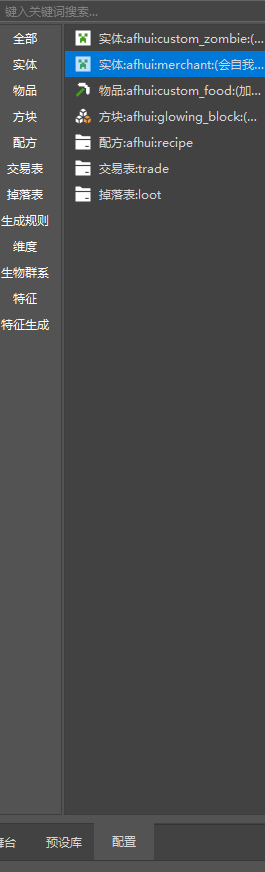
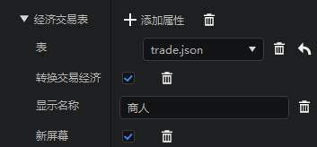
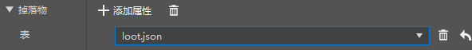
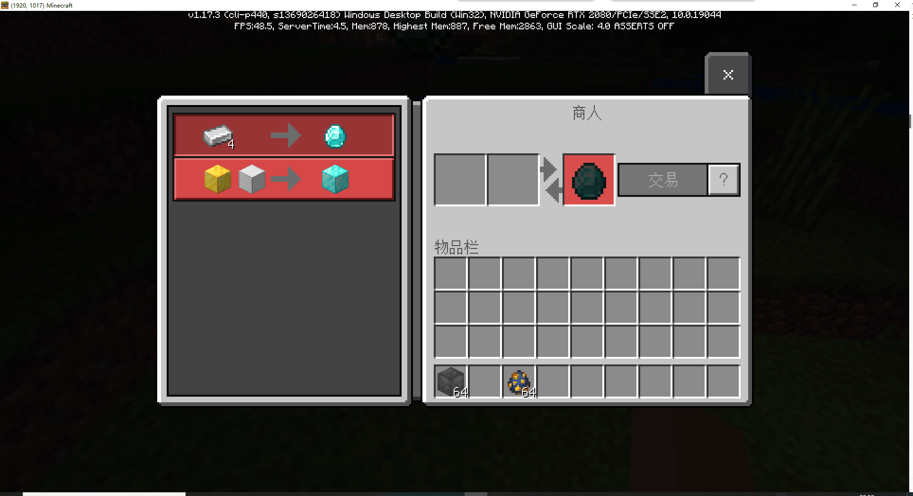
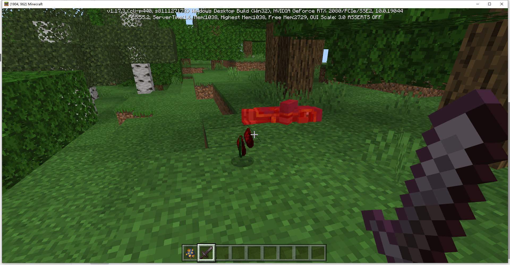

## Homework on Economic Function

We have just learned how to configure the trading table and drop table. Now let's try to add them to our custom wandering trader!

In the configuration bar on the left, find the self-protecting trader that was configured before.

After selecting it, the property panel on the right will display the properties of this trader.

In the behavior pack component on the right, add an `Economic Trading Table` property to allow this entity to trade.

And configure this transaction as follows.

Select the trading table we created before in the table, and you can use your own display name.

Then we configure the drops. Create a new `Drops` property, add a table property, and select the drop table created before.

After completing the configuration, click Save to enter the game test.

Right-click the merchant and you can see that the transaction is working properly.

Kill the merchant and you can see that emeralds will definitely drop, while redstone and fluorite are random.

This is the case where redstone is randomly drawn twice.