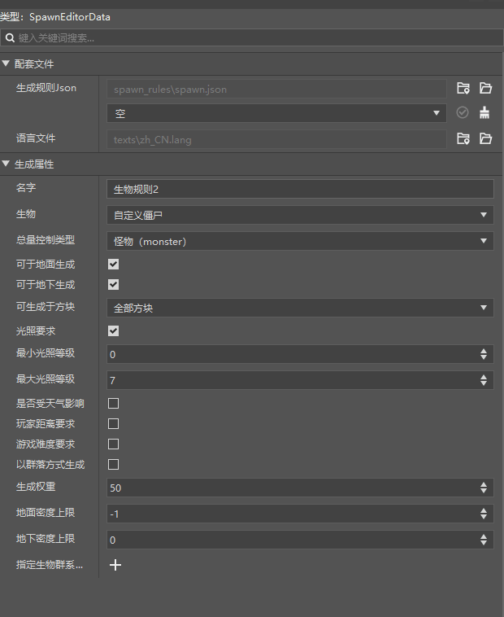
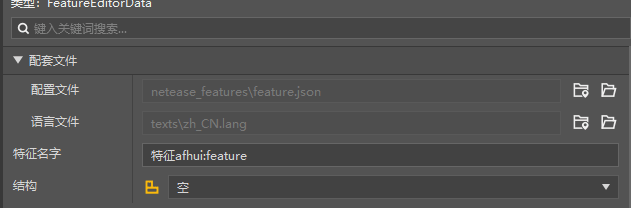
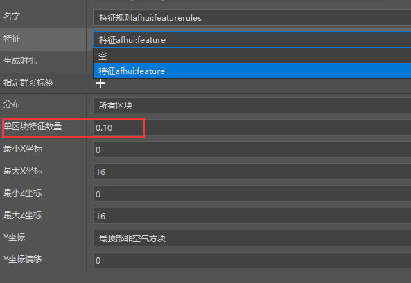

# Start configuring biome functions

This section will mainly introduce the configuration and use of generation rules, features, and feature rules.

<iframe src="https://cc.163.com/act/m/daily/iframeplayer/?id=632863afe6c041f2578ca7ea" width="800" height="600" allow="fullscreen"/>

## Generation rules

Generation rules are mainly used to configure the refresh rules of entities. In the original version, the natural refresh of zombies and other creatures is achieved by using generation rules.

We open the editor, create a new generation rule, and create a custom zombie generation rule. Or create it in New->Configure->Generation Rules and name it. And configure it according to the figure below.

> Explanation of some configurations:
>
> Name: No special requirements, only used to distinguish different rule files
>
> Creature: Creature to be generated
>
> Lighting requirements: Limit the lighting requirements under which the creature can be generated. For example, we set zombies to be generated at a brightness of 0-7
>
> Total control type: Select according to the positioning of our entity. There are related controls on the total amount of various types of entities in the game
>
> Generation weight: Used to control the probability of the creature's generation. The larger the number, the greater the probability of generation
>
> Other configurations can be moved to the title to view specific explanations as needed.

## Features

Features are also called features. They represent a single generation rule for a series of blocks when the map is generated. Feature rules are also used with them.

Let's take the generation rule of diamond ore in the game to illustrate the connection between features and feature rules.

As we all know, diamond ore starts to refresh below the 13th floor underground. And it is usually generated in clusters between 1-8.

Then we can use features to represent a cluster of 1-8 diamond ores, and use feature rules to represent that diamond ores are generated below the 13th floor underground.

The same is true for the generation of buildings. We use the editor, click New, Configure, Feature, Name and Create.

You can see that there is a selection box to select the structure to be generated, that is, a block building.

We will leave the structure here for after-class homework, make a wandering merchant hut, and then configure it.

## Feature rules

Feature rules are used to set where and when features will be generated.

In the editor, create a new one, configure, generate features, name and create, **note that the file name must be all lowercase**.

In the property window, click the feature selection box, select the previously created feature, and then adjust the number of single-block features to prevent too many features from being generated.

Other configurations remain default. Interested students can move the mouse to their names to view the corresponding explanations and configure them freely.

