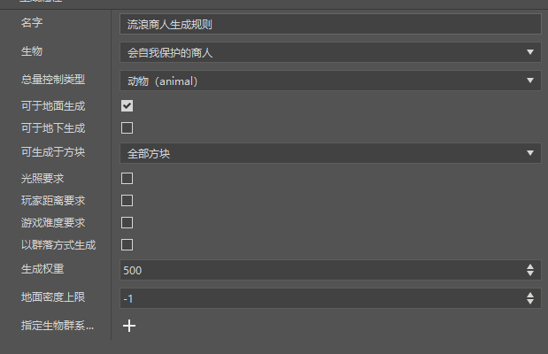
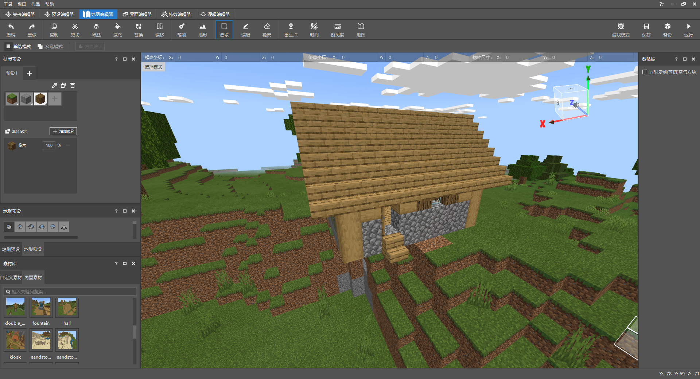
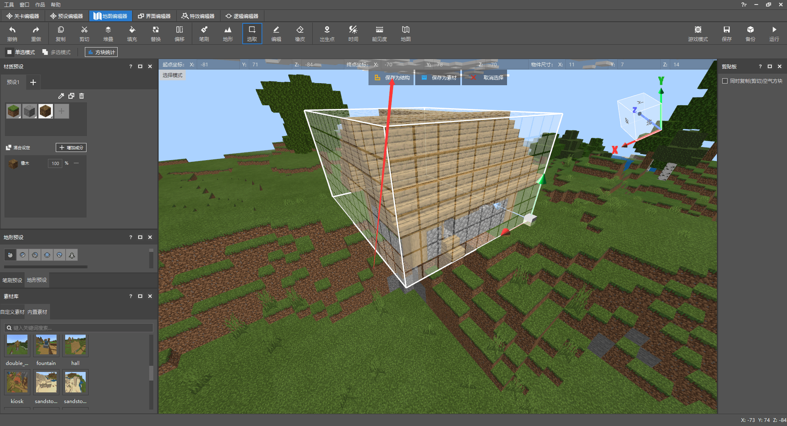
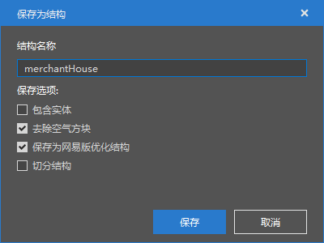
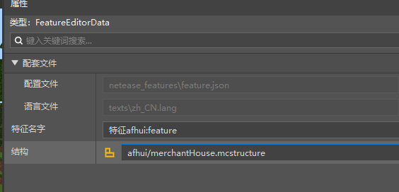
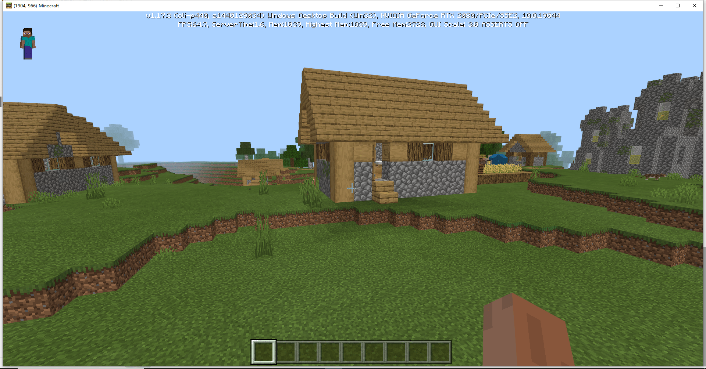

# Biome Function Homework

This homework has the following requirements:

- Configure new generation rules for the new wandering trader
- Use the map editor to make a hut, save it as a structure, and use the feature rule to randomly generate it in the world

## Wandering Trader Generation Rules

Create a new generation rule as in the previous tutorial, and then configure the selected creature to be the custom entity we configured in [Gameplay Function Homework](./1-Gameplay Function Homework.html).

Configure as shown in the figure, change the total control type to animals, and adjust the generation weight to 500, so that we can verify it later.

## Wandering Trader Hut

Use the map editor, select and place a hut in the built-in material library.

Then use the selection tool to select the hut, and then click Save as Structure.

Then name it and save it.

Next, we return to the level editor and find the previously created feature in the configuration bar on the left.

Then select the structure of the hut just saved as its structure.

Finally, click Save and the configuration is complete. We can enter the game to verify it.

You can see that the house is successfully generated in the game, but the generation probability is still high. Interested students can adjust it by themselves to find a suitable value.