# Make a Wandering Trader Hut Preset

Before starting this section, we have a concept that needs to be clarified.

When we created projects in the previous few lessons, we must have noticed that everyone chose a blank add-on pack, not a blank map.

When opening the editor, the blank add-on pack and the blank map are basically the same. What is the difference between them?

When you open the level editor with a blank add-on pack, you can see the game terrain, buildings, etc. on the stage, but these maps will disappear after the game starts. Even if you make changes in the map, they will not be saved.

And the blank map can not only add various recipes, blocks, and items like the blank add-on pack, but also save the map and scene in the editor together, and keep it the same when you start it next time.

In short, blank map = blank add-on pack + fixed map.

So the content of this section is to lead you to make a preset for a wandering trader hut to learn how to use the preset.

<iframe src="https://cc.163.com/act/m/daily/iframeplayer/?id=63286495e6c041f2578ca7f4" width="800" height="600" allow="fullscreen"/>

## Export resources

Before creating a map, we first export the custom wandering trader made in the previous chapter and reuse it to avoid duplication of work.

Open the editor and select **Export** in the resource management of the level editor.

Check `Entity`, `Drop`, `Trade` under the behavior pack, and `Entity Resource`, `Text` under the resource pack, and click Export. And save it to a directory, you can see that it is a file ending with .mep.

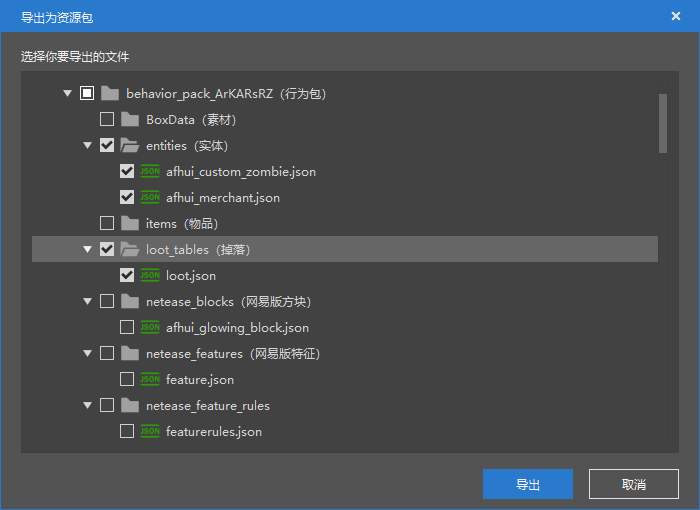

## Start making a cabin preset

Then we create a blank map, the name can be freely used, click Start Editing, after entering the editor, we open the level editor and import the resources just exported.

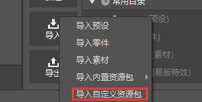

Select Import Custom Resource Pack, then select the file you just saved, and select Import All.

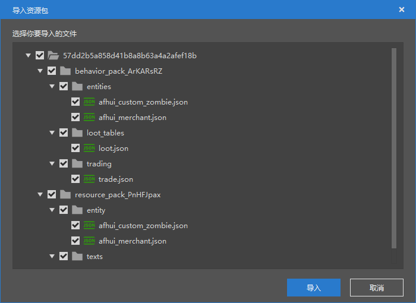

Then you can see that the entities, drop tables, and transaction tables we created in the previous chapter have all been successfully imported into the map project.

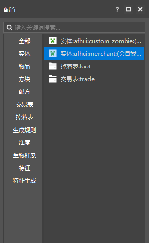

Next, we create an empty preset. In the resource management, click New, Common, Empty Preset.

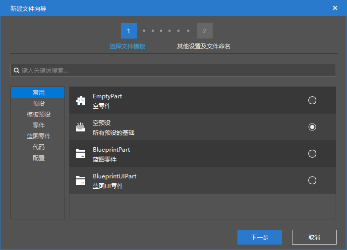

We can give it any name, we call it `House` here, click Create.

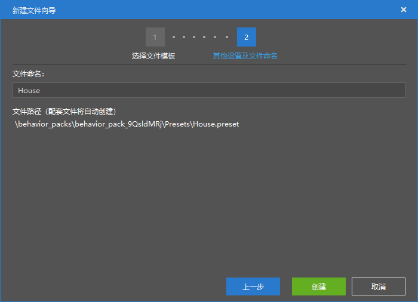

After the creation is completed, you can see that the preset editor has been automatically opened. We find the `Material` folder in the resource management and click the import button on the right. In the file selection window, select the `hall.mdl` material as our hut.

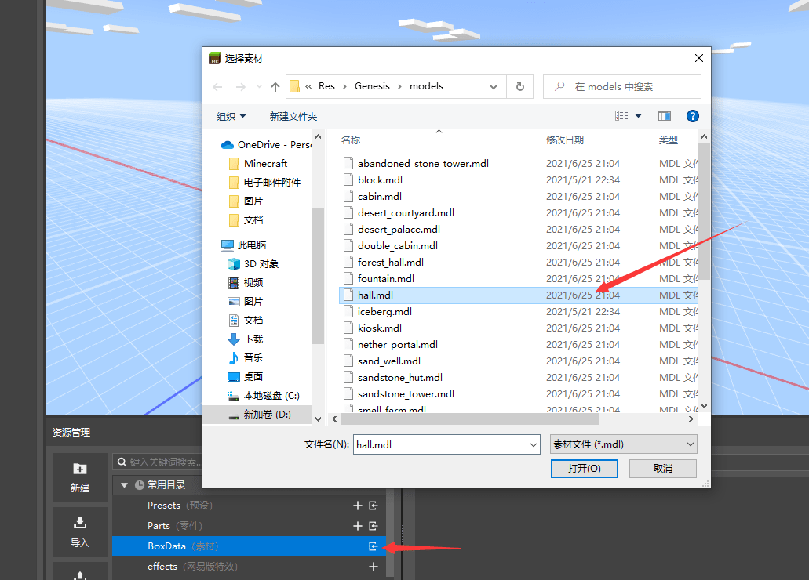

Then in the Add Material section of the upper toolbar, select the `hall.mdl` just imported. You can see that this hut material appears in the preset editor.

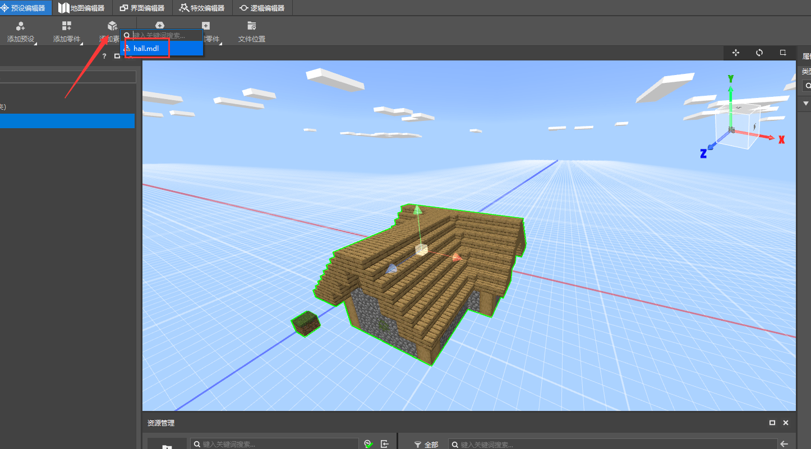

Then we continue to add and add the custom wandering merchant as an entity part to this House preset.

Click Add Part, select `EntityBasePart`, and in the corresponding right property window, change the entity type to the `self-protecting wandering merchant` we edited before.

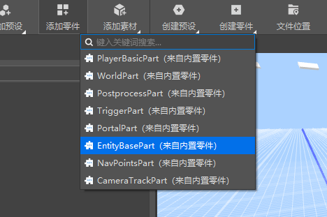

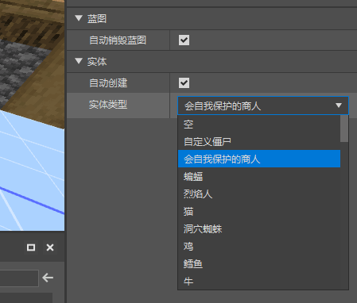

If you can't find the entity we customized in the entity type, it may be a bug in the editor. You can try to **save the project and restart the editor**, and you will usually find it.

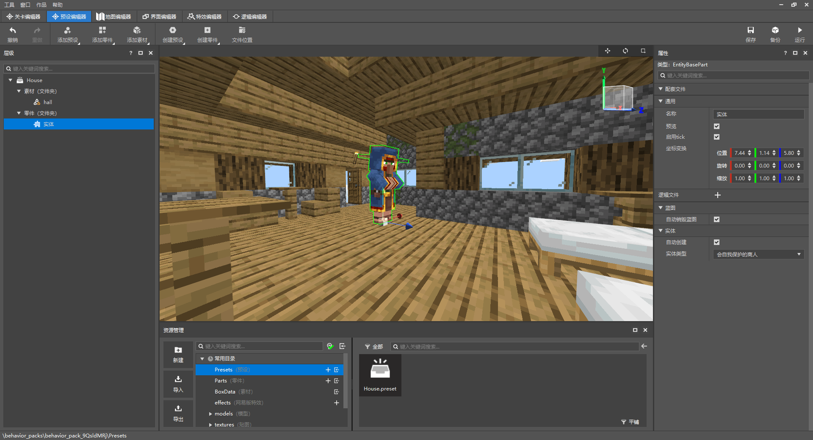

You can see that after selecting the `entity` on the left, the corresponding wandering merchant entity in the game is also highlighted, and there are 3 arrows. We can drag it into the house to define its spawning location.

After the adjustment is completed, our wandering merchant hut preset is actually ready, but in order to make it more interesting, we can add a bed component to the wandering merchant so that it can rest in the bed at night.

Go back to the level editor, find the self-protective merchant, and edit its behavior pack component. Search for the bed and add it.

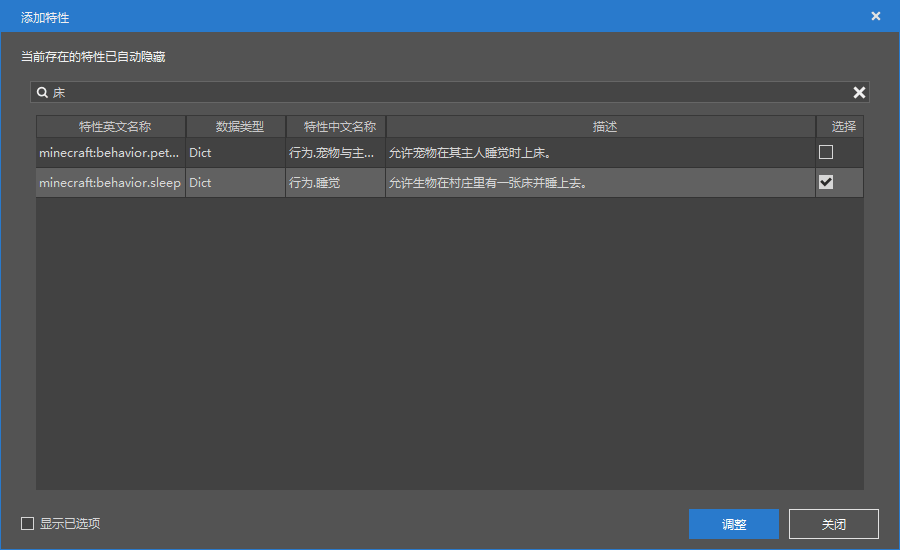

After the configuration is completed, you can find the `Presets` folder in the resource manager, click it, and drag the `House.preset`, which is the hut preset we just edited, into the game.

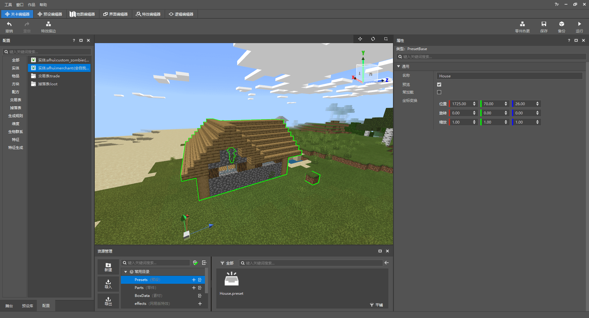

In this way, the preset of our wandering merchant hut has been configured and successfully placed in the game.