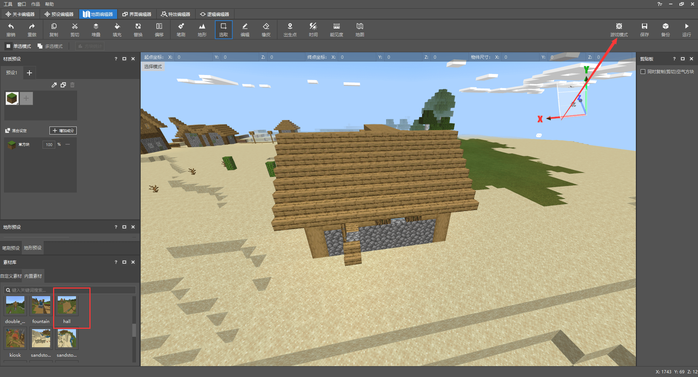
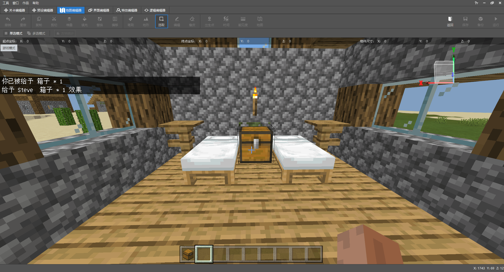
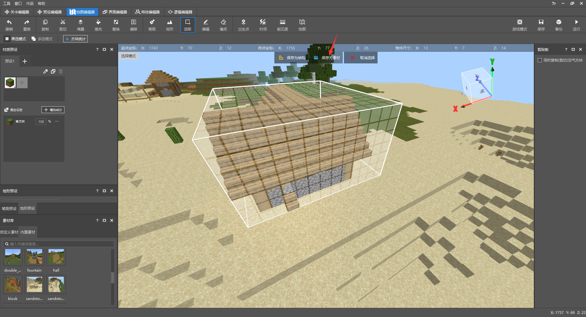
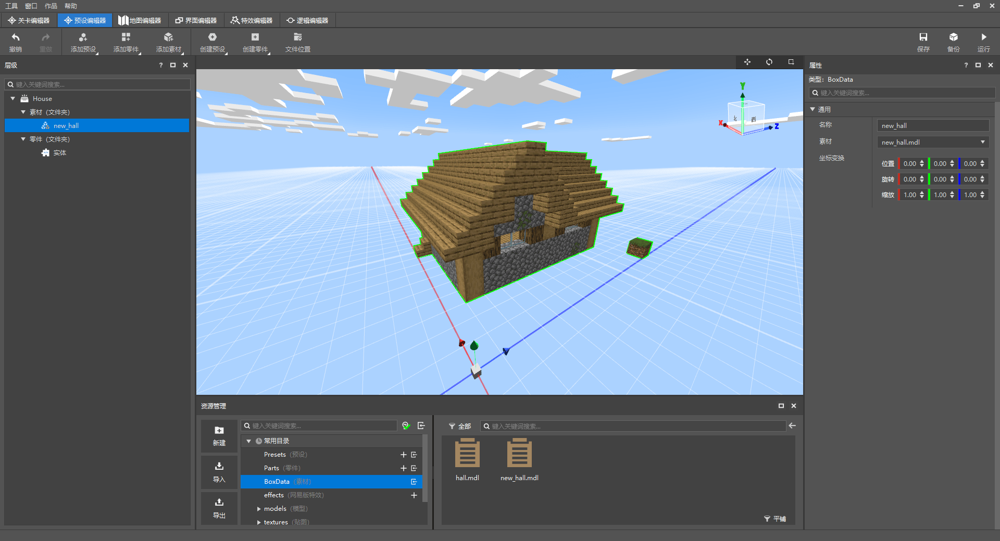
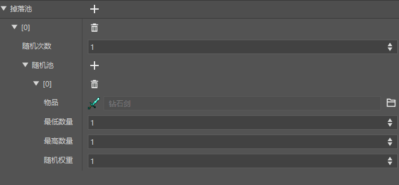
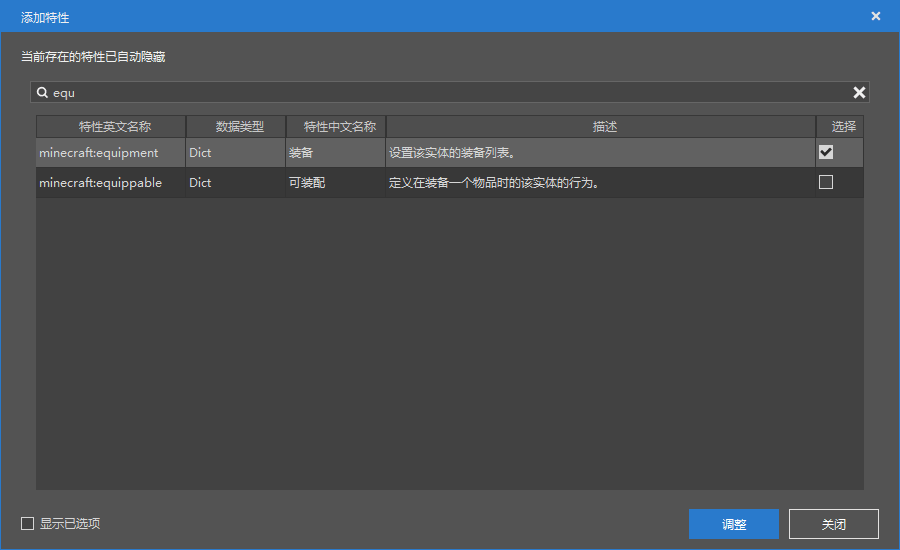

# Homework for Hut Presets

After learning the basic usage of presets, you can try to complete the following requirements to familiarize yourself with the usage of presets.

- Place a box block in the hut material
- Add a piglin-like attack on treasure thieves to the custom wandering merchant
- Use the drop table to add initial equipment to the custom wandering merchant

## Place a box block in the material

To place a box block in the material, first we need to place the original `hall.mdl` material in the map, then edit it, and then save it as a new material.

Open the map editor, find the hall material in the material library, click to select it, and then place it in the map.



Then click the game mode in the upper right corner, switch the editor to the player perspective of the game, enter the game, and place a box in the house.



After placement, press ESC to exit. Then use the selection tool to reselect the hut and save it as a material named `new_hall`, then delete the selected part and restore the terrain to its original state.



Then find the custom material in the material library, right-click the material `new_hall` just saved, and select `Import as preset material`.

Return to the preset editor, delete the material's `hall` and replace it with `new_hall`.



At this point, the box in the material is placed.

## Attack the treasure thief behavior

Enter the level editor, find our custom wandering merchant entity, and open its behavior package json file.

Because it involves the behavior of attacking the treasure thief similar to the piglin, the behavior component required cannot be edited in the level editor for the time being, so we need to manually edit the json file.

Here we will first post the specific writing methods of some json components that need to be used.

`minecraft:block_sensor` can be used to detect surrounding blocks and whether there are events such as destruction. After detection, a certain json event is triggered and it needs to be placed under the `components` node.

```json
"minecraft:block_sensor": {
"sensor_radius": 16,

"on_break": [
{
"block_list": [
"minecraft:chest"
],
"on_block_broken": "important_block_destroyed_event"
}
]
}
```

`component_groups` refers to component groups. We can define some components under this node. After an event is triggered, we can add or delete a component group for the entity to achieve some effects. It needs to be under the `minecraft:entity` node.

For example, here we define a `take_target_as_response_to_block_break` group to update the behavior pack component of the wandering trader to make it attack the player.

```json
"component_groups":{
"take_target_as_response_to_block_break": {
"minecraft:behavior.nearest_attackable_target": {
"priority": 7,
"entity_types": [
{
"filters": {
"test": "is_family",
"subject": "other",
"value": "player"
},
"max_dist": 16
}
]
}
}
}
```

`events` refers to json events, which can define an event and respond to it when it is triggered, such as adding/deleting a component group. It needs to be under the `minecraft:entity` node.

Here we define an `important_block_destroyed_event`, which will be triggered when the player destroys the box, and then add the `take_target_as_response_to_block_break` component group to the entity to make it attack the player.

```json
		"events": {
            "important_block_destroyed_event": {
                "add": {
                  "component_groups": [
                    "take_target_as_response_to_block_break"
                  ]
                }
            }
        }
```


The final configured json file is as follows, and the modified parts are commented for reference.

```json
{
    "format_version": "1.12.0",
    "minecraft:entity": {
        "components": {
            "minecraft:attack": {
                "damage": 10
            },
            "minecraft:behavior.float": {
                "priority": 0
            },
            "minecraft:behavior.look_at_player": {
                "look_distance": 8,
                "priority": 8,
                "probability": 0.02
            },
            "minecraft:behavior.melee_attack": {

            },
            "minecraft:behavior.nearest_attackable_target": {
                "entity_types": [
                    {
                        "filters": {
                            "all_of": [
                                {
                                    "subject": "other",
                                    "test": "is_family",
                                    "value": "monster"
                                }
                            ]
                        },
                        "within_default": 10
                    }
                ],
                "must_see": true,
                "reselect_targets": true
            },
            "minecraft:behavior.open_door": {
                "close_door_after": true,
                "priority": 6
            },
            "minecraft:behavior.random_look_around": {
                "priority": 9
            },
            "minecraft:behavior.restrict_open_door": {
                "priority": 5
            },

            "minecraft:behavior.sleep": {

            },
            "minecraft:can_climb": {

            },
            "minecraft:economy_trade_table": {
                "convert_trades_economy": true,
                "display_name": "Businessman",
                "new_screen": true,
                "table": "trading/trade.json"
            },
            "minecraft:jump.static": {

            },
            "minecraft:loot": {
                "table": "loot_tables/loot.json"
            },
            "minecraft:movement": {
                "value": 0.5
            },
            "minecraft:movement.basic": {

            },
            "minecraft:navigation.walk": {
                "avoid_water": true,
                "can_open_doors": true,
                "can_pass_doors": true,
                "can_path_over_water": true
            }, "minecraft:persistent": {

},
"minecraft:physics": {

},
"minecraft:pushable": {
"is_pushable": true,
"is_pushable_by_piston": true
},
// Used to detect surrounding blocks
"minecraft:block_sensor": {
"sensor_radius": 16,
"on_break": [
{
"block_list": [
"minecraft:chest"
],
"on_block_broken": "important_block_destroyed_event"
}

                ]
              }
        },
        //New component grouping
        "component_groups":{
            "take_target_as_response_to_block_break": {
                "minecraft:behavior.nearest_attackable_target": {
                  "priority": 7,
                  "entity_types": [
                    {
                      "filters": {
                        "test": "is_family",
                        "subject": "other",
                        "value": "player"
                      },
                      "max_dist": 16
                    }
                  ]
                }
            }
        },
        //New event definition
        "events": {
            "important_block_destroyed_event": {
                "add": {
                  "component_groups": [
                    "take_target_as_response_to_block_break"
                  ]
                }
            }
        },
        "description": {
            "identifier": "afhui:merchant", "is_experimental": false,
"is_spawnable": true,
"is_summonable": true
}
}
}
```

## Use the drop table to configure the initial equipment

First, use the resource manager to create a new drop table named `merchant_weapon`

Add a diamond sword to the drop pool.



This completes the configuration. If you want randomness, you can also add multiple different types of swords.


Then go back to the entity configuration of the custom wandering merchant, search for equipment in the behavior pack component and add it.



After adding, find the equipment column in the behavior pack component, click Add Property, add the `Table` property, and fill in `loot_tables/merchant_weapon.json`, which is the drop table we just created.

So far, all the requirements have been completed. After saving, you can click Run to enter the game test!

> Why can't I see the wandering merchant holding a sword after entering the game?
>
> Because we didn't configure the relevant sword holding animation and rendering settings for it, this sword can only increase its attack power and cannot be displayed.
