# Make item block presets

In this section, we will use blockbench to make new weapon block models to enhance the expressiveness, and add the models to a new block and place them in our previous hut.

<iframe src="https://cc.163.com/act/m/daily/iframeplayer/?id=6328652ec6dfd1bb76f1d120" width="800" height="600" allow="fullscreen"/>

## BlockBench

This software, BlockBench, has been mentioned in the basic version tutorial. It can be used to make models in Minecraft.

Download address: [click me](https://www.blockbench.net/downloads)

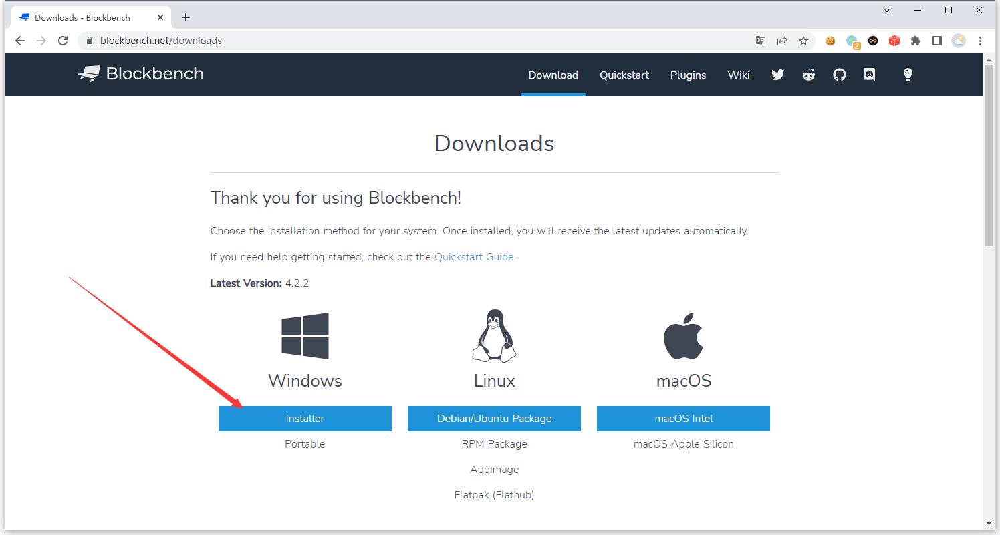

Choose the installation package according to your system. For Windows system, you can select according to the instructions in the picture. After downloading, click Install.

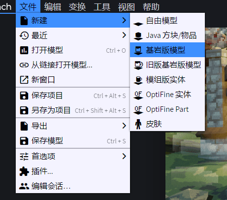

After the installation is complete, open it, click File, New, Bedrock Edition Model. Fill in `weapon_block` for the file name and model id, which is the model id we will use in the future. Fill in the rest according to the picture.

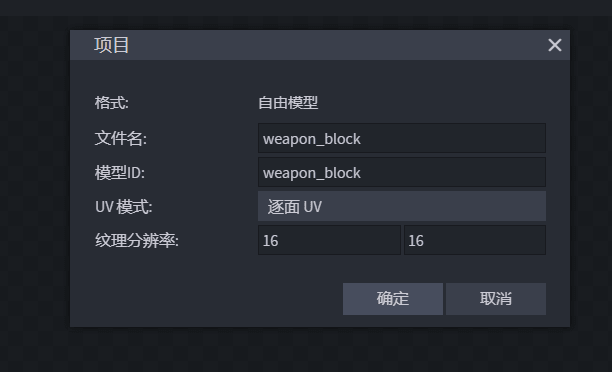

After the creation is completed, click Import Texture and import a texture of an iron axe (you can choose according to your preferences, or you can draw it yourself).

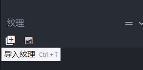

You can search for the original resource package of Minecraft by yourself, or you can directly save the following picture for use.


After the import is completed, right-click in the blank area below the outline on the right, first select Add Group, and then select Add Texture Mesh. Drag texture_mesh into bone.

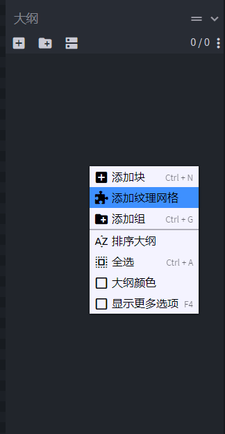

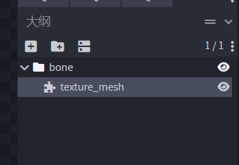

After adding, you can see the editing area in the middle, where our axe texture mesh has appeared. Then select bone and texture_mesh at the same time and move them.

You can see that there are many buttons in the upper left corner, namely **Move, Size, Rotate, Pivot Tool, Vertex Snap**.

Here we adjust the position of the model, use the Rotate Tool, Move Tool, etc., and adjust it according to your preferences.

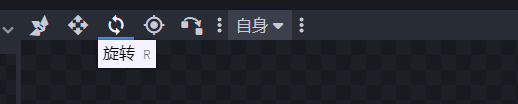

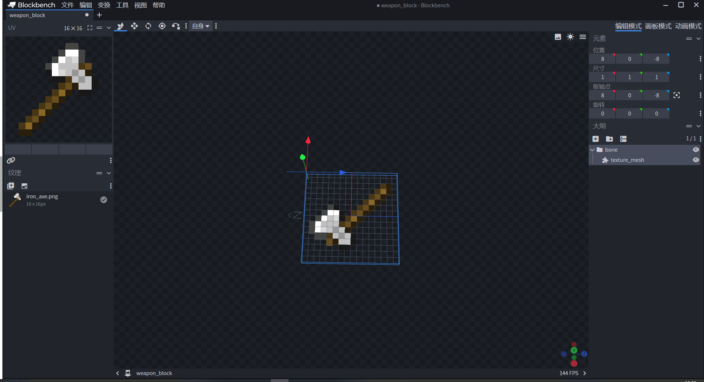


After adjusting according to your own preferences, we also need to translate the entire model in the direction of the red and blue lines in BlockBench. As shown in the figure below, the center position of the model is the corner with red and blue lines in the gray grid at the bottom of BlockBench.

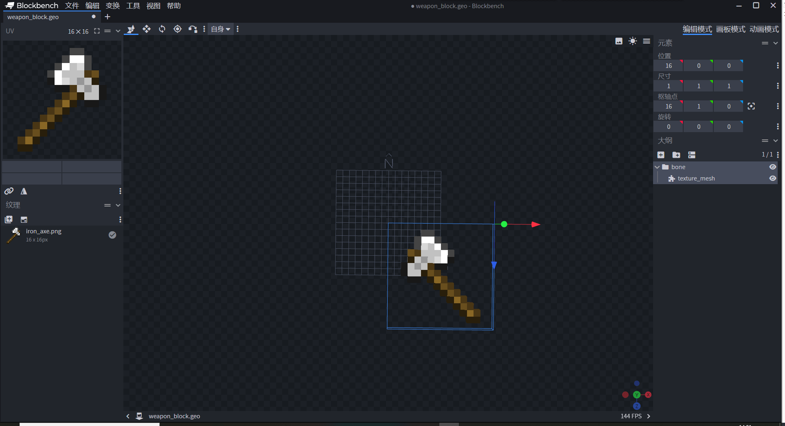

In order to show more clearly, the position before translation is the position in the red box in the figure below, and the position after translation is the position in the yellow box in the figure below.

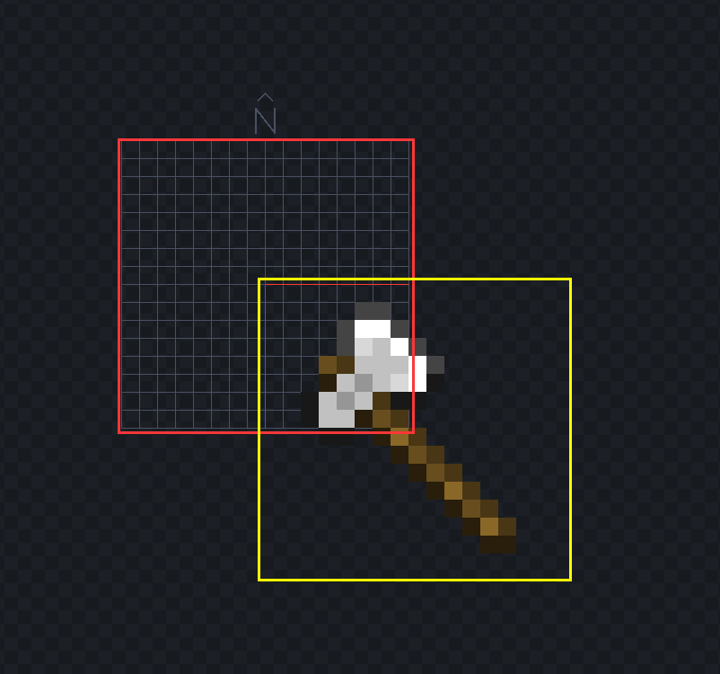

After editing the model, we save it. It should be saved as a file with the suffix `.json`

## Configure blocks

As before, create a new block configuration in the level editor, call it `weapon_block`, and create it.

Then in the resource management, click the import button, select `BlockBench model-json model (organism)`, select the json file we just saved, and import it.

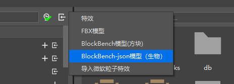

> Why choose json model (creature)

>
> Because the texture mesh model we made is a unique feature of the Bedrock Edition model.
>
> The BlockBench model (block) requires the model to be a free model and cannot use texture mesh.
>
> So here we use the form of a block entity to add this model, so that the Bedrock Edition model of this block can use the texture mesh.

Check whether the image is correct according to the prompts, and change it if it is incorrect.

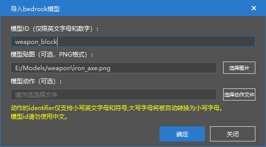

After the import is completed, we still need to find `models/entity/weapon_block.geo.json` and double-click to open it

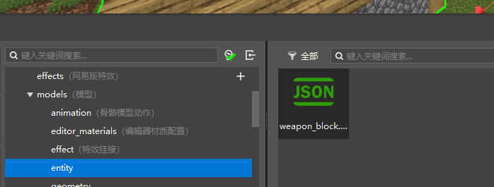

Find `texture_meshes` node in the place shown in the figure, find `texture`, and change it to `"texture": "default"`.

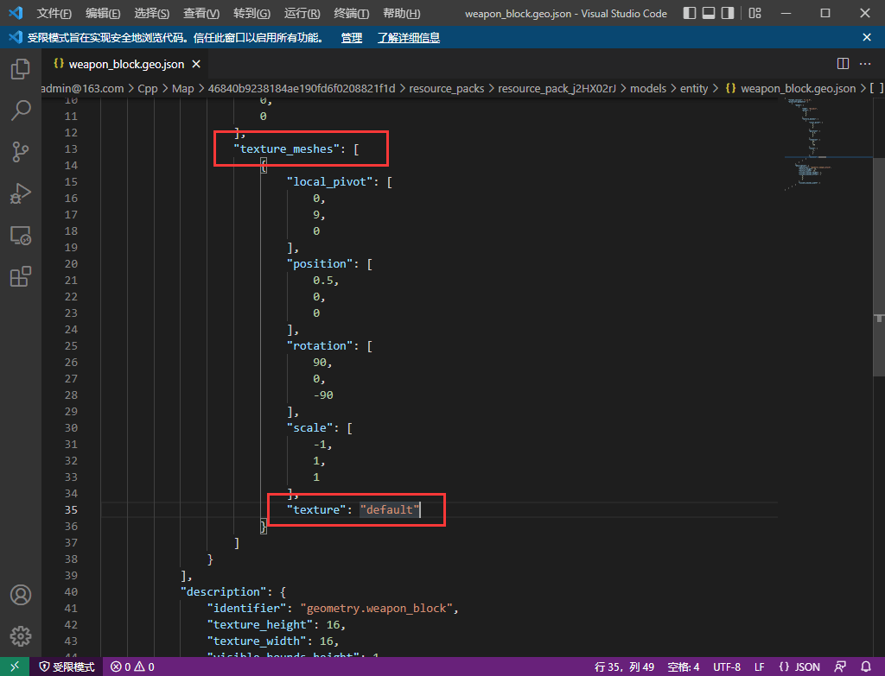

This configuration is because we use the special function `texture_mesh` to make the model, and the model edited by BlockBench does not correctly set the texture file used by texture_mesh, so we need to manually open the file and set its texture to `default`, which is the texture of the entity by default.

Next, switch back to the block configuration and add the block entity component in the behavior package component. You don't need to check anything.

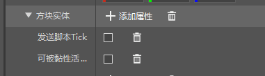

Because it is in the form of a block entity, create a new entity next, and the name is the same as our block, here it is called `weapon_block`.

After selecting the model and texture in the resource package component, open the resource package Json and configure its rendering controller and material.

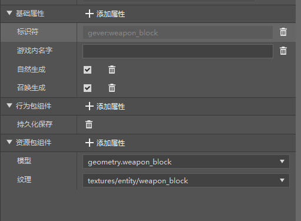


```json
{
"format_version": "1.8.0",
"minecraft:client_entity": {
"description": {
"geometry": {
"default": "geometry.weapon_block"
},
"identifier": "gever:weapon_block",
//The content to be added starts here
"materials": { 
"default": "entity_alphatest"
},
"render_controllers": [
"controller.render.default"
],
//The content to be added ends here
"textures": {
"default": "textures/entity/weapon_block"
}
}
}
}
```

Because the editor does not currently support the configuration of models using block entities, we need to manually modify the `blocks.json` file to apply the entity to the block.

In the resource management, find the resource pack folder, find `blocks.json` on the right, and double-click to open it.

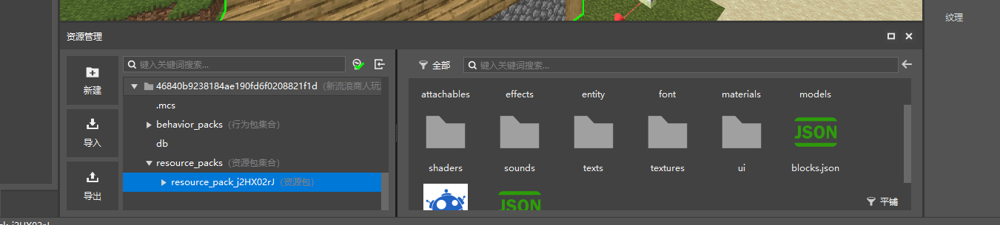

In the opened file, there should be a field called `namespace:weapon_block`. For example, mine is `gever:weapon_block`, which is the identifier of this block.

We delete the content and replace it with

```json
"client_entity": {
"identifier": "gever:weapon_block",
"hand_model_use_client_entity": true
}
```

The identifer here is the identifier of the entity you just created. Note that you need to replace your own namespace.

Example of `blocks.json` after configuration

```json

{
"format_version": [
1,
1,
0
],
"gever:weapon_block": {
"client_entity": {
"identifier": "gever:weapon_block",
"hand_model_use_client_entity": true
}
}
}
```

Currently, when you enter the game in this way, you will find that although the model is visible, there will be an error. This is mainly because our model uses the texture_mesh format. At present, this type of model does not fully support the block entity, so we will ignore the error for the time being. In order to avoid subsequent players' errors, we can use the logic editor later to make a replacement item, listen to the click event, and place this block.

Go back to the block configuration, search for `rendering material` in the behavior package component, and add it. Select the value as fully transparent.

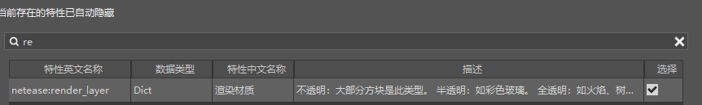

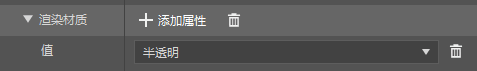

Add the absorbance attribute and set it to 0. Otherwise, the block will look black in the game.

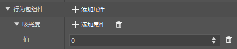

The basic properties can set its in-game name and sound. At the same time, delete the texture properties. All the contents of the basic properties are shown in the figure below.

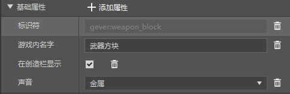

After this configuration, the weapon block is configured.

## Placement of Shop Station and Weapon Block

Next, we can use the map editor to design a shop station material, place the weapon block in it, and combine it with the wandering merchant hut preset.

To get the weapon block, you can use the command `/give @s gever:weapon_block`, and pay attention to replace the namespace with your own. If you don't have the item, you can try restarting the editor.

After the production is completed, save it as a material, and then delete it in the map. And import it as a preset material.

Then go to the preset editor, open the House preset, and place the preset material just imported in front of the hut.

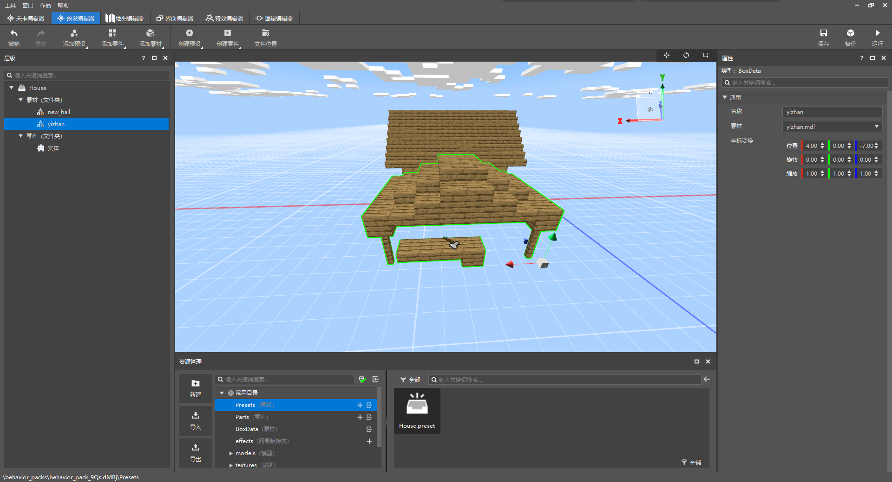

After we start the game, we can see a new post building in front of the cabin.

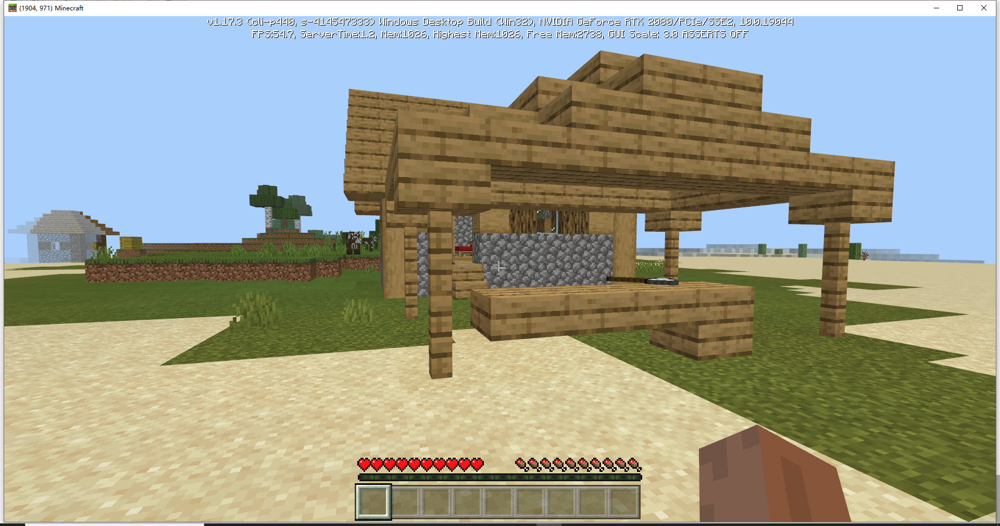

Our preset editing is now complete.