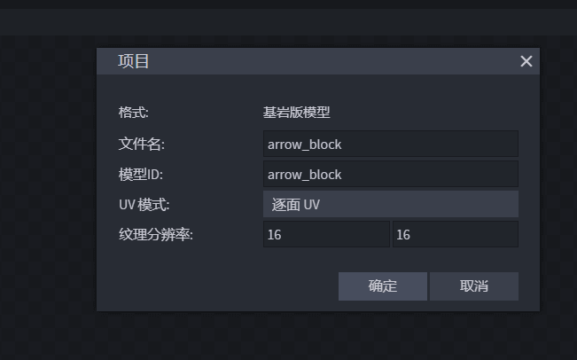
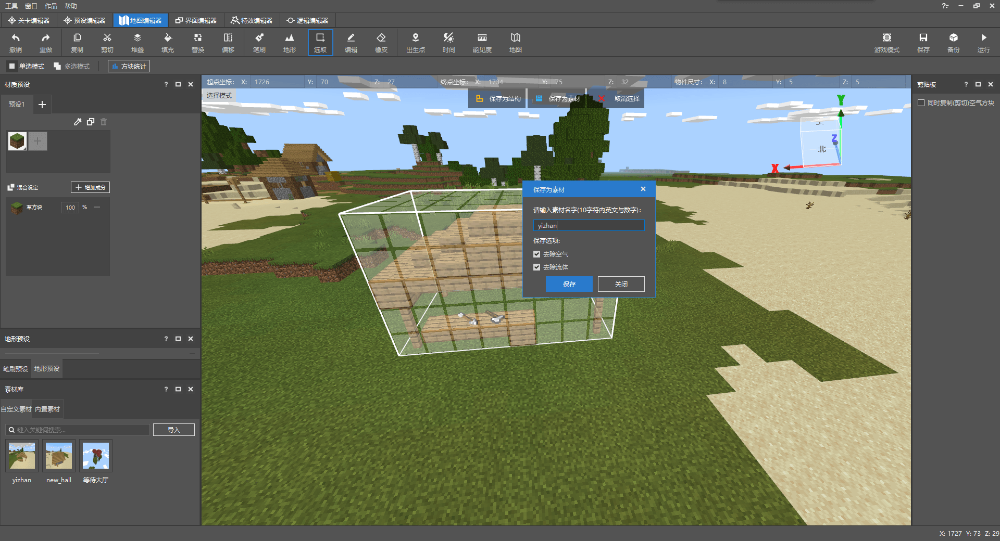
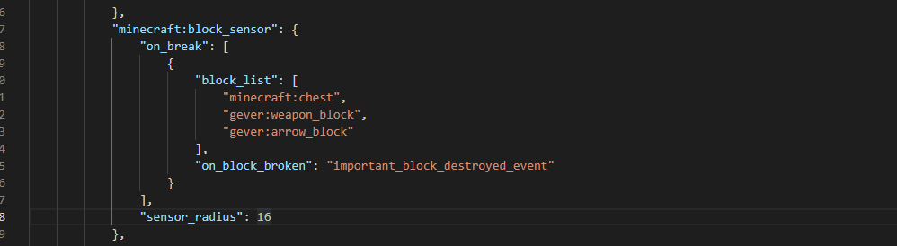

# Homework for Item Block Presets

Requirements:

- Design more weapon blocks to decorate the post station
- Add components for the custom wandering merchant to attack the target after being destroyed

## More weapon blocks

Since the steps for adding more weapon blocks are exactly the same as in the [previous section](./2-Make item block presets.html), we only need to distinguish different model names when creating models, so we skip it here and show the results directly.



For example, the `arrow_block` here is different from the previous `weapon_block`.

After adding the blocks, place the materials of the post station and save them again, and import the preset materials.



In this way, our more weapon blocks are added.

## Attacking the treasure thief

To attack the player who destroyed the weapon block, the principle of implementation is the same as the previous principle of attacking and destroying the box.

So we go back to the configuration of the custom entity, open the json file, and find `minecraft:block_sensor`.

```
"minecraft:block_sensor": {
"on_break": [
{
"block_list": [
"minecraft:chest"
],
"on_block_broken": "important_block_destroyed_event"
}
],
"sensor_radius": 16
},
```

The `block_list` is the block that needs to be detected and destroyed. Here we add our newly added weapon blocks, such as `gever:arrow_block` and `gever:weapon_block` in the example.

After the configuration is completed, as shown in the figure:




## Complete resource download

So far, the entire content of the preset editor has been introduced. The following is the file of the entire map. You can unzip it and import it into the editor for reference and learning.

Download address: [click me](https://g79.gdl.netease.com/preset_tutorial_res.zip)