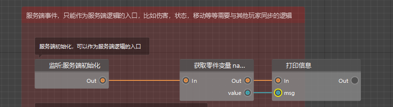

# Make the first blueprint part

After learning the preset editor, I believe everyone has a certain understanding of presets and parts. In this chapter, we will mainly introduce the most powerful custom function among the parts - blueprint parts.

I believe everyone has already come into contact with blueprint parts in the basic tutorial of gameplay components, and completed the production of an explosive bow according to the tutorial. Now, we will start to learn more about blueprint parts and logic editors.

In this section of the tutorial, we will still use the gameplay map made by the preset editor in the previous chapter. If you have not completed the production, you can download and import it [here](https://g79.gdl.netease.com/preset_tutorial_res.zip)

<iframe src="https://cc.163.com/act/m/daily/iframeplayer/?id=6328655ee6c041f2578ca7fa" width="800" height="600" allow="fullscreen"/>

## Mounting of parts

In the level editor, first create a blueprint part.

For the name, fill in `FirstBlueprint` to facilitate the distinction later.

After the creation is completed, find our custom wandering merchant in the configuration bar, right-click, and create a preset for it.

For the file name, fill in `EntityMerchant` here, of course, you can also name it according to your own preferences.

After the creation is completed, it will automatically switch to the preset editor. In the resource management, find `Parts` and click `FirstBlueprint`, the blueprint part we just created.

Here you can see the relevant files of our blueprint parts. Among them, the first file can be dragged to the preset to complete the attachment of the part and the preset. The second file is a logic file, which can be opened in the logic editor by double-clicking. The three files ending with .py will be discussed in subsequent courses, so we will skip them here for now.

Now all you need to do is drag the first file to the entity preset in the left hierarchy window.

This completes the attachment of the part to the preset. In this way, whenever this entity preset is loaded, all its parts will be initialized and run according to the logical relationship in the logic editor.

On the contrary, if you just create a part and write the logic code, but it is not attached to any preset, or the attached preset is never loaded, then the logic code in the part will not be run.

## Logic Writing

Double-click the logic file to open the logic editor. You can see that some nodes have been preset in the logic editor, they are:

- Listen: Client initialization
- Listen: Client every moment
- Listen: Client destruction

- Listening: Server initialization
- Listening: Server every tick
- Listening: Server destruction

It is not difficult to see that the listening is divided into two parts, namely the client and the server. Each end has three listenings, namely initialization, destruction, and every tick.

Initialization and destruction are opposites, one is the beginning and the other is the end. Every tick is the stage from the beginning to the end. My world server and client define 1 second as 30 ticks, and the nodes corresponding to each tick will be executed 30 times per second.

The difference between the client and the server will be introduced in detail later, so here we will just briefly understand it.

You can see that there is an Out on the right side of these nodes, and there is a circle, which we call a port.

### Connection method between nodes

At the port, press the mouse and drag outward to see a line. Release the mouse and a node selection panel will pop up. Select it here to create a node. For example, here we need to print the message "Server initialization" when the server is initialized, and we can create nodes and automatically connect according to the animation below.

This creates a node for printing information and initializes it to connect with the server. In addition to this creation method, we can also right-click in the blank space to create a node, and then manually connect the Out port of the previous node to the In port of the next node.

### Execution connection and data connection

It can be found that no matter which method is used to connect the nodes, the connection from the Out port to the next In port is an orange connection.

Such an orange connection is an **execution connection**, which represents the execution order between logical nodes. The program will always execute from the Out port of a node to the node connected to the next In port.

In addition, there is another connection, which is blue, as shown in the figure below. Such a connection is a **data connection**, which only represents the data transmission relationship, not the execution order.

> The logic in the above figure means that after initialization, the name of the current part is obtained and the name is printed.
>
> The name of the part is passed to the print information node for output.

After understanding the basic node connection, we print information when initializing the server and client respectively.

In this way, the production of the first blueprint part of the logic is completed. We can enter the game to view the log and check whether the configuration is correct.

If the configuration is correct, after entering the game, you can see the output information selected by the red box.