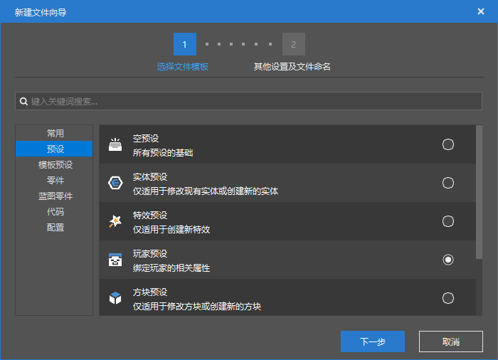
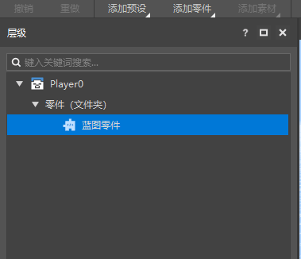
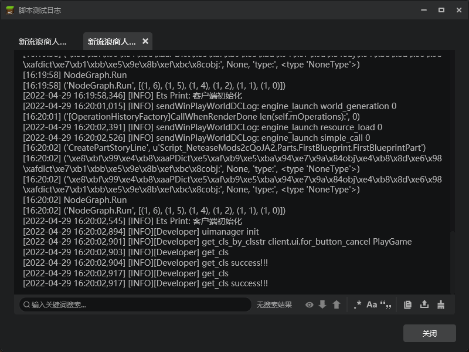

# Homework for Blueprint Parts

Homework requirements are as follows:

- Attach the first blueprint part to the player preset and observe the log output

## Operation steps

Create a new player preset

Open the preset editor, edit the player preset, and drag the `FirstBlueprint` part to the player preset.

This completes the configuration, and we can enter the game and observe the log. You can see that there should be 2 outputs for the server and client. Because there is 1 player entity and 1 wandering trader entity, each entity will trigger the client and server once.

