# Basic concepts of logic editor (1)

Starting from this section, we will systematically introduce how to use the logic editor.

This section will mainly introduce the following contents:

- Server and client interface calls
- Recognize data types
- Learn the connection between nodes

<iframe src="https://cc.163.com/act/m/daily/iframeplayer/?id=6328659bc6dfd1bb76f1d124" width="800" height="600" allow="fullscreen"/>

## Server and client interface calls

Before we start to understand the server and client interfaces, we first need to clarify the concepts of client and server.

In the game of Minecraft, the operation part of the game is mainly divided into two parts: server and client. They each have their own responsibilities and are responsible for the operation of different parts of the game. They can communicate with each other to synchronize some information. The following lists some of the parts that the server and client are responsible for

### Server

- Damage

- HP

- Position

- Blocks

### Client

- UI
- Special effects
- 3D rendering

It is not difficult to see that the server is mainly responsible for processing all entities and player data. The client is mainly responsible for processing local players, entities and visual data.

Therefore, when we edit the logic in the logic editor, the interfaces we call are separated due to the different responsibilities of the server and the client. For example, if we want to make a fashion module, the data that our server needs to process is what fashion each player is equipped with, and send all the data to the client for fashion rendering.

Next, we enter the logic editor to actually operate.

First, create a blank add-on package, create a player preset, and create a blueprint part, and mount it in the player preset. The operation steps can be reviewed in [previous section] (./0-Make the first blueprint part.html). Then open it to the logic editor.

We create a node `Set whether it rains`


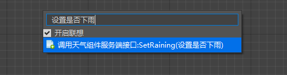

You can see that in the search box for creating a node, the first part is `Server Interface`, which means that this interface can only be called in the relevant logic of the server. Correspondingly, if the front shows `Client Interface`, it can only be called in the client logic.

## Data Type

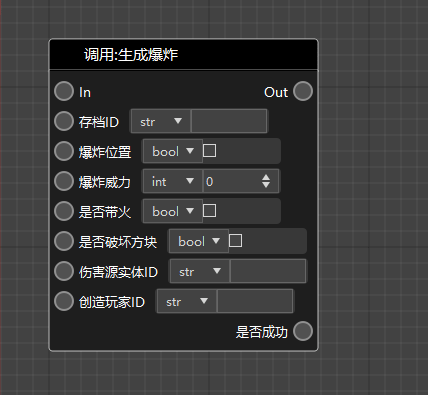

The logic editor involves the transfer of some data, as shown in the nodes in the picture above. These data have specified types, see the table below.

| Data Type | Description |
| :-----------: | :----------------------------------------------------------- |
| Boolean value (bool) | Boolean values have only two value conditions: "true" and "false". The values generated after relational judgment and logical operation are all Boolean values. |
| Integer (int) | For example, -2, 0, 100, etc. are all integers. |
| Floating point numbers (float) | Non-integers are represented by floating point numbers (this is a popular way of understanding). Most of the time, developers do not need to care whether the numbers in the game are integers or floating point numbers. |
| Strings (str) | The speeches and text prompts of players in the chat channel in the game are all strings. |
| Dictionaries (dict) | One-to-one mapping of data, such as players and their coordinates, can be represented by dictionaries, one player corresponds to one coordinate. |
| Lists (list) | A collection of one or more data, which can be repeated. For example, the player's xyz coordinates can be represented by a list. |
| Objects (object) | All types of data are an object. |

## Connections between nodes

There are two ways to connect between nodes, namely **execution connection** (orange) and **data connection** (blue).

**Execution connection** must be connected from the Out port of one node to the In port of the next node. It represents the execution order between nodes, starting from the first node and executing in the direction of the connection.

**Data connection** only represents the data transmission path, not the execution order of the nodes. The data types at both ends of the connection need to match. If they do not match, necessary type conversion needs to be added in the middle.

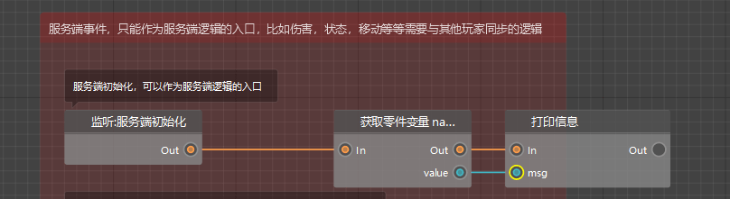

> **Note:**
> 1. Not all nodes need to have execution connections. For example, the addition (+) node only needs to use the data connection to pass in two values, and then pass them out with the right data connection. Where its addition logic is called, it will be executed there.
> 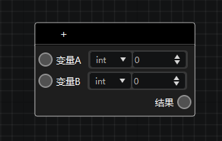
>
>2. Not every Out port needs to be connected with an execution connection. For example, the conditional node will determine whether the input Boolean value is true or false. If it is true, the logic of the "True" Out port will be executed; if it is false, the logic of the "False" Out port will be executed. If you only want to execute the logic when the Boolean value is true, but not perform any operation when it is false, you can leave the "False" Out port empty without connecting any wires.
> 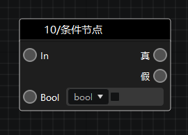

# Homework

Try to set the player immediate respawn rule of the world rule to true in the server initialization event.

## Operation steps

First, we want to achieve the effect of setting the world rules (GameRules) after the server initialization.

Then our node connection should start from the server initialization, and only call server-related interfaces.

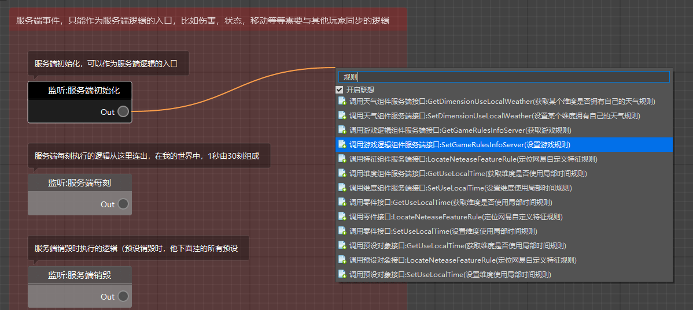

After the server initializes the node, we connect an execution connection, search for `rules` in the search box, select `SetGameRulesInfoServer (set game rules)`, and you can notice that this interface is marked as a server interface.


Next, we will go to the document to find the detailed parameter explanation of this node.

Document address: [click me](https://mc.163.com/dev/apidocs.html)

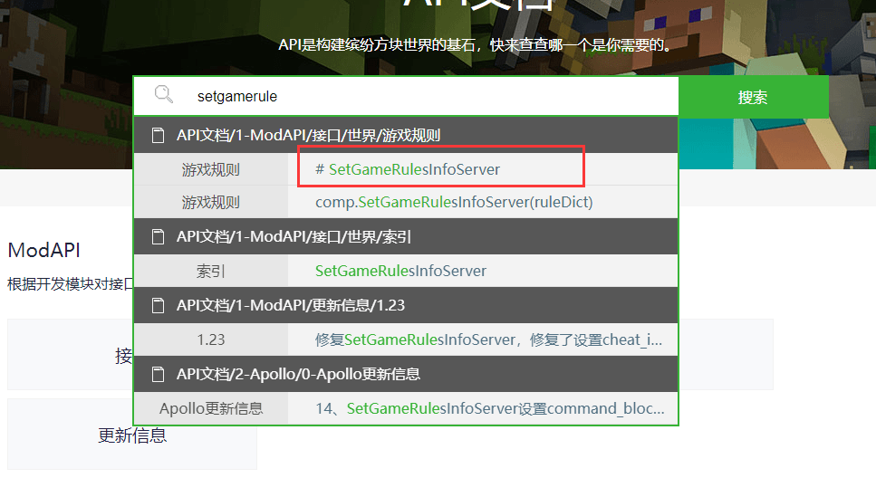

Search the English or Chinese related to this interface in the document to find the corresponding instructions.

> 1. If you are still not sure which node should be used to achieve the effect you want, you can first enter keywords in the document search box and browse related nodes. After finding it, you can copy the interface name, such as `SetGameRulesInfoServer` here, and then paste it into the node input box of the logic editor.
>
>2. In the node list of the logic editor, there are a lot of nodes for you to choose from under the category of [Built-in game nodes]. If you create a built-in game node but don't know its specific usage, you can hover the mouse over the node name. After a while, a tip will pop up with the document link corresponding to the node. Click the link directly to jump to the online document of the node.
>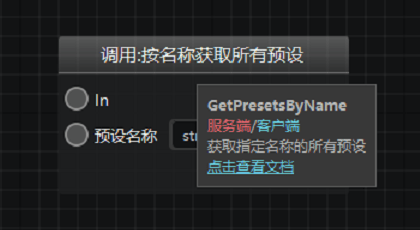

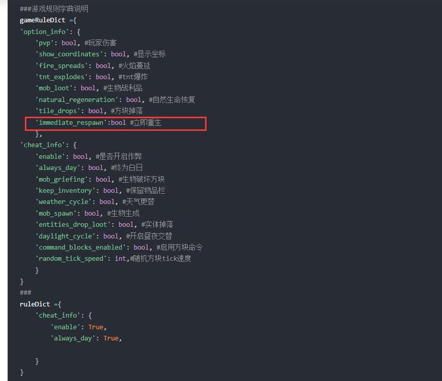

You can see examples and notes in the document.

> Each item in the game rule dictionary is an optional parameter, but after setting one of the sub-items of option_info or cheat_info, option_info or cheat_info must be added.

From the example, we learned the following information: If we need to set immediate rebirth to true, we first need to construct a **dictionary**, then set the **value** in the dictionary, and pass this dictionary** to the interface**.

After finding out how to write, we can right-click on the new node in the logic editor to construct a dictionary. It is not difficult to see that the game rule dictionary is a dictionary formed by two nested dictionaries. So we first search for `Construct dictionary` in the search box, and then fill in the corresponding parameters.

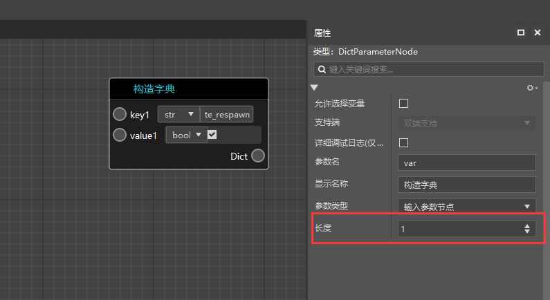

According to the instructions of the data type we learned, the key of the dictionary should be of str type and the value should be of bool type. In the dictionary, we select str at key1, fill in `immediate_respawn`, select bool for value1, and check it as true.

If we need to set multiple rules, we can modify the length of this dictionary in the property window on the right to generate multiple one-to-one corresponding keys and values.

Next, construct another dictionary, select str as key1, fill in `option_info`, and drag the Dict output of the previous dictionary to the value1 of the new dictionary for connection.

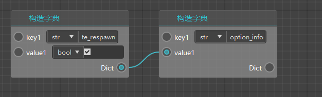

In this way, we get a dictionary, and its content is

```json
{
"option_info": {
"immediate_respawn": True
}
}
```

In this way, we have completed the construction of the game rule dictionary, find the `Set game rules` node, and need a parameter, which is the archive ID. The archive ID can be obtained through the following interface.

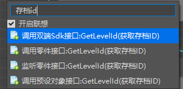

As you can see, this is a two-end interface, which means that both the server and the client can use it.


Now we have all the parameters we need, and we can connect them as shown below.

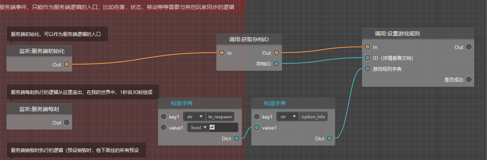

Then we can click "Save" and then "Run" to enter the game test and see if it will respawn immediately.
