# Basic Concepts of Logic Editor (2)

In the homework of the previous lesson, we have successfully listened to the server initialization event, called the interface for setting game rules, and constructed a dictionary to provide specific parameter settings for the game rules.

In this lesson, we will continue to introduce the concepts of event, interface, data structure setting and acquisition.

At the same time, we should also learn to consult the development documentation to understand the meaning of specific parameters.

The address of the document [click here](https://mc.163.com/dev/apidocs.html) will be often used in subsequent tutorials and actual development, it is recommended to collect it.

<iframe src="https://cc.163.com/act/m/daily/iframeplayer/?id=632865d66b13db499d094787" width="800" height="600" allow="fullscreen"/>

## Event

Events mainly serve as an entry point in computer programs. For example, the software we use has initialization events, closing events, minimization events, and so on.

Using the design of events, you can easily expand the program and let third-party programs listen to these events to make corresponding responses. Some events allow the event parameters to be modified midway and affect the final result.

In my world, such event design is also used to carry out secondary development of game content. We know that the program is executed in sequence, so the event is the starting point of a program segment. After an event is triggered, the program that listens to this event will be executed accordingly.

In the game, the player joining the game is an event. We can use this event to start executing the code related to loading player data. Similarly, the player placing/digging blocks is also an event. We can listen to this event to implement a gameplay similar to the lucky block. After the player digs a block, determine whether the block is a lucky block, perform subsequent randomization, and execute the code for related effects.

There are a huge number of events in my world, which are listed and introduced in detail in the document. We can use the document to find events that are helpful for our gameplay development and learn how to use them.

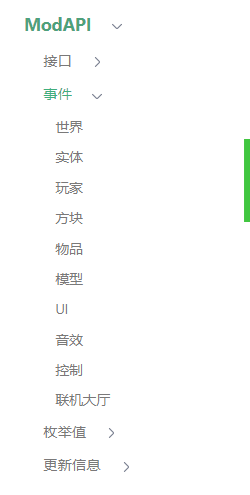

We open the document and can see many categories of events in the left navigation bar. For example, if we want to make a gameplay of lucky blocks, we need to use the event of block destruction. According to this logic, we can infer that this event may appear in the category of `player` or `block`. We can search in turn. Finally, in the `block` category, we find `ServerPlayerTryDestroyBlockEvent`. This event meets our needs and can be used as the entry point for the lucky block program.

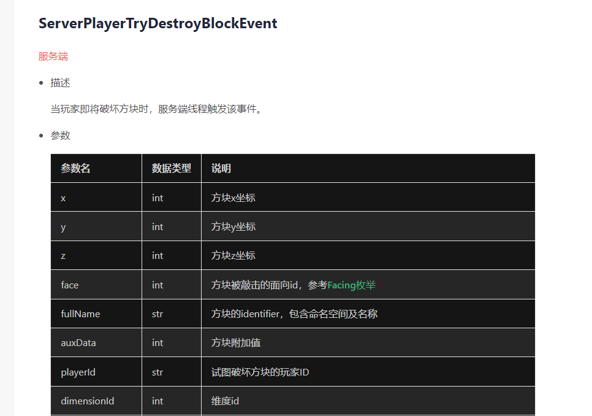

Events are also divided into "server events" and "client events". The `ServerPlayerTryDestroyBlockEvent` we need to use here is a server event. After listening, only the server logic can be executed.

Looking at its parameter list, we can see the corresponding parameter names and data types. These parameters may be used when we make judgments in the following program, so you can understand them first.

After finding the interface you need to use, you can create a node in the logic editor, search for `ServerPlayerTryDestroyBlockEvent`, and create a listener.

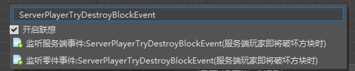

When searching, we will find that there are two events about to destroy blocks, one is `server event` and the other is `part event`.

Here we simply understand that: the part event will match the preset to which this blueprint part is attached, and the server event can be used under any preset.

- **Server Event**: If you want to execute some logic from the listener node when any block in the current scene is destroyed by any player, then you should use "Listen Server Event".

- **Part Event**: Part events are only used for preset architecture. If you use entity preset/player preset and hook your blueprint parts under this preset, then if you use part events, only when the block is destroyed will this event be listened to and subsequent logic executed.

In general, it is recommended to use part events.

## Interface

Interface refers to the function reserved by the program for other third parties to call. Usually we only need to understand the effect and the parameters passed in after the interface is called, and we don’t need to know what processing will be done inside the function to achieve this effect.

For example, in the interface for setting game rules used in the previous section, we only need to know that after executing the interface, the game rules will be changed, and we don’t need to know how the game rules are made effective inside the game.

All available interfaces can also be found in the document. We can locate the possible location of the interface document by roughly classifying it and search in depth.

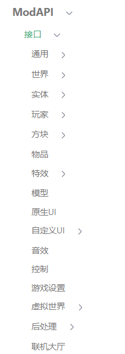

For example, if we need to damage the player, then we can easily see that this interface is related to `player` and `entity`, and we can search in these categories.

Or we can use the search box to find the interface we need to use more quickly.

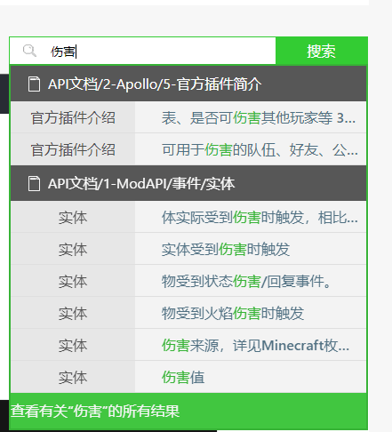

The interface we need can be found in all results.

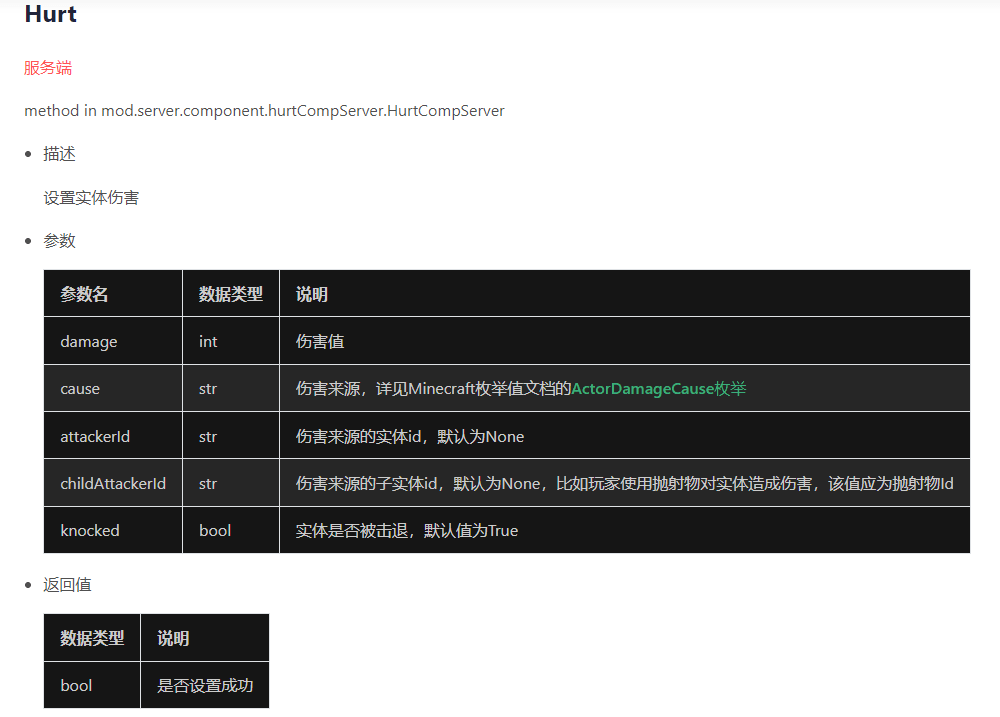

You can easily find the interface we want to use, and see its related parameter explanations and return values.

After the search is completed, we can return to the editor, search for `Hurt`, find this interface, and create a node for use.

However, it should be noted that operations such as `Player destroys blocks` have both events and interfaces.

If we call the `Player destroys blocks interface` in the `Player destroys blocks event`, the `Player destroys blocks event` will be triggered again, and the loop will continue.

In development, we should consider the possibility of such an infinite loop and add restrictions, such as setting a list, adding the player's entity ID to the list, and before calling the `Player destroys blocks interface`, determine whether the player's entity ID is in this list, and after the destruction is completed, remove the player's entity ID from the list to avoid an infinite loop.

Then this involves the acquisition and setting of data structures.

## Get and set data structure

Data structure can be used to manage data more efficiently and orderly. In the development of logic editor, there are two main data structures that can be used, namely list and dictionary.

### List

List is the list in Python. In the logic editor, you can find `Construct list` to generate an empty list.

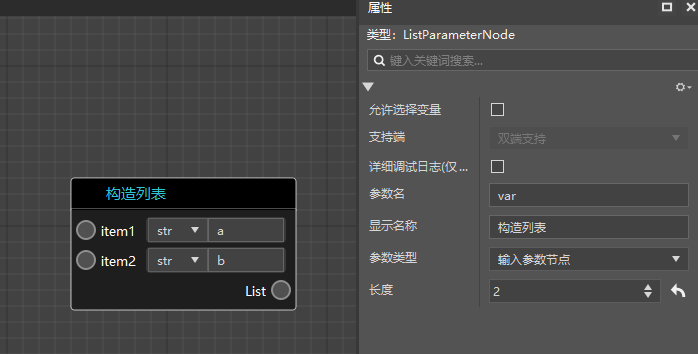

The item in the list represents its element. After selecting the construct list node, you can modify its length in the property panel on the right.

Each element has its corresponding index position, which starts from 0. For example, in the list above, the element at position 0 is "a" and the element at position 1 is "b".

So how do we get the element at a certain index position in the list? We can use the "Get Attribute" node.

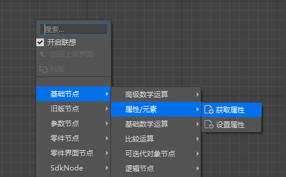

Connect the List port to the object port and fill in the index value to be obtained at the key. For example, in the figure below, the value obtained is "a".

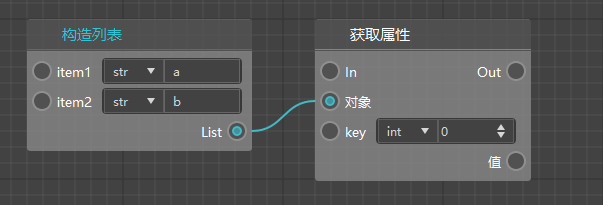

If we need to get all the elements in the list, we can use the `loop traversal node`. There are two types of traversal nodes, namely `conditional loop traversal node` and `sequential loop traversal node`. Here is just a simple example, which will be introduced in detail in the next section.

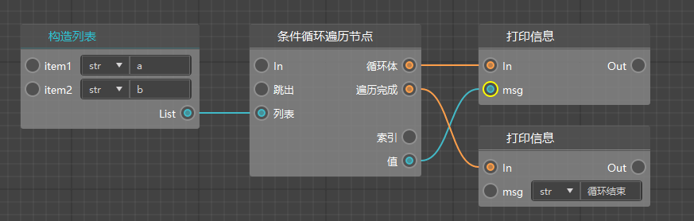

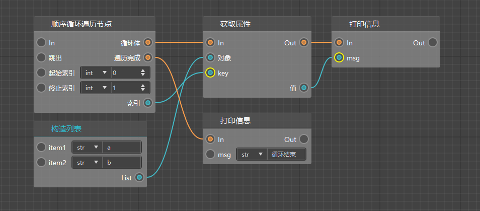

You can choose to use it according to your needs.

### Dictionary

A dictionary is a data structure that can be used to store one-to-one corresponding data. Each pair of elements in the dictionary has a key and a value, which are one-to-one corresponding. The corresponding value can be found by the key, but the key cannot be found by the value.

For example, if you need to store the experience value of all players, the key of the dictionary can be the player ID, and the value can be the player's experience value.

It should be noted that a key in a dictionary can only correspond to one value.

In the editor, use `Construct Dictionary` to create it, and you can also modify the length in the property window on the right. Of course, you can also set the length to 0 to construct an empty dictionary.

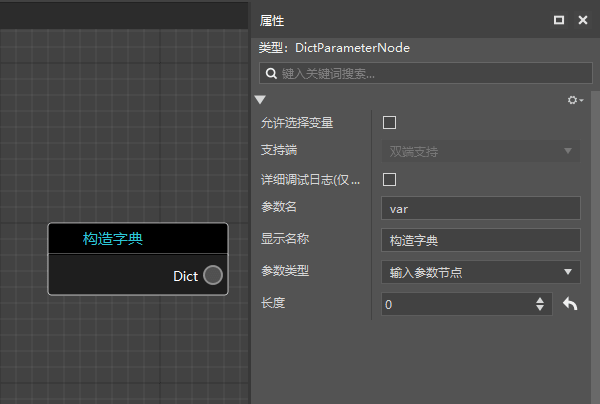

The values in the dictionary can still be obtained and modified by setting/getting properties like a list.

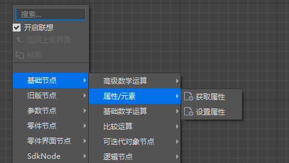

For example, the following operation can set the value of "b" to 2 and get the value of a.

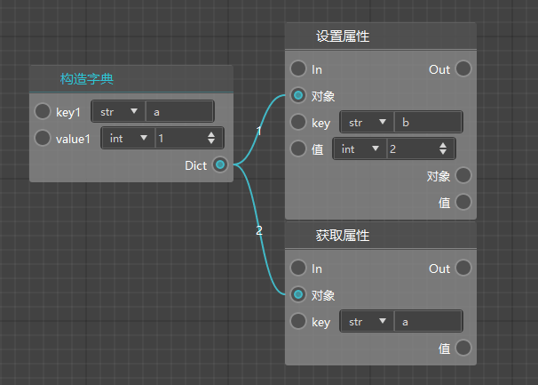

## Homework

In the event of an entity being damaged, return the damage to the attacker.

### Operation steps

If you follow the steps in the course, we have now created a blueprint part and attached it to the player preset.

Then we can listen to the part event of the `Entity Damage Event` here.

Then create an interface of `Set Entity Damage`. We can know from observing the document that the entity to be damaged, the damage value, and the damage source entity are the parameters we need to fill in.

First, connect the nodes as shown below to determine who attacks whom after being injured.

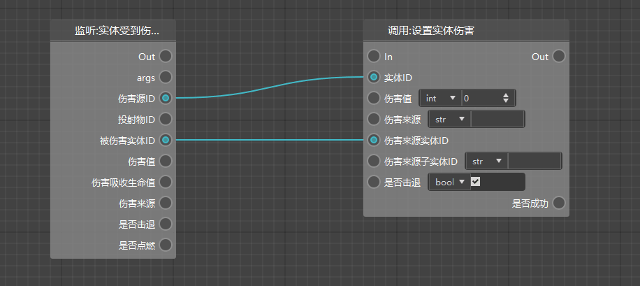

Then we need to fill in the damage value and pass it directly to the entity damage setting interface. Then connect the execution line.

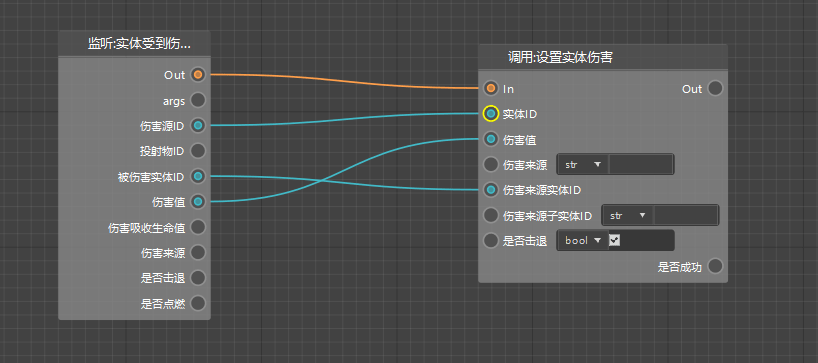

In this way, we have completed a simple function of returning attack damage. However, such a node will generate an error in some cases, such as when the player is injured by falling.

Falling damage does not have a damage source ID, so it needs to be judged before returning the damage. The judgment node will be introduced later.

