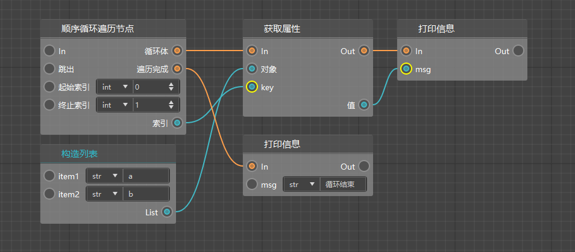

# Basic Concepts of Logic Editor (3)

This section will focus on two very important logic functions in the logic editor: judgment logic and loop logic.

I believe that in the previous logic production, everyone has encountered many places where logical judgment and looping are required. In this section, we will introduce how to use these nodes.

<iframe src="https://cc.163.com/act/m/daily/iframeplayer/?id=63286619a240f794f8c5fbaf" width="800" height="600" allow="fullscreen"/>

## Judgment Logic

The logic editor has many nodes that can be used for judgment. The figure below lists all the nodes that can be used for logical judgment in `Old Version Nodes`.


Similarly, in the basic nodes, there are also many nodes that can be used for judgment.


Here we simply create a Boolean value judgment in the `Comparison Operation` to illustrate.


Such a Boolean value judgment node will judge the value of the input variable. If it is `true`, it will continue to execute from the = port. If it is `false`, it will continue to execute from the != port.


Similarly, there is a string comparison node. We can enter two string variables in this node to judge their size. Strings can not only judge whether they are equal, but also judge whether they are greater than or less than. The judgment basis for greater than or less than is the index position in the encoding corresponding to the string. For example, "a" is represented as `\u0061` in unicode, and "b" is represented as `\u0062` in unicode. The corresponding decimals are 91 and 92 respectively, so 91<92, that is, a<b. If you don't know computer coding, it may be difficult to understand the judgment of greater than or less than. It is recommended that you can directly regard the ports of < and > as not equal.

## Loop logic

Using loops, we can easily retrieve all elements from an object that stores multiple elements in the program.

In the previous section, we have introduced the creation and use of lists (List) and dictionaries (Dict), and also introduced that loops can be used to retrieve all their contents.

In the development of the logic editor, there are two main loop nodes that can be used, namely `conditional loop traversal node` and `sequential loop traversal node`.

### Conditional loop traversal node

First, we can observe the input and output ports of this node.


It has three input ports: `In`, `Break`, and `List`, and four output ports: `loop body`, `loop completion`, `index`, and `value`.

#### Loop body


For the content of each loop, if the input list is ["a", "b"] as shown in the figure above, after entering the loop, the loop body will be executed twice, and the values "a" and "b" will be printed respectively.

#### Traversal completed

After the entire loop is completed, the program will continue to execute from the traversal completion port.

#### Index

The index value of each loop in the traversal, if it is a list, it starts from 0; if it is a dictionary, it is the key of the dictionary.

#### Value

The value of each loop in the traversal, if it is a list, it is the item of the list; if it is a dictionary, it is the value of the dictionary.

#### In

Like the In port of all nodes, when the In port of this port is connected, after the previous node of it is finished running, it will run to the conditional loop traversal node.

#### Jump out

When a condition is met in the loop and you want to terminate the loop immediately, you can connect the execution line to the jump out port. Then the loop will terminate immediately and continue to execute the node after the traversal is completed.


For example, in the loop structure above, there is a list ["a", "b", "c"]. Each time in the loop body, it will determine whether the value of the element is equal to "b". If they are equal, it will jump out of the loop, otherwise it will print information.

Then the final running result of the above string of nodes should be:

```
a
End of loop
```

#### List

The object to be looped can be a list, a dictionary, or some other iterable object.

### Sequential loop traversal node

Although sequential loops and conditional loops are both loops, they are slightly different.



As shown in the figure above, the loop node will start looping from the starting index. Each loop executes the contents in the loop body. After the loop body is executed, the index value will be +1 and the loop body will continue to execute. Until the index value > the end index, the content after the traversal is completed will be executed.

The main difference between it and the conditional loop node is that the conditional loop can only loop in iterable objects such as lists or dictionaries, while the sequential loop traversal node does not rely on these objects to loop. The other usages are basically the same.

For example, if you need to write a logic to print numbers from 5 to 10, you can set the actual index to 5 and the end index to 10, and then print the value. Just like the figure below.


## Homework

1. In the event of entity being damaged, the damage will be returned to the attacker only when the attacker is judged to be a player and holding a diamond sword.

2. In the event of entity being damaged, the attacker will be judged to be a player and holding a diamond sword, and random items will be dropped according to the item list.

The homework for this lesson can be modified based on the homework in the previous lesson. First of all, it can be determined that both requirements require the attacker to be judged to be a player and holding a diamond sword.

Then we can first find the interface to get the item in the player's hand in the interface, and then get the item's id to determine whether it is a diamond sword.

- Search for `GetEngineTypeStr`, create a part interface to get the entity type, connect its entity ID and damage source ID, and determine whether the entity type is `minecraft:player`.
- Search for `GetPlayerItem`, create a component interface for getting player items, and determine whether the newItemName of the item information dictionary is `minecraft:diamond_sword`.

The data format in the item information dictionary can be found in the <a href="../../../../mcguide/20-Gameplay Development/10-Basic Concepts/1-My World Basic Concepts.html#Item Information Dictionary">Document</a>. You can also print the item dictionary information yourself and find the item name of the item you want to determine in the log window.

At the node where the player item is obtained, according to the <a href="../../../../mcdocs/1-ModAPI/Interface/Player/Backpack.html?key=GetPlayerItem&docindex=1&type=0">Document</a>, the item position is an enumeration of the player item position. We can create an enumeration object and then change it to the main hand in the right property.


Now we have obtained the item information in the player's hand. We get newItemName from the dictionary to determine whether it is `minecraft:diamond_sword`.


In this way, we can filter out the players who use diamond swords to attack and return damage. Next, we will continue to complete the generation of drops. Here we directly use the generated item drop interface.


At the same time, to randomly extract drops, we also need to construct a list to store the list of items that need to be randomized. Here we construct a list of 2 lengths, which first stores the item names of diamonds and iron ingots. `minecraft:diamond` and `minecraft:iron_ingot`. Next, we need to randomly extract them.


Random extraction requires the use of a random function to extract a number from 0 to the list length - 1, and then obtain the value of the list index corresponding to this number. Or for convenience, we can also use the shuffle function of the built-in python interface to shuffle the list and obtain the 0th element. Then construct a dictionary. According to the format of the item dictionary, we must fill in the values of `newItemName`, `newAuxValue`, and `count`.


In this way, we have obtained a random item information dictionary, and then we need to generate it to the position of the attacked entity.

Create a part interface node for generating item drops. You can see that we also need the dimension id and the generation position. By consulting the document, we can know that the dimension id is the id of the dimension where the entity is located, and the generation position is used to locate the generation coordinates. They can all be obtained through the part interface.


The entity IDs in the above picture are all connected to the damaged entity IDs. In this way, we have completed the generation of random drops.

We connect the first In node to the entity damage setting, and let it execute after setting the damage.


In this way, we have completed the connection of all nodes. You can enter the game to test the effect!
