# Basic Concepts of Logic Editor (4)

After learning to use the various component interfaces and SDK interfaces provided by the official, we can now try to customize an interface ourselves.

<iframe src="https://cc.163.com/act/m/daily/iframeplayer/?id=6328664ee6c041f2578ca804" width="800" height="600" allow="fullscreen"/>

## What is a custom interface

In large-scale gameplay development, we will find that sometimes many places need to call the same function and execute almost the same logic nodes except for the parameters. Then the custom interface can solve this problem well. We can customize an interface and define the logic nodes executed inside the interface. And call it freely. This can greatly simplify our logic code.

## Define a custom interface

In the logic editor, we can see the custom interface column on the left. Here you can create a custom interface.

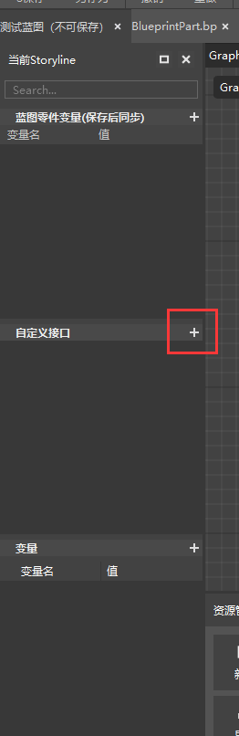

Click the plus sign on the right side of the custom interface to create a custom interface. Then modify its name. Here we change it to `f_test`. Note that the custom interface must start with `f_`.

And you can see `Graph > f_test` at the top, which represents the interface we are editing.

Click Graph to return to the original editing interface. Double-click `f_test` in the custom interface on the left to return to the editing of this custom interface.

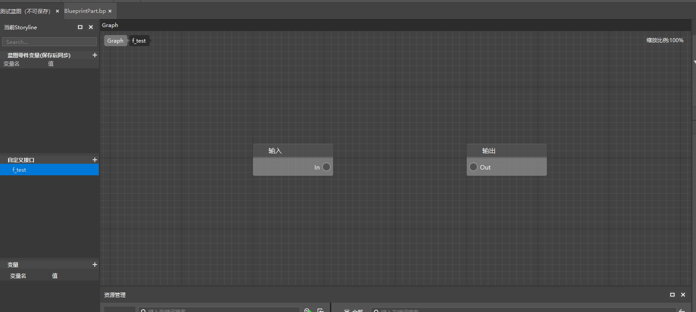

We can write the logic we need here, starting from the input of In and executing until the output of Out, and then exit the custom function.

The custom function must have a complete execution line from In to Out, otherwise it will not work properly.

For example, we loop here to print from 1 to 100, and then link the output.

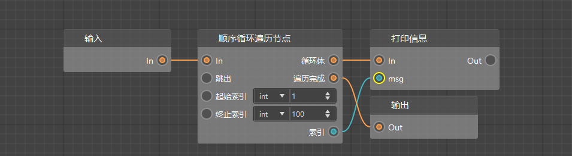

This completes the editing of the custom interface. We return to the Graph interface.

You can select `f_test` from the custom interface on the left and drag it to the editing interface to create a node to call our custom interface. Then we connect it to the server for initialization and execute it to view the output effect in the log window.

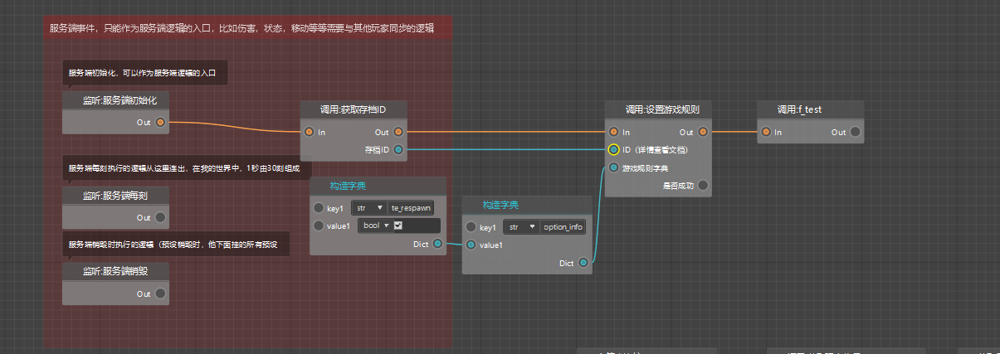

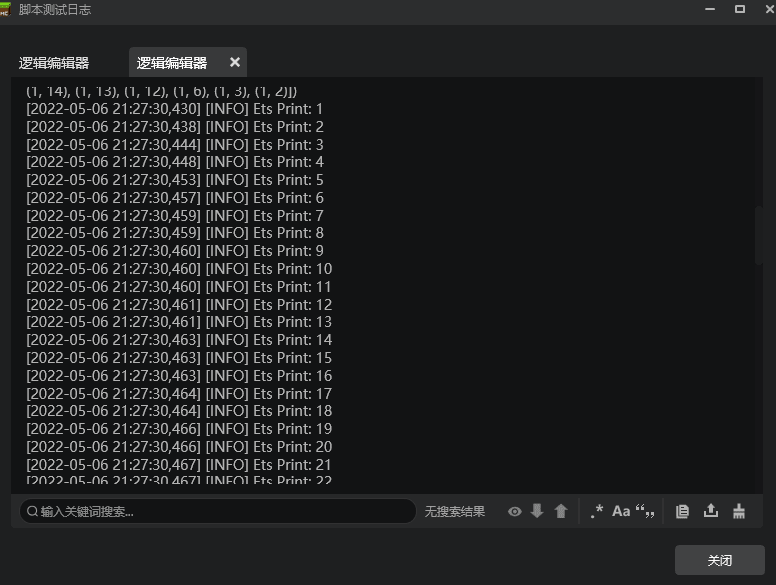

You can see that it prints from 1 to 100 as expected.

## Custom interface parameters

If the custom interface can only encapsulate a part of the nodes into an interface and call it, as we just did, it will be very rigid because the values are fixed.

In this case, we can create a parameter for it. When calling this interface externally, we can bring the parameter into the interface, which can greatly improve the practicality of this interface.

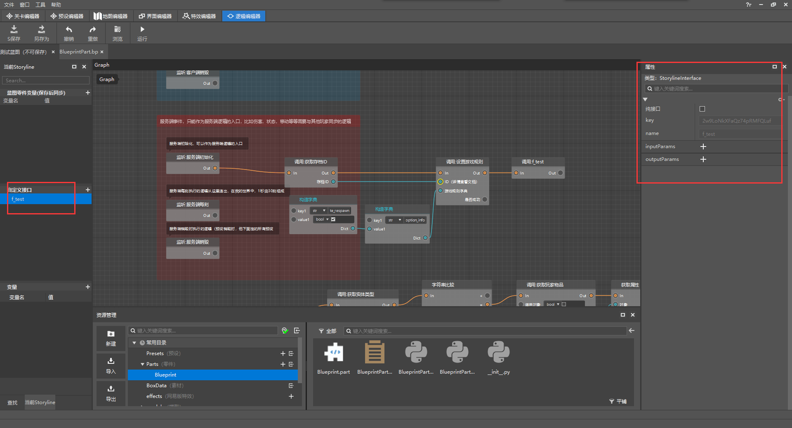

After selecting the custom interface to be edited in the left custom interface, the corresponding configuration will appear in the right property panel. You can see that there is an `inputParams` column and an `outputParams` column.

We can add input and output parameters here to let it pass in some values before running and pass out some values after running.

If it is still the custom interface of the loop just now, we want to pass in parameters to specify how many it loops from 1 to, we can add a `inputParams` and click the plus sign to add.

If we also need this interface to pass back a certain operation result, we can also add an `outputParams` as the return value.

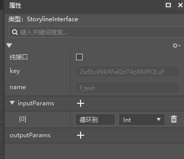

We first add an input parameter here, define its name as `loop to`, type as `int`, and then return to the custom interface editing again. You can see that the input node has an additional loop to port, and we can pass it the corresponding parameters to achieve the desired effect.

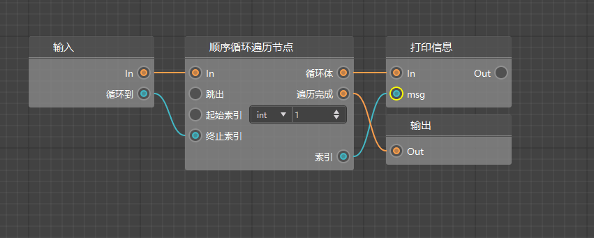

In this way, we can define how many times to loop outside the custom interface. Now you can enter the number you need to loop to.

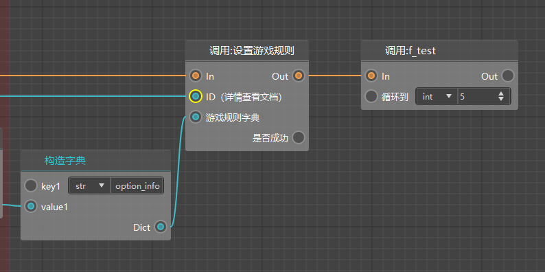

## Python module

In addition to the interfaces already provided by the logic editor, we can also directly call Python's built-in modules to achieve more powerful functions.

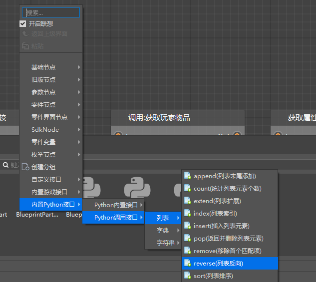

Careful students may have discovered that in our editor, there is also a category of built-in Python interfaces, where you can call some interfaces provided by Python, such as tool functions for lists and dictionaries.

For specific usage methods, please refer to Python's function documentation.

## Homework

In the event of `Entity is damaged`, use the custom interface to define the three parameters of `Entity identifier`, `Handheld item name`, and `Item list`, and re-implement the logic that the attack entity will randomly drop items in the item list`.

### Operation steps

First, we need to create a new custom interface, called `f_dropRandomItem`, and define 3 input parameters for it. The type of the item list should be list, but there is no list here, so select Any to represent any.

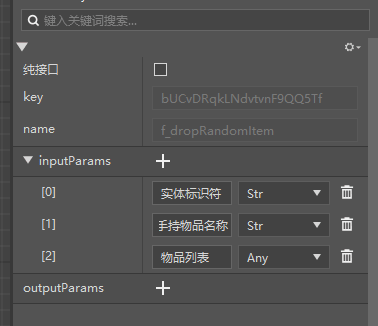

Next, we can copy some of the previously written logic nodes to the custom interface. Then adjust its connection. The final effect is as follows:

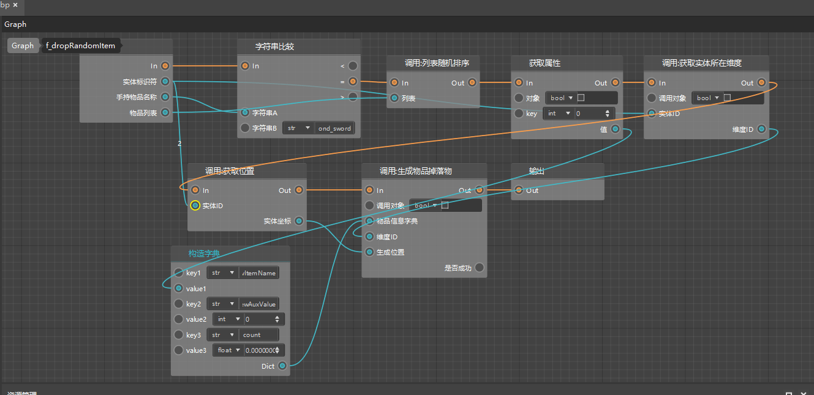

After completing the configuration, return to the Graph and directly replace the logic node for randomly generating dropped items with a call to the custom interface.

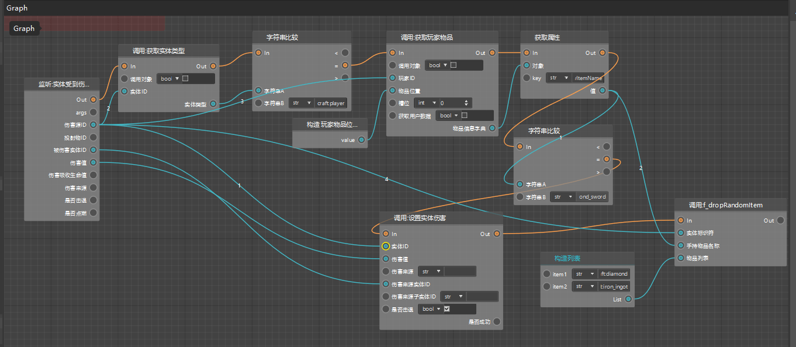