# Basic concepts of logic editor (5)

So far, we have basically introduced all the basic concepts of logic editor. This section will continue to introduce some comprehensive knowledge.

<iframe src="https://cc.163.com/act/m/daily/iframeplayer/?id=63286681a240f794f8c5fbb7" width="800" height="600" allow="fullscreen"/>

## Part nodes and SDK nodes

I believe that in the previous learning process, everyone has noticed that many interfaces or events have both part nodes and SDK nodes.

If it is an interface or event that only has a part node or SDK, we can directly use this SDK or part node.

So when a certain interface or event has both a part node and an SDK node, how should we choose?

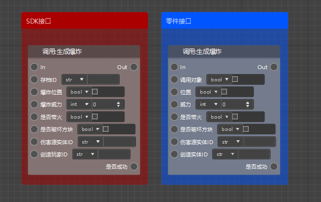

The above pictures are also explosion generation interfaces, but the left side is the SDK interface and the right side is the part interface.

It can be clearly seen that except for the first parameter, all other parameters are the same. The first parameter of the SDK interface is the archive ID, which needs to be obtained by calling the `GetLevelId` interface, while the first parameter of the part interface is the calling object, which can be left blank.

Then it can be easily seen from the node of the interface that the SDK interface needs to pass in an additional archive ID parameter, while the part interface does not need it. Obviously, the part interface is more convenient.

For events, the SDK interface and the part interface are basically the same, except that the use of the part event needs to match the type of the preset it is attached to, otherwise it may not work properly.

## Non-empty preset and empty preset

In all the content before this chapter, we attached the blueprint part to a specific preset, that is, a non-empty preset. For example, the event of monitoring entity injury that we made before is to attach a blueprint part to the player preset.

However, there is actually a special preset in the preset category, that is, the empty preset.

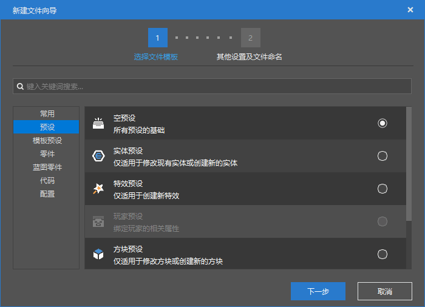

The empty preset is not linked to any in-game elements such as entities and blocks. Directly creating an empty preset and mounting blueprint parts will not work.

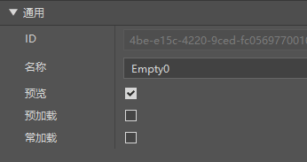

Only when you check the preload in the properties of the empty preset will this preset take effect, at the position (0,100,0). For specific instructions, you can move the mouse to the preload label to view.

If you check the constant load, the preset will not be unloaded when the block is unloaded.

Generally speaking, if you make some common blueprint parts, you can mount blueprint parts on the empty preset, check preload and constant load, and implement the required functions by listening to SDK events.

## Homework

Now I believe that you have basically understood the basic usage of the logic editor, so now try to use the logic editor and preset functions to make a complete gameplay function!

**Assignment requirements:**

Use the editor of the developer workbench to create a lucky block gameplay

### Operation steps

First, create a blank add-on package. In the menu bar of the level editor, find the work and change the namespace to `luckyblock`, so that our mod name is no longer random characters, and it is also easier to identify if the player uses the command to give the item.

Next, we create a new block configuration, named `luckyblock`, and select the glowing ordinary block as the data template.

Draw a lucky block texture yourself, or save the lowered texture and copy it to `textures/blocks`.

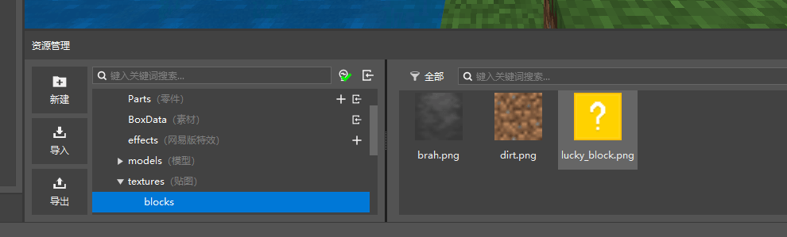

Then set some related properties, as shown in the figure after setting.

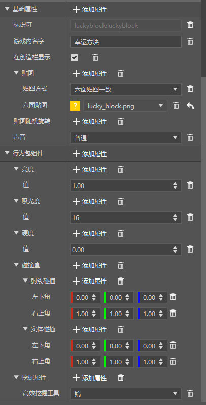

So we have a glowing lucky block that can be mined and dropped normally. But it has no actual function yet.

Next, we create a player preset, and create and mount a blueprint part named `LuckyBlock`.

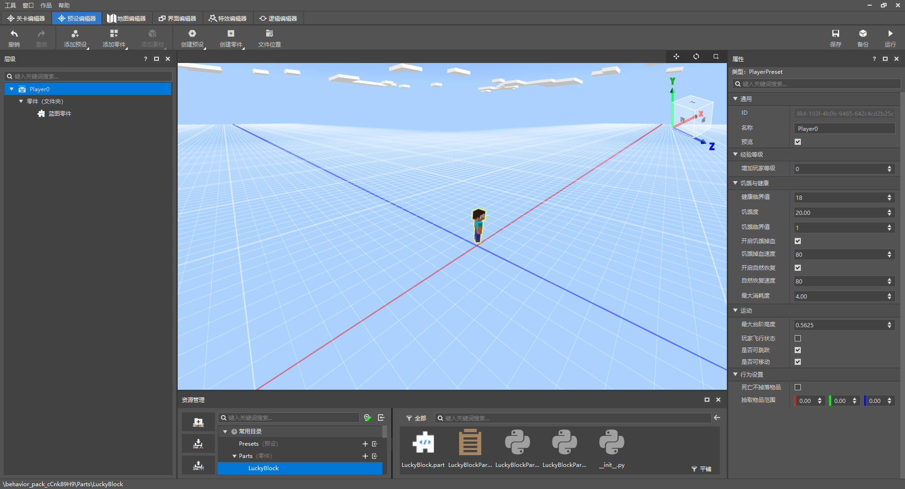

Next, open the blueprint logic of `LuckyBlockPart`. We need to listen to the event of the block being destroyed, determine whether it is a lucky block, cancel the generation of dropped objects, and then trigger a random event.

Listen to the `ServerPlayerTryDestroyBlockEvent` part event, and compare the block identifier with `luckyblock:luckyblock`. If `=`, proceed to the next step and set `spawnResources` in args to False

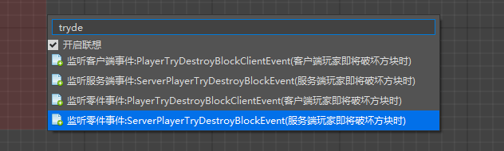

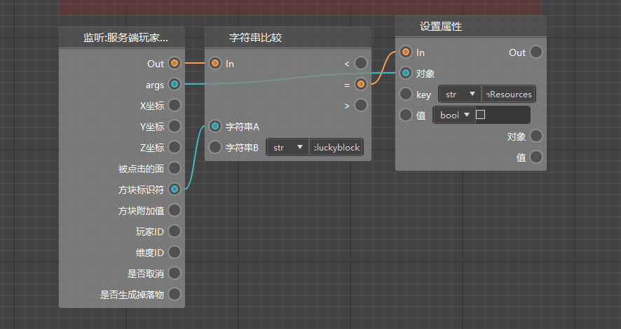

Next is the randomness of the event. Here we simply make a random creature. To randomly generate creatures, we should first have a random list of creature identifiers.

First, in the variable window on the left, we create a `randomList` variable and define it as our random list of creatures.

And assign it a value when the server is initialized.

In the list, we give 3 values here, `minecraft:zombie`, `minecraft:skeleton`, `minecraft:creeper`, representing 3 kinds of monsters.

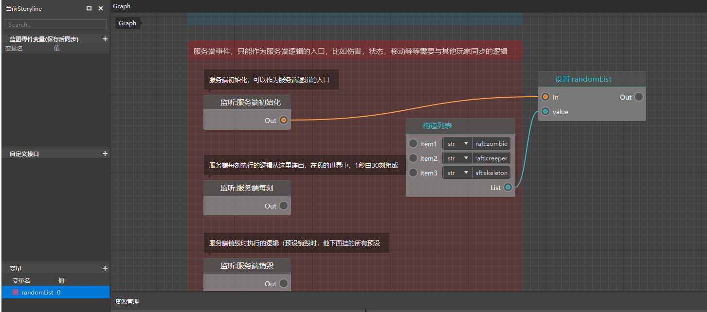

Next, get the variable randomList, and then according to its maximum length, randomly take an integer value of [0, quantity), get the attribute in randomList, so that you can get a random entity id.

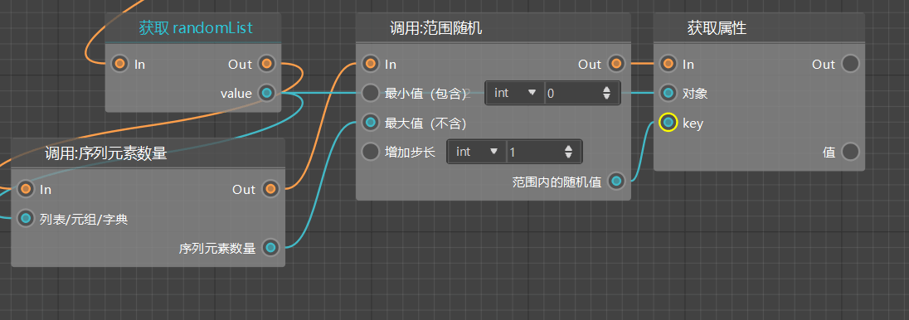

Next, create an entity by type, and the entity type is the value we get randomly.

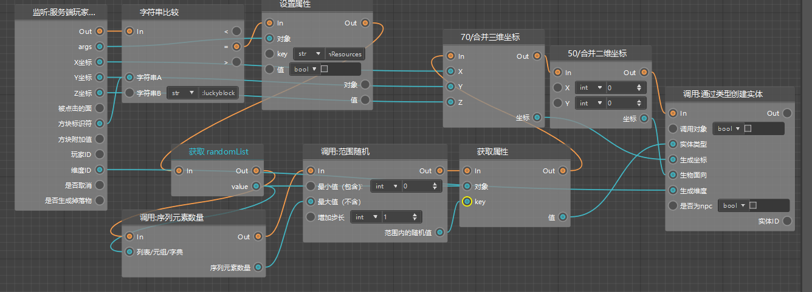

Finally, pass the data, generate coordinates, and obtain the latitude ID through the event parameters, and generate a two-dimensional coordinate with a direction of 0 0.

In this way, we have completed a random block that can randomly refresh creatures, so more random events can be explored by everyone.

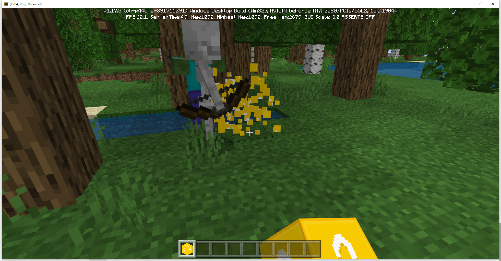