# Interface creation and logic writing

This section will introduce how to use the interface editor, logic editor, and preset editor to create an interface.

<iframe src="https://cc.163.com/act/m/daily/iframeplayer/?id=63286c08e6c041f2578ca84e" width="800" height="600" allow="fullscreen"/>

## Interface drawing

First, let's learn how to use the interface editor. After switching to the interface editor, we first need to create an interface before editing it.

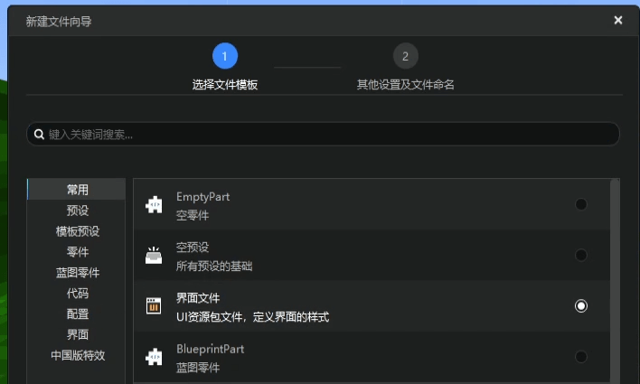

In the resource management, create a new interface and name it `Team name_Interface name` to prevent conflicts. Here we call it `soldier_screen`.

In this way, we select the interface we just created and start editing. The toolbar above the interface contains some buttons that can quickly create interface controls.

Click these buttons to create a new control under the selected structure.

The parent-child relationship of the controls in the current interface is shown on the left, and you can see that a main control has been created by default. This is a canvas and the root control of an interface.

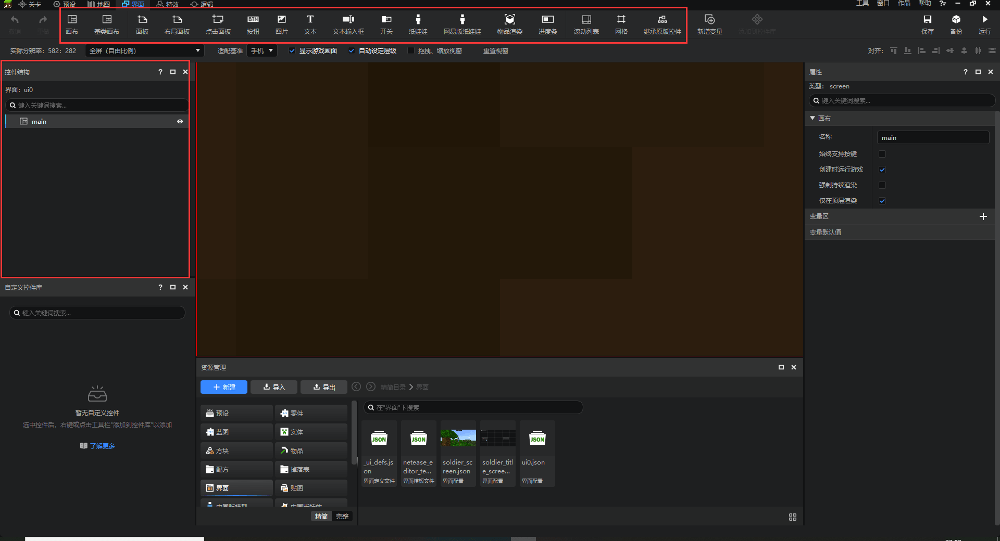

Next, let's try to make a simple interface that displays the player's real-time coordinates.

For example, now we click the panel button above to create a control called `main_panel` under `main`.

Then change its parent-child anchor point to the lower right corner, so that you can see the red outline of the panel, which is fixed to the lower right corner of the interface.

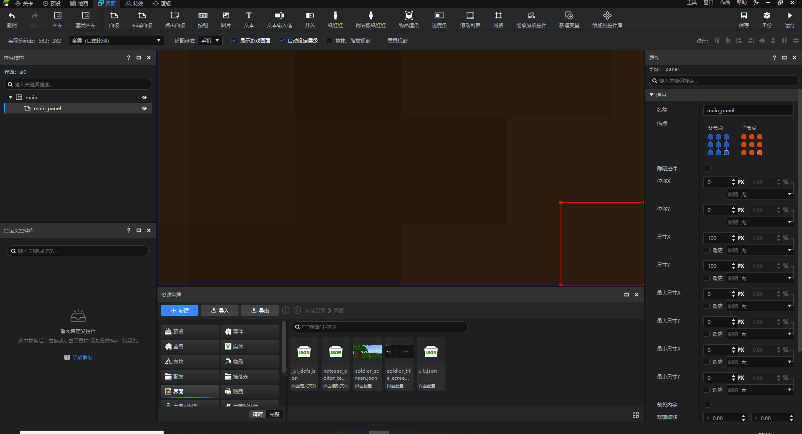

Correspondingly, the property panel can also set its displacement coordinates and size.

For example, here we change the displacement X to `-10+parent control size X*1%`, and the displacement Y to `parent control size Y*-1%`. Size Y is changed to 20.

As you can see, the size controls the size of this control. Currently, the red box is a 100x20 rectangle.

The displacement controls its offset value relative to the anchor point position. Using the follow parent control, you can set it based on percentage, so that the interface can be better adapted when the resolution is different.

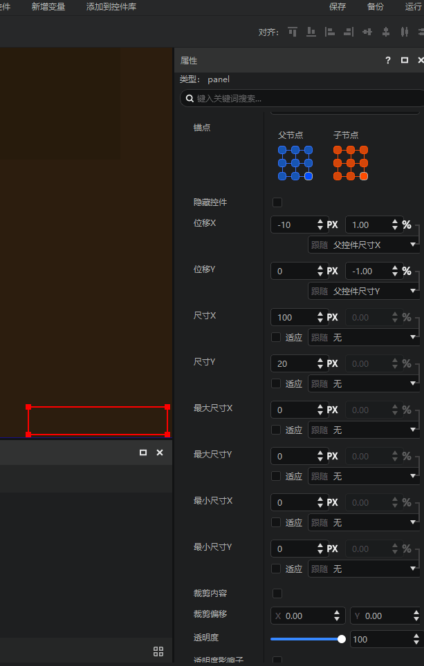

At the same time, the resolution selection box above the game interface can select the aspect ratio of the preview. We select `21:9` here. You can see that the displacement X and Y are offset by 1% based on the parent control (currently the entire screen).

From this, it can be seen that using the relative position of percentage for layout can easily adapt the position of the interface when the screen resolution is different, without the situation where the interface layout is messed up due to the change of resolution.

> Although the percentage-based layout seems convenient, it is actually a value calculated according to the resolution of the player's screen when the interface is initialized.

>
> When the window size is adjusted and the resolution changes dynamically during the PC game, the layout will be messed up. This requires developers to compare and choose the one that is more suitable for their own use.

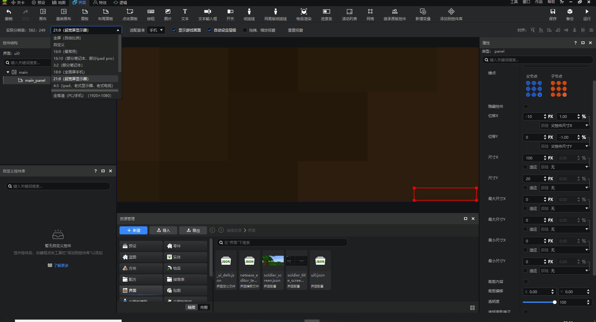

After setting the position, we can add an image to this panel as the background.

After selecting the `main_panel` control, click the image button to create a new image.

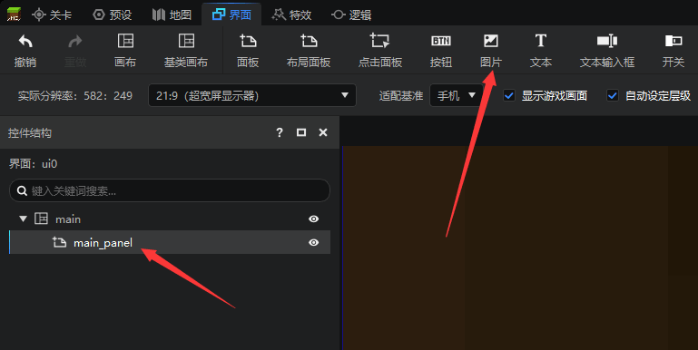

And check the size X and size Y to adapt. This way, the image can completely fill its parent container, that is, the `main_panel` panel.

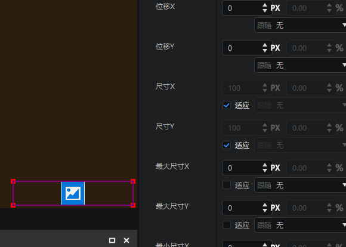

Next, we can replace the image resource used by this image control and use an original image resource. Click the folder button on the right and select the image `./ui/effect_background.png`

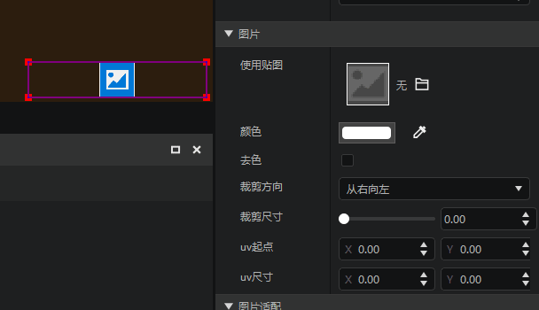

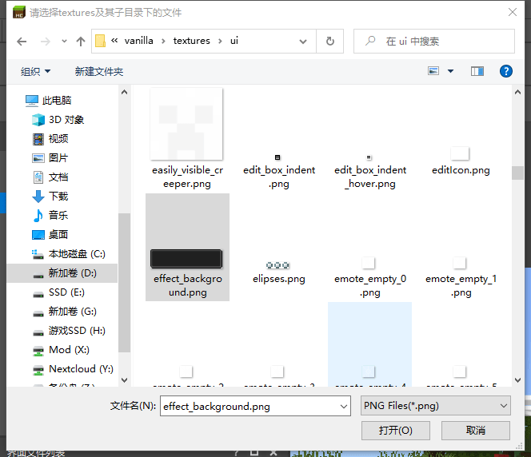

In this way, we have successfully replaced this image with the background image of the potion effect. This is an original nine-grid resource. If you draw the image interface yourself, it is recommended to ask art students to draw the nine-grid resource. For specific rules, [click me](https://mc.163.com/dev/mcmanual/mc-dev/mcguide/16-%E7%BE%8E%E6%9C%AF/50-%E8%B4%B4%E5%9B%BE%E8%A7%84%E8%8C%83%E5%8F%8A%E4%B9%9D%E5%AE%AB%E6%A0%BC%E4%BD%BF%E7%94%A8.html).

Next, we can continue to create a text control under `main_panel`, with the same size X and size Y, and rename it to `pos_text`.

It should be noted that the names of all the controls we have created are for easier finding by their names when writing logic later.

For example, the path of our current text control should be `/main_panel/pos_text`. Later, we can use the logic editor to find it through the logic node and modify its value.

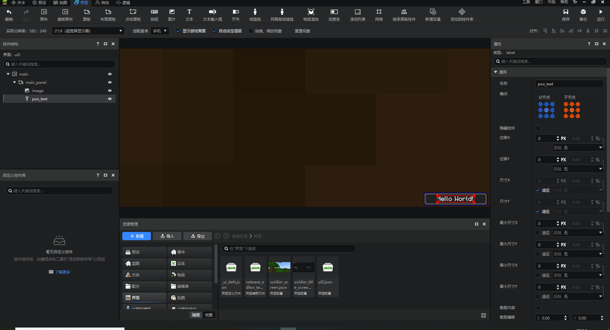

## Create a preset

After drawing the interface, we need to go to the preset editor and create an interface preset.

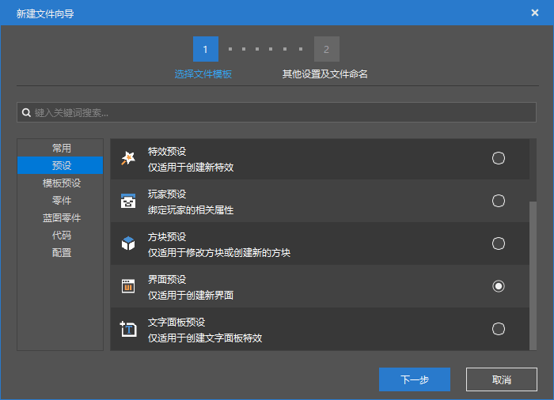

The first file name is called `PosUI` here. It needs to be unique. It will be used as an identifier for creating this interface.

At the same time, there is a file name at the bottom, which is the control file name of the corresponding interface. It also needs to be unique for each interface.

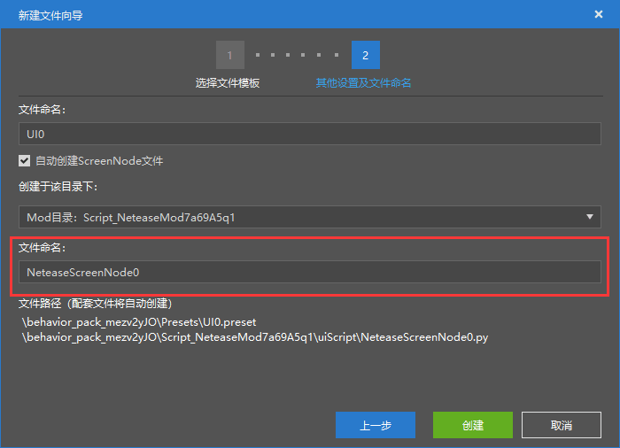

After the preset is created, you can see that the interface we edited before has been automatically checked in the interface. If not, you can select it yourself in the `bound interface canvas`.

In the property window, the main thing to pay attention to is the box selected below.

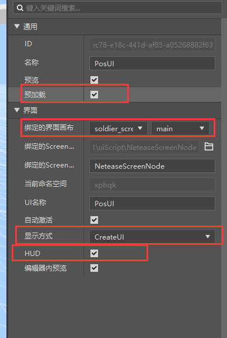

### Preload

Preload **must be checked**, only when preload is checked, this interface will be displayed.

### Bound interface canvas

Select the interface file and the corresponding canvas in the interface editor, the canvas is usually main.

### Display mode

<iframe src="https://cc.163.com/act/m/daily/iframeplayer/?id=63286681a240f794f8c5fbb7" width="800" height="600" allow="fullscreen"/>

#### CreateUI

The interface created using CreateUI will be directly superimposed on the player's game interface.

Generally suitable for creating HUD.

#### PushScreen

The interface created using PushScreen will create an interface in the form of a stack, and only this interface will be displayed in the game, and interfaces such as inventory and operation buttons will not be displayed. And the mouse will be automatically called out when called on the PC side.

Generally suitable for creating separate operation interfaces such as boxes and furnaces.

### Hud

If Hud is checked, the interface will float in the game window and will not affect the actual interaction of the game.

For example, the health bar, satiety, and inventory interface in the original version are all Hud.

### Logic Writing

After completing the configuration, our interface can be displayed normally after entering the game.

Next, we need to create a blueprint UI part to write logic for this interface.

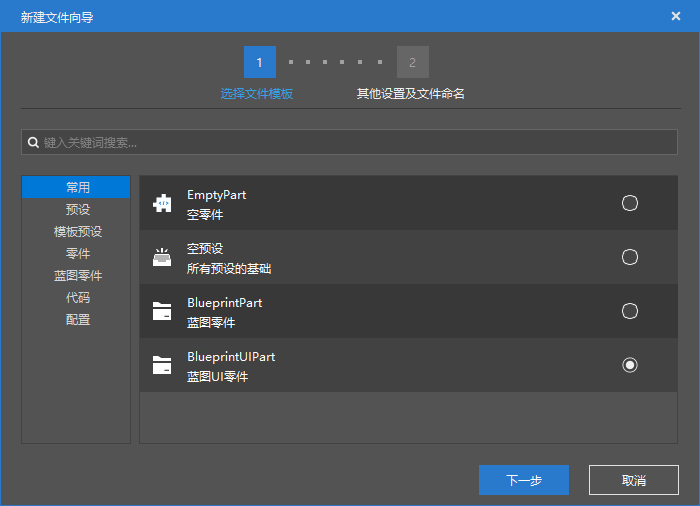

Similarly, attach the newly created part to the interface preset. Then double-click the logic file to open the logic editor.

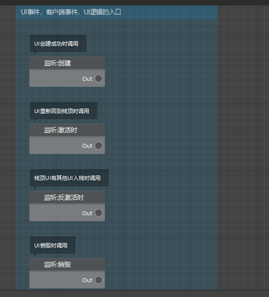

As you can see, compared with general blueprint parts, there is an additional UI-related event listener.

Among them, `Create` and `Listen` are functions that can be triggered by interfaces created in any way. And `Activate` and `Deactivate` are interfaces created using the `PushScreen` method, and additional events will be triggered.

Next, if we want to update the coordinates in real time, we need to create a node of the `GetBaseUIControl` interface at every moment on the server to obtain the object.

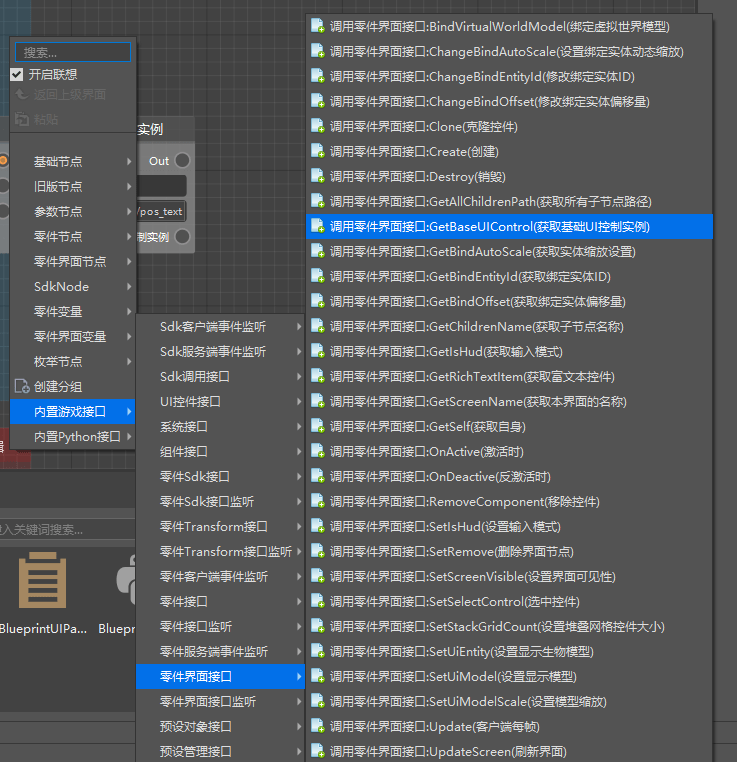

The control path in the node is our previous text label `/main_panel/pos_text`. After the operation of this node, we can get the basic control object corresponding to the text. Next, we need to convert it into a more specific text control object to change the value of the text.

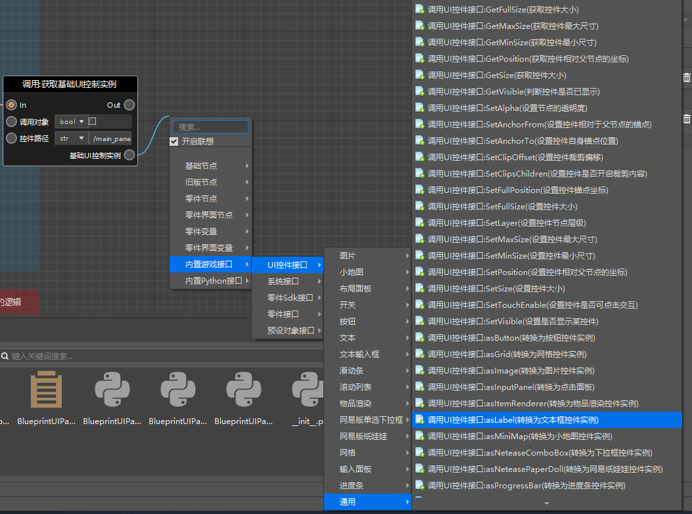

Find the `asLabel` interface, convert it into a text control object, and then call the `SetText` node again to set the value of the text.

Then the value of the text requires us to obtain the player's coordinate information, consult the document, use `GetPos`, and concatenate the string.

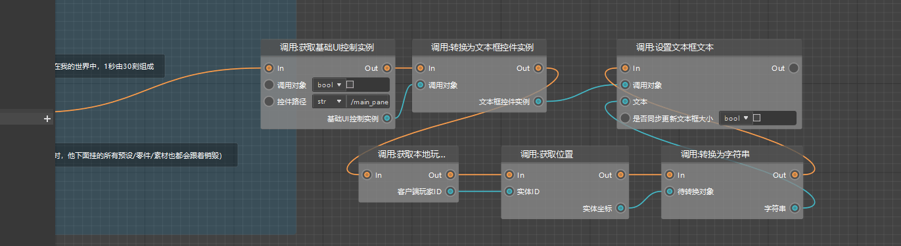

The effect after completion is as shown in the figure, so that the content of the text control can be updated in each tick of the client, and the coordinates can be displayed in real time.

Of course, there are many places that can be optimized. For example, our coordinate information does not actually need to be updated 30 times per second.

After entering the game, you can see that the interface appears in the lower right corner and displays our real-time coordinates.

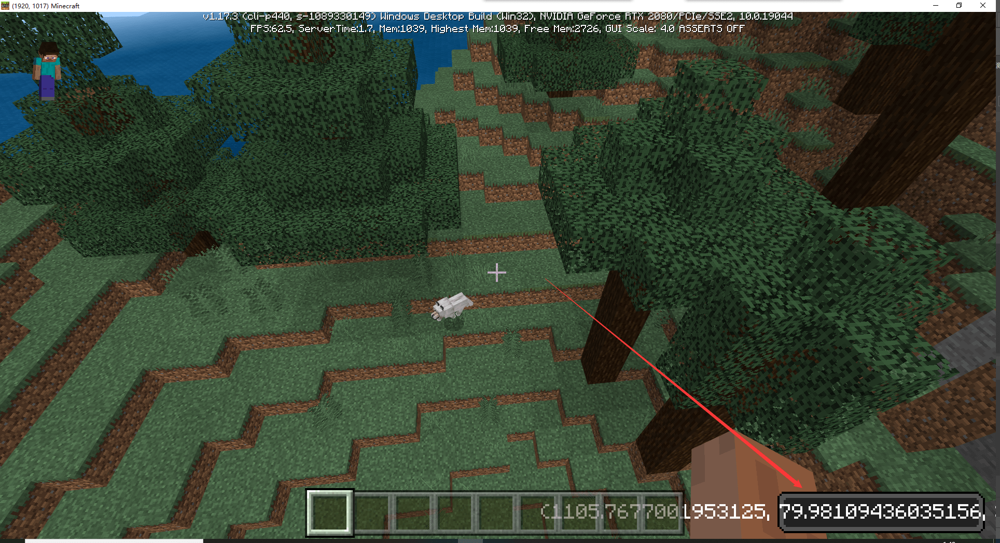

However, the decimal point is too long to be fully displayed. You can try to change the interface position to the center of the screen and change the size X to make the image wrap the text.

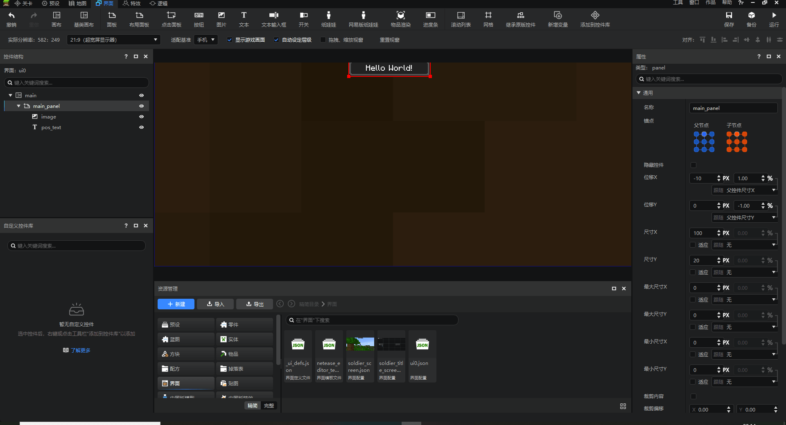

You only need to change all the anchor points of `main_panel` to the upper middle.

In summary, there are several steps to modify the data inside the interface in the logic

1. Get the basic control example through `GetBaseUIControl` according to the control path

2. According to the specific type of control, convert it into a specific example through `asXXXX` (such as the Label text here, and the Button button similarly)

3. Call the interface in the corresponding example to achieve the actual modification effect

All UI related interfaces can be found in [document](https://mc.163.com/dev/mcmanual/mc-dev/mcdocs/1-ModAPI/%E6%8E%A5%E5%8F%A3/%E8%87%AA%E5%AE%9A%E4%B9%89UI/UI%E6%8E%A7%E4%BB%B6.html?catalog=1).

## Homework

Homework requires making an interface to broadcast the content entered by the player to all online players through the title method.

### Interface drawing

- Create a `soldier_title_screen` interface and edit it.
- Add a panel called `main_panel`, with the anchor point centered and the size X and size Y set to 200,150 respectively.
- Add an image under `main_panel`, with the size X and size Y adapted, and replace the image with the native image `./ui/achievements_dialog.png`.

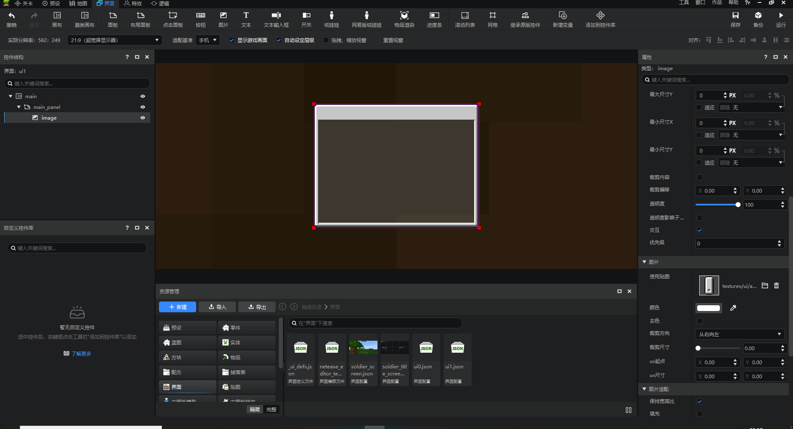

- This completes a simple window frame. Next, we add a text input box and a button under the `main_panel` node.
- Change the size of the text input box to `180,27` and the name to `title_text`.
- Change the name of the button to `confirm_button`, change the size X to 50, and the size Y to 20. Change the font scaling factor to 0.5, and change the text to `Send`. Set the displacement Y to `35`.

The effect after completion is as shown in the figure. You can freely play and add more elements to the page. For example, add a text box and fill in: `Send the content of the title` as a prompt.

And you can freely adjust the size of this interface to make it look more beautiful.

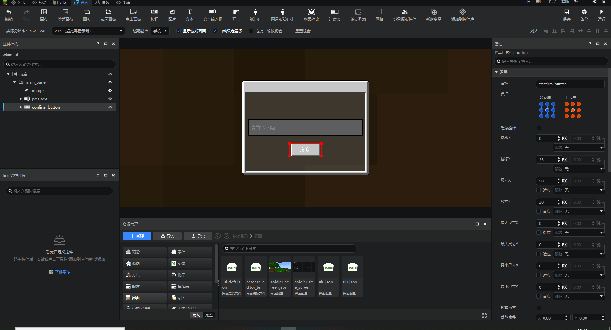

For example, a text is added as a title here.

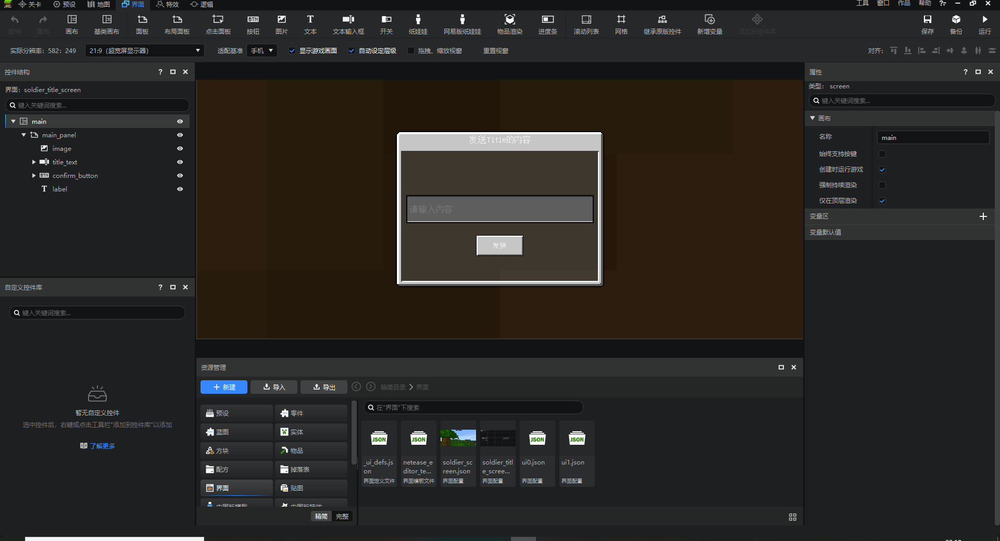

In this way, we have completed the editing of the interface. You can refer to your own interface to see if it is consistent with the path in the tutorial.

You need to check whether the path of the text box is `/main_panel/title_text` and the path of the button is `/main_panel/confirm_button`, which will be used in the subsequent logic writing.

### Create a preset

Create a new interface preset and change the file name to `TitleScreen`.

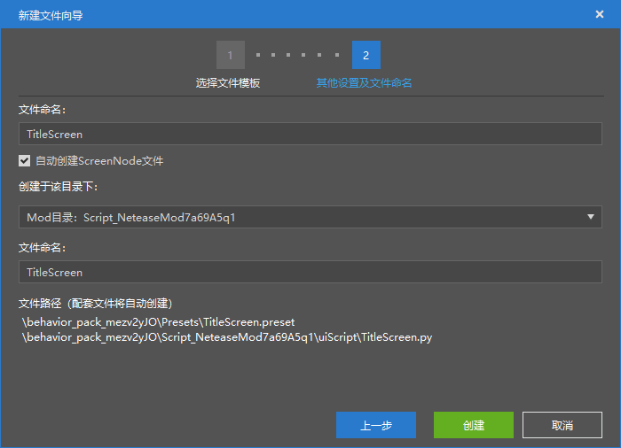

1. Check preload

2. Change the bound interface canvas to `soldier_title_screen`

3. Change the display mode to PushScreen

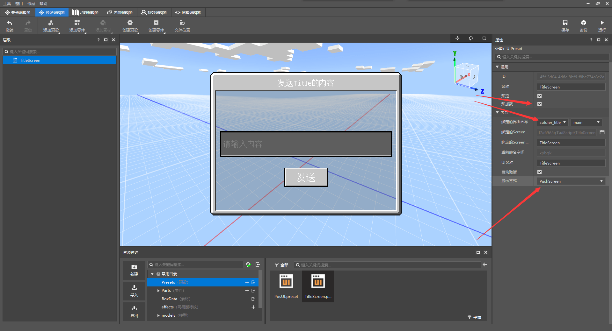

Next, create a blueprint UI part, attach it, and open the corresponding logic file.

### Logic writing

When creating, get the button instance according to the path and enable the button callback function. The specific operation is as follows:

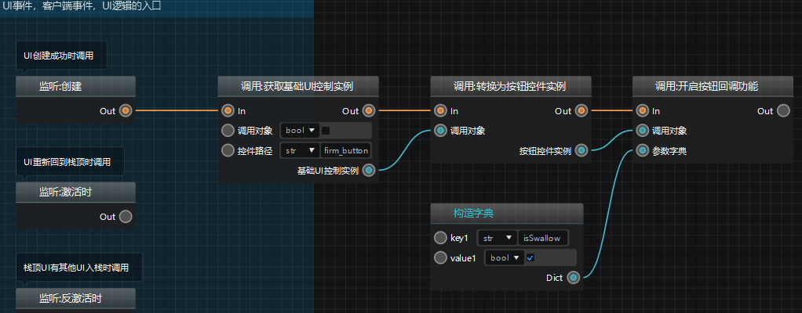

It should be noted that the parameter dictionary can be found in the [document](https://mc.163.com/dev/mcmanual/mc-dev/mcdocs/1-ModAPI/%E6%8E%A5%E5%8F%A3/%E8%87%AA%E5%AE%9A%E4%B9%89UI/UI%E6%8E%A7%E4%BB%B6.html#addtoucheventparams), where we directly set it to True.

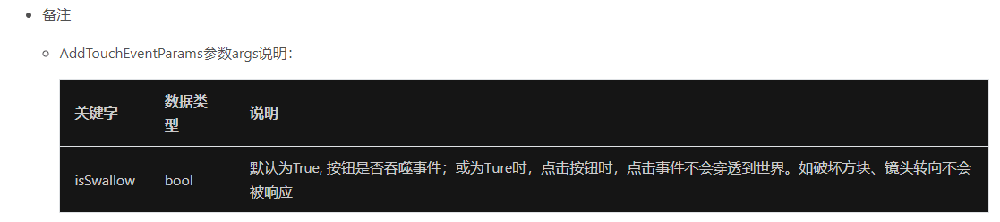

Next, we create a custom interface `f_ConfirmButtonClick` to write the response logic after the button is clicked. And add a parameter of type Any, named `args`, which is the button click event parameter, the specific type is a dict, which can be printed and viewed. We can not use it, but need to set this parameter in the custom interface.

First, we get the instance of this text box normally, and then get the text in it, which is what we want to send.

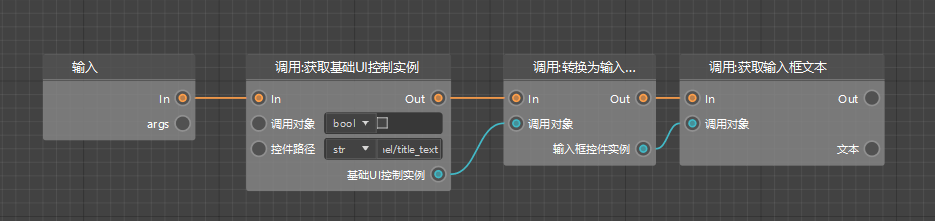

Next, because we need to call a command to send the title, and the UI is client logic, we cannot directly call the server interface. So we need to use the notification server interface to send this information to the server and let the server process this data.

The notification server interface mainly requires 2 parameters, one is the event name and the other is the event data.

The event name should be a text, which can be named according to your own preferences to distinguish the content of each communication. In the development of the entire gameplay component, it should correspond to its function.

For example, if we set it to `SendTitle` here, then we should assume that all communications that send title data are defined with this event name to prevent data confusion.

Event data should be a Dict, which is the carrier of specific event data and will be sent to the server in its entirety.

After understanding the basic process of communication, you can write the corresponding logic.

Here we construct a dictionary with key1 as `text` and value1 as the content of title, and use this dictionary as event data to send the event `SendTitle` to the server.

After sending, call `PopScreen` to close this interface in the form of stack management.

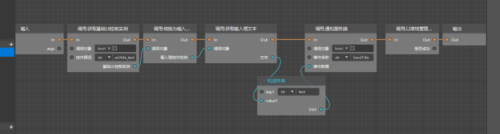

After editing this function, we return to the Graph interface, and after turning on the button callback function, use `SetButtonTouchUpCallback` to set the callback function of this button.

The calling object of this interface is the button control example, callback function, through **Get part variable**, get the custom interface named `f_ConfirmButtonClick`, that is, the function we just edited.

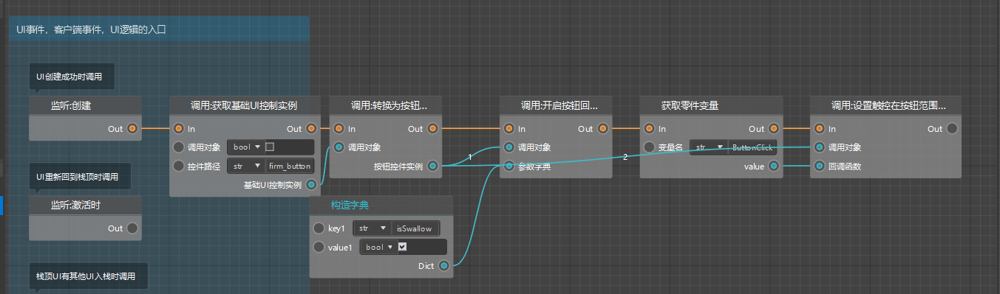

After completing the logic of the client button, you need to listen to this custom event on the server to complete the sending of title information.

You also need to create a new custom interface. Here we create a new custom interface called `f_OnRecvTitle`. The parameter is also args of any type. This parameter is the dictionary we sent from the client.

Then when we initialize the server, use the get own interface, then get the part variable, get our custom interface named `f_OnRecvTitle` as the callback function, and then call the listener self event to listen to our `SendTitle` event

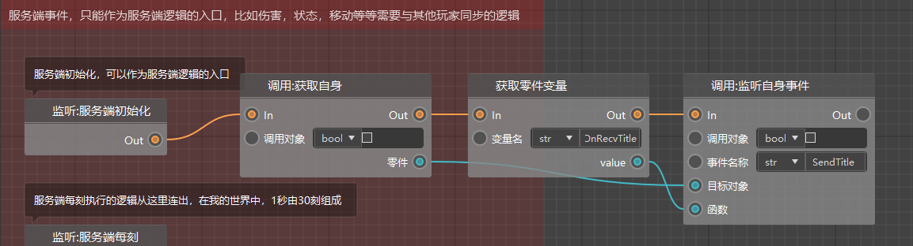

Next, we continue to edit `f_OnRecvTitle` to get the text in the args parameter. And concatenate it with the title command `title @a title ` (note that there is a space at the end), and finally execute it in the game.

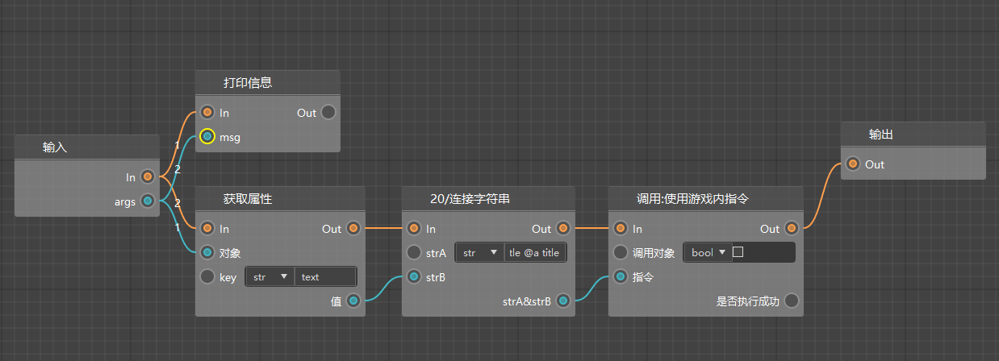

Here we print the input parameter args, so that you can see the content in args more intuitively in the log.

It should be noted that according to the document, there are 3 parameters for using the in-game command interface, of which `playerId` and `showOutput` are optional parameters. We choose not to fill them here, so we need to delete these two parameters of this node, otherwise it will still be counted as filling in an empty str parameter.

At this point, our interface is complete. If you still need to open the interface after closing it, you can call `PushScreen` to open it. The namespace and interface name can be found in our interface presets, and the opening parameters do not need to be filled in.

The namespace can be named as your own mod's English name. You can find it in the work button above the level editor

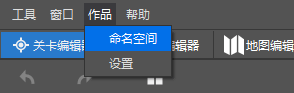

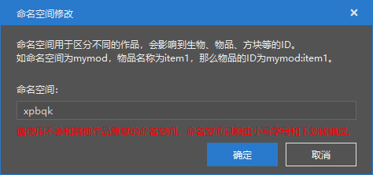
