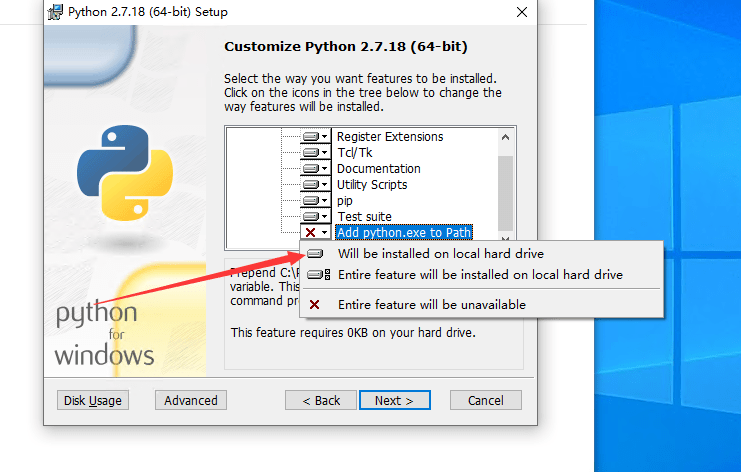
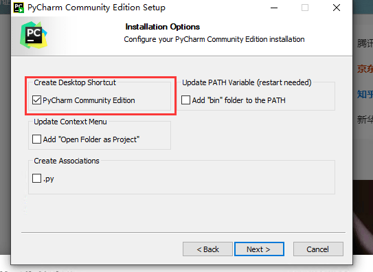
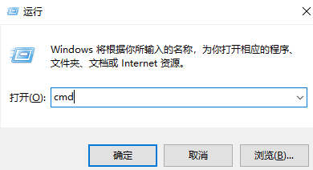
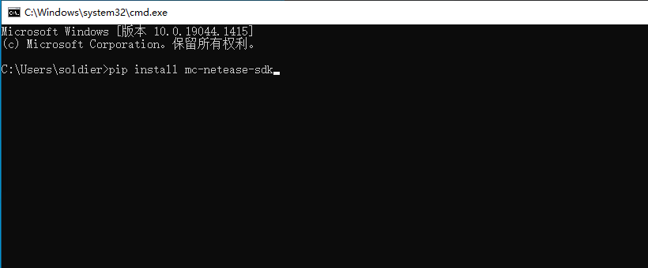
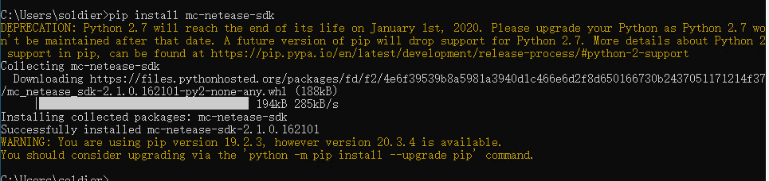
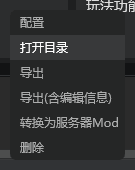
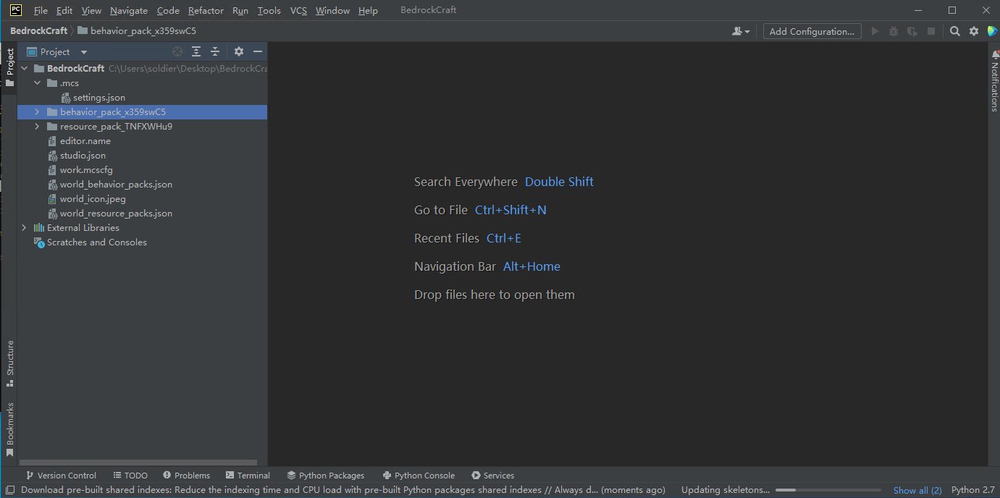
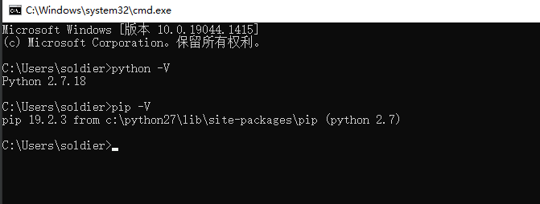

# Development Environment

Python 2.7 is required to develop the gameplay components of Minecraft. It is also recommended to install an integrated development environment to assist in code development.

In this course, we will guide you to download and install Python 2.7 and PyCharm.

<iframe src="https://cc.163.com/act/m/daily/iframeplayer/?id=632867066b13db499d094793" width="800" height="600" allow="fullscreen"/>

## Python 2.7

Python 2.7 download address: [link](https://www.python.org/downloads/release/python-2718/)

You can choose to download according to your operating system. Generally, Windows 64-bit systems download `Windows x86-64 MSI installer`.

After downloading, open it for installation and select the installation path. It should be noted that in this interface, scroll to the bottom, check `Add python.exe to Path`, and then continue to click to install.

## PyCharm

PyCharm is an integrated development environment for Python developed by JetBrains. Download address: [link](https://www.jetbrains.com/pycharm/download/).

After opening the page, download the `Community` version, then click Install, and check Create a desktop shortcut here.

## Install the completion library

After completing the installation, we also need to manually install the completion library. With the completion library, module development will be more convenient.

Press Win and R at the same time, enter cmd in the pop-up "Run" window and press Enter.

In the command prompt window, enter `pip install mc-netease-sdk` and press Enter

If this prompt appears, the installation is successful. If an error occurs, you can check whether the network connection is stable and try again after changing the network.

## Open the add-on package project using PyCharm

First, we need to find an add-on package to be opened in Studio, then right-click and open the directory.

After opening the directory, record the path of the directory. Then in PyCharm, click Open, find the directory that just popped up in the directory browsing window, and click Open.

After opening, there are `behavior_pack` and `resource_pack` in the directory, which means it is opened correctly.

## Homework

In the homework, we need to verify whether Python2.7 is installed successfully.

The specific steps are as follows:

- Open cmd
- Enter `python -V`
- Enter `pip -V`
- Check if there is correct output

The method of opening cmd has been introduced when installing the completion library. The correct output is shown in the figure below. You can enter it yourself and refer to it.

As you can see, the version of Python is 2.7.18, and the path of pip is in the directory of python2.7.