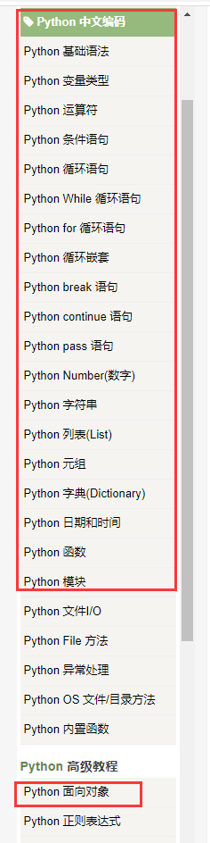
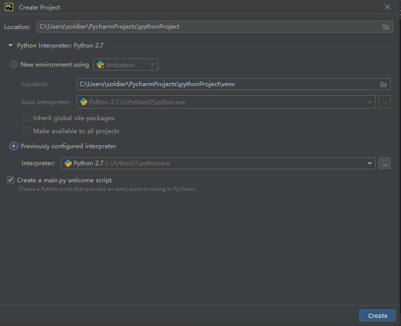
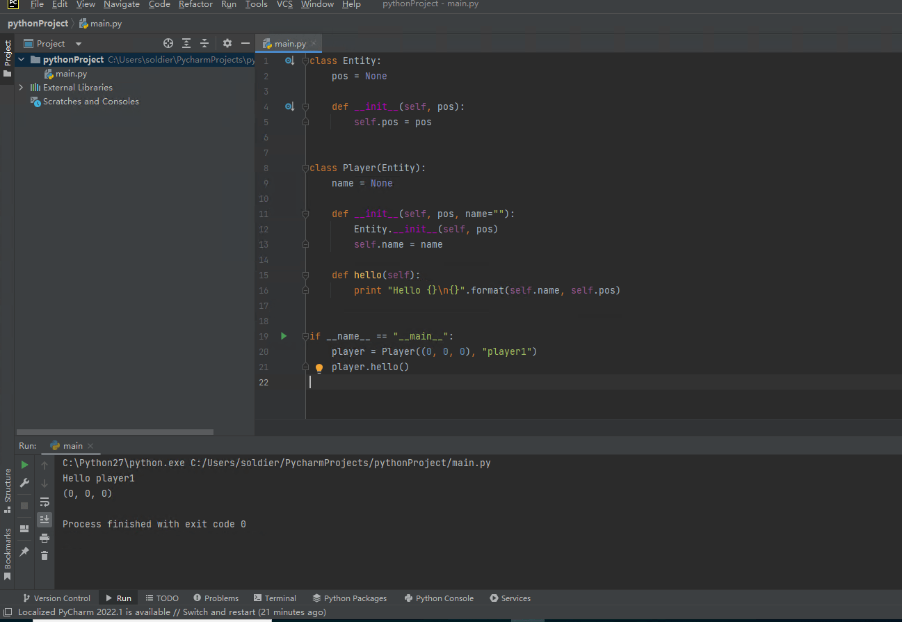

# Basic Python syntax

If you want to use Python for gameplay development, you must learn the basic syntax of Python.

Because there are already a lot of excellent tutorials to guide you to learn Python, we will not introduce the basic syntax of Python here, but mainly introduce the parts related to Python and Minecraft gameplay development. For Python tutorials, see: [link](https://www.runoob.com/python/python-chinese-encoding.html). In this series of tutorials linked, we have completed the environment setup, so start from the chapter linked to it and read on until you see `Python module`, plus `Python object-oriented`, you can start learning the content of this section.



<iframe src="https://cc.163.com/act/m/daily/iframeplayer/?id=63286726e6c041f2578ca816" width="800" height="600" allow="fullscreen"/>

## Object-oriented technology

Object-oriented technology (Object-Oriented Technology) emphasizes that in the process of software development, the thinking method commonly used by people in the process of understanding the objective world is adopted to describe the relevant things in the objective world intuitively and naturally.

This technology is also used in the development of the gameplay of Minecraft.

After learning object-oriented technology, if you want to develop the gameplay components of Minecraft, you first need to understand the classes that need to be used in the Python parts development introduced this time.

```python
# -*- coding: utf-8 -*-
from Preset.Model.PartBase import PartBase
import random
from Preset.Model.GameObject import registerGenericClass


@registerGenericClass("MyLogPart")
class MyLogPart(PartBase):
	def __init__(self):
		super(MyLogPart, self).__init__()
		self.name = "Log Parts"
		self.description = "Log part, used to test debug logs"
		self.interval = (30, 90)
		self._tickCnt = 0
		self._tickInterval = random.randint(self.interval[0], self.interval[1])

	def TickClient(self):
		self._tickCnt += 1
		if self._tickCnt == self._tickInterval:
			print("%s in %s" % (self.GetDisplayPath(), self.GetWorldPosition()))			self._tickInterval = random.randint(self.interval[0], self.interval[1])
			self._tickCnt = 0

```

```python

# -*- coding: utf-8 -*-
from Meta.ClassMetaManager import sunshine_class_meta
from Meta.EnumMeta import DefEnum
from Meta.TypeMeta import PBool, PStr, PInt, PCustom, PVector3, PVector3TF, PEnum, PDict, PFloat, PArray, PVector2
from Preset.Model import PartBaseMeta

@sunshine_class_meta
class MyLogPartMeta(PartBaseMeta):
CLASS_NAME = "MyLogPart"
PROPERTIES = {
"interval": PVector2(sort=1000, group="MyLogPart", text="Print interval"),
}

```

Here are two Python files for a log part in the official built-in parts.

As you can see, the first file is a class named `MyLogPart`, which inherits the `PartBase` class and defines some member variables to describe the name (name) and function (description) of the part.

This class has two main functions, one \_\_init\_\_, which will be executed during initialization, and one TickClient function, which will print log information.

The second file is a class named `MyLogPartMeta`, which inherits the `PartBaseMeta` class. This class also defines member variables to store some basic data of this class. This class is actually a metadata class, which is used to connect with the editor, so that we can set some variables to the part through the editor. In this section, we mainly only understand it and do not study it in depth.

In gameplay development, in fact, there are more than just PartBase and PartBaseMeta classes that can be inherited. All classes related to gameplay development can be found in the documentation, [link](https://mc.163.com/dev/mcmanual/mc-dev/mcdocs/3-PresetAPI/%E9%A2%84%E8%AE%BE%E5%AF%B9%E8%B1%A1/%E9%80%9A%E7%94%A8/%E6%B8%B8%E6%88%8F%E5%AF%B9%E8%B1%A1GameObject.html?catalog=1).

Interested students can click on the link to get a general idea of what classes are available, what their functions are, and what the inheritance relationship is.

## Homework

After understanding object-oriented technology, in order to deepen the understanding of this technology, the homework hopes to use object-oriented technology to make a simple program.

### Requirements

1. Write an Entity class to represent all entities in the game. It needs to have a member variable pos, which is a tuple type and represents the coordinates. It receives a tuple of 3 ints when initialized and stores it in pos.
2. Write a Player class that inherits the Entity class. It needs to have a member variable name, which is a str type and represents the player name. Define a hello function to print "Hello player name" and print the value of the pos variable of this class.
3. Instantiate the Player object and call the hello function.

### Operation steps

In the menu bar in the upper left corner of PyCharm, click File and select New Project to create a new project.

You can choose the path and name it yourself. For simplicity, we do not use a virtual environment. For `Python Interpreter`, please select `Previousl configured interprer`. The path should be the installation path of your Python, without words such as venv.



After the creation is complete, open main.py and you will see that there is already a simple helloworld program. We can write it in main.py.


First, write the Entity class. The code is as follows, which contains a pos member variable and a constructor.

```python
class Entity:
pos = None

def __init__(self, pos):
self.pos = pos
```

Then continue to write the Player class, which inherits the Entity class and has a name variable

```python
class Player(Entity):
name = None

def __init__(self, pos, name=""):
Entity.__init__(self, pos)
self.name = name

def hello(self):
print "Hello {}\n{}".format(self.name, self.pos)
```

Then write the main function

```python
if __name__ == "__main__":
player = Player((0, 0, 0), "player1")
player.hello()
```



Run after writing, the complete code and running results are shown in the figure.