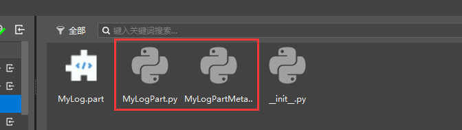
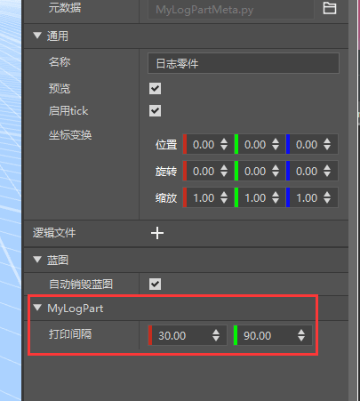
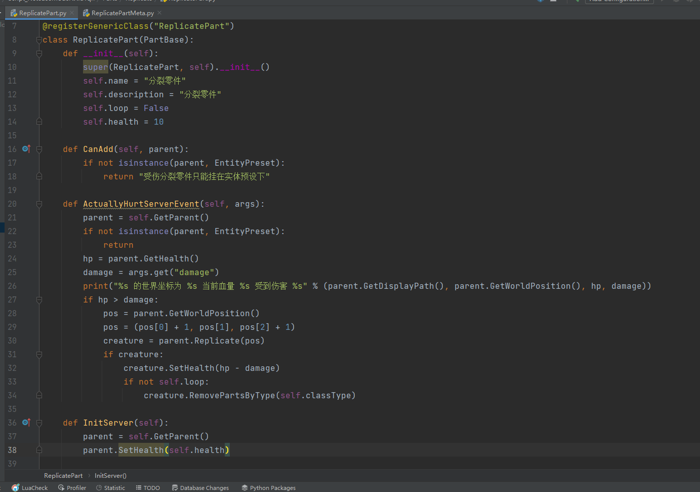
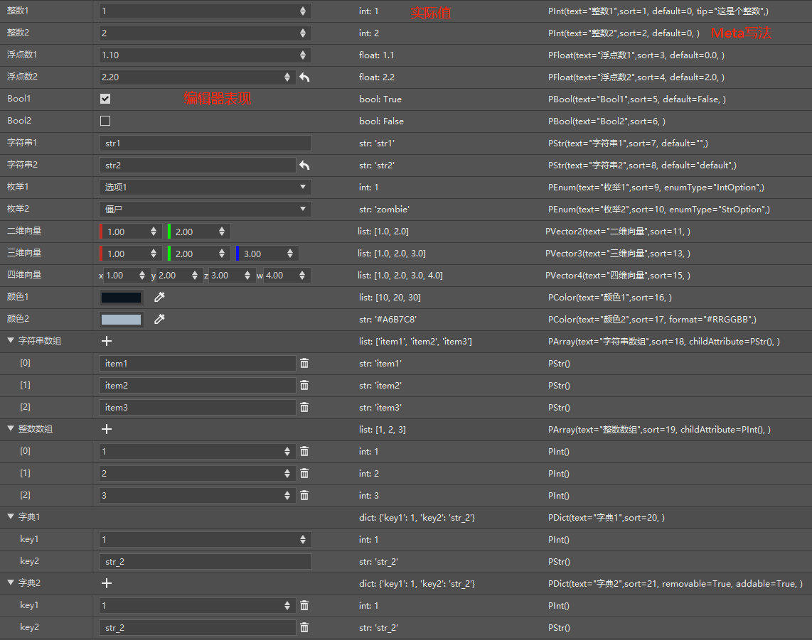

# Basics of Part Development

This section will introduce the life cycle of parts through some built-in part templates, and lead everyone to have a preliminary understanding of part development.

<iframe src="https://cc.163.com/act/m/daily/iframeplayer/?id=6328676ba240f794f8c5fbc1" width="800" height="600" allow="fullscreen"/>

## Example

### MyLogPart

First, we create a player preset, and then find `MyLogPart` in the new part and create it. And attach MyLogPart to the player preset.

Next, we can see that the MyLog part is mainly composed of two python source code files, namely `MyLogPart.py` and `MyLogPartMeta`. We open this project in PyCharm.



Right-click the file, open the file location, and find the root directory of the project


Copy the path, open it in PyCharm, and set the folder of the resource package as Sources Root, otherwise the completion function will not work properly.


Next, open `MyLogPart.py` according to the path shown in the figure to observe its code.


It can be found that there is a `MyLogPart` class in the code, which inherits the `PartBase` class. In the `__init__` initialization function, its own `name` and `description` are defined. These two are variables inherited from PartBase, representing the name and description of the part respectively.

The reserved variable names of all parts are listed below. Developers should avoid using these variable names when developing parts to prevent unexpected accidents.

-id
-classType
-isClient
- filterKeys
- _parent
- entityId
-boxId
-name
- transform
-isRemoved
- loaded
-needUpdate
- <iframe src="https://cc.163.com/act/m/daily/iframeplayer/?id=63286726e6c041f2578ca816" width="800" height="600" allow="fullscreen"/>


- tickEnable
- data
- dataKeys
- eventMap
- replicated

The remaining variable definitions are all member variables of this class.

The `TickClient` function is an overridable function that will be called by the client every tick.

And each time, a random number between 30 and 90 is used as the interval for printing output.

Next, let's look at MyLogPartMeta.py, which inherits PartBaseMeta and is used to store editable content on the preset editor.


For example, the interval here corresponds to the interval variable of MyLogPart.py, which is of type PVector2 and can set prompt text. The specific writing format will be introduced later.

After setting Meta, we can see the corresponding print interval setting item in the properties of the part in the preset editor.



### ReplicatePart

Create a `ReplicatePart` part again and continue to observe its code.



You can see that the `__init__` function of the split part is similar to that of the log part, and both are used to initialize data.

The `CanAdd` function and the `InitServer` function are rewritten here, where `InitServer` represents server initialization, and `CanAdd` will be triggered when the part is mounted to prevent the part from being mounted on the wrong preset.

Compared with the log, it listens to an additional entity injury event, which is used to split when injured.

Its PartMeta is also similar, defining two parameters, which are PBool and PInt types.

```python
@sunshine_class_meta
class ReplicatePartMeta(PartBaseMeta):
CLASS_NAME = "ReplicatePart"
PROPERTIES = {
"loop": PBool(sort=1000, group="ReplicatePart", text="Loop split"),
"health": PInt(sort=1001, group="ReplicatePart", text="Health"),
}
```

## Life cycle

The life cycle of a part refers to the entire operation process of the part from the beginning to the end of the game.


Parts are divided into server and client, and different functions will be triggered in each process of operation.

Take the server as an example, it will first `__init__` and then `InitServer` in the initialization phase. After initialization is completed, `TickServer` will be triggered every Tick. In the uninstallation phase (game shutdown/block uninstallation), `UnloadServer`. After being killed or actively calling the Destroy interface, `DestroyServer` is triggered. The same is true for the client.

The specific definition of each function can be viewed in the <a href="../../../../mcdocs/3-PresetAPI/Preset Object/Part/PartBase.html">Document</a>. There are also other functions in the document, you can check the usage by yourself, such as the <a href="../../../../mcdocs/3-PresetAPI/Preset Object/Part/PartBase.html#canadd">CanAdd function</a> just seen.

## Custom properties

Custom properties are defined by the `PartBaseMeta` class. To create a custom property, we mainly need two steps.

1. Define member variables in the class that inherits `PartBase`

2. Define the `PROPERTIES` dictionary in the class that inherits `PartBaseMeta`, where the Key is the variable name and the Value is the variable property corresponding to this data.

Currently, custom parts support editing all basic types of python, namely: integer int, floating point float, Boolean bool, string str, dictionary dict, list list. In addition, corresponding support is also provided for some specific needs, such as drop-down list selection, multi-dimensional vector, etc.



The above table lists all currently supported property variables and the corresponding Value definitions.

For a detailed explanation of each property, please refer to the <a href="../../../../mcguide/20-Gameplay Development/14-Preset Gameplay Programming/2-In-depth Understanding of Parts/1-Custom Property Panel.html?catalog=1#Type and Property">Official Document</a>.

```python
@sunshine_class_meta
class ReplicatePartMeta(PartBaseMeta):
CLASS_NAME = "ReplicatePart"
PROPERTIES = {
"loop": PBool(sort=1000, group="ReplicatePart", text="Loop Split"),
"health": PInt(sort=1001, group="ReplicatePart", text="Health"),
}
```

Let's take the properties of the split parts as an example. First, define a `CLASS_NAME`, which class these variables are member variables of (will be automatically generated, no need to write manually). Define another `PROPERTIES`, define two variables `loop` and `health`, set the order and group and description text.

## Homework

1. Create a new blank add-on package, create a player preset, and create a part. At each stage of the part's life cycle (except tick), print information to observe the execution order.
2. Set custom properties for this part, provide 2 parameters, representing the player's maximum health and current health, and apply them to the player when the player sends a chat message "update health".

### Operation steps

The operation of creating a new add-on package and creating a player preset has been demonstrated many times before, so I will skip it here.

Next, create a new empty part, name it `PlayerHealthPart`, and attach it to the player preset.

Next, use PyCharm to open the project folder, set Sources Root, and open the corresponding preset python file.

Some life cycle functions have been rewritten by default in the file. We can modify them on this basis and add a print function to each to output each stage.


And additionally rewrite `UnloadClient` and `UnloadServer`, add corresponding output, the modified code is as follows:

```python
# -*- coding: utf-8 -*-
from Preset.Model.GameObject import registerGenericClass
from Preset.Model.PartBase import PartBase

@registerGenericClass("PlayerHealthPartPart")
class PlayerHealthPartPart(PartBase):
def __init__(self):
PartBase.__init__(self)
# Part name
self.name = "Empty Part"

def InitClient(self):
print "InitClient"

def InitServer(self):
print "InitServer"

def TickClient(self):
pass

def TickServer(self):
pass

def DestroyClient(self):
print "DestroyClient"

def DestroyServer(self):
print "DestroyServer"

def UnloadClient(self):
print "UnloadClient"

def UnloadServer(self):
print "UnloadServer"

```

Next, create two new variables, health and maxHealth, representing the player's health and maximum health, and modify the name of this part.

```python
@registerGenericClass("PlayerHealthPartPart")
class PlayerHealthPartPart(PartBase):
def __init__(self):
PartBase.__init__(self)
self.health = 20

self.maxHealth = 30
self.name = "Custom player health parts"
```

And modify `PROPERTIES` in `PlayerHealthPartPartMeta.py`, the modified code is as follows:

```python
# -*- coding: utf-8 -*-
from Meta.ClassMetaManager import sunshine_class_meta
from Meta.TypeMeta import PInt
from Preset.Model import PartBaseMeta

@sunshine_class_meta
class PlayerHealthPartPartMeta(PartBaseMeta):
CLASS_NAME = "PlayerHealthPartPart"
PROPERTIES = {
"health": PInt(sort=1, text="Health", default=20, group="Custom part health"),
"maxHealth": PInt(sort=2, text="Maximum health", default=30, group="Custom part health"),
}

```

Now open the editor, you can see that the property panel of the part shows the custom properties.


Then go back to `PlayerHealthPartPart.py` and write the logic for setting health. Add a function to listen to <a href="../../../../mcdocs/1-ModAPI/事件/世界.html?key=Join&docindex=2&type=0#serverchatevent">ServerChatEvent</a>, then we directly determine whether the chat content and the entity id sent are our player, and then set it to update health.

```python
def ServerChatEvent(self, args):
if args["message"] != "Update health":
return
parent = self.GetParent()
entityId = parent.GetEntityId()
if args["playerId"] != entityId:
return
self.SetEntityAttrValue(entityId, AttrType.HEALTH, self.health)
self.SetEntityAttrMaxValue(entityId, AttrType.HEALTH, self.maxHealth)
```

This is how our health is set. Final code:

```python
# -*- coding: utf-8 -*-
from Preset.Model.GameObject import registerGenericClass
from Preset.Model.PartBase import PartBase
from mod.common.minecraftEnum import AttrType


@registerGenericClass("PlayerHealthPartPart")
class PlayerHealthPartPart(PartBase):
    def __init__(self):
        PartBase.__init__(self)
        self.health = 20
        self.maxHealth = 30
        self.name = "Customized player health parts"

    def InitClient(self):
        print "InitClient"

    def InitServer(self):
        print "InitServer"

    def TickClient(self):
        pass

    def TickServer(self):
        pass

    def ServerChatEvent(self, args):
        if args["message"] != "Update blood volume":
            return
        parent = self.GetParent()
        entityId = parent.GetEntityId()
        if args["playerId"] != entityId:
            return
        self.SetEntityAttrValue(entityId, AttrType.HEALTH, self.health) self.SetEntityAttrMaxValue(entityId, AttrType.HEALTH, self.maxHealth)

def DestroyClient(self):
print "DestroyClient"

def DestroyServer(self):
print "DestroyServer"

def UnloadClient(self):
print "UnloadClient"

def UnloadServer(self):
print "UnloadServer"

```

We enter the game test and observe the log output. We can see that there is relevant life cycle output.


And send `Update health`, we can see that our health value has been changed.


