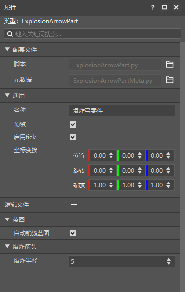

# Basics of coding

This section will mainly introduce the differences between interfaces and events, document reference, and communication between the client and the server.

<iframe src="https://cc.163.com/act/m/daily/iframeplayer/?id=632867a9e6c041f2578ca820" width="800" height="600" allow="fullscreen"/>

## Interfaces and events

The interface and event definitions here are consistent with those of the logic editor. If you have forgotten, you can go to [Review](../2-Logic Editor Basics/3-Logic Editor Basic Concepts (2).html).

In the logic editor, all events are reflected as `listen: xxxxx`, while in part development, listener events are generally defined as a function.

If you need to check all the events that can be monitored, you can query <a href="../../../../mcdocs/1-ModAPI/事件/世界.html?catalog=1">here</a>.

For example, if the following function is defined in `PartBase`, it is considered to monitor ServerChatEvent

```python
def ServerChatEvent(self, args):
pass
```

In part development, calling interfaces is done in the form of calling functions.

Still in this event, `GetParent`, `SetEntityAttrValue`, `SetEntityAttrMaxValue`, all call the `PartBase` interface.

All available interfaces can be queried <a href="../../../../mcdocs/3-PresetAPI/创建管理/PresetApi.html?catalog=1">here</a>.

```python
def ServerChatEvent(self, args):
if args["message"] != "Update health":
return
parent = self.GetParent()
entityId = parent.GetEntityId()
if args["playerId"] != entityId:
return
self.SetEntityAttrValue(entityId, AttrType.HEALTH, self.health)
self.SetEntityAttrMaxValue(entityId, AttrType.HEALTH, self.maxHealth)
```

> Why is GetParent used in the above code not found in <a href="../../../../mcdocs/3-PresetAPI/Preset Object/Preset/Preset Base Class PresetBase.html?catalog=1#Preset Base Class presetbase">PartBase</a>?
>
> Because we develop presets and parts based on object-oriented technology. PartBase inherits SdkInterface and TransformObject objects, so it can call functions from the parent class.
>
> In fact, the GetParent interface we call comes from <a href="../../../../mcdocs/3-PresetAPI/Preset Object/General/Transformation Object TransformObject.html#getparent">TransformObject</a>. In this way, GetParent can get the player because the part is mounted on the player preset.


## Server-client communication

In the previous logic editor interface production, we have already touched upon some communication between the server and the client.

At that time, the interface sent the content in the client to the server. The server listened and executed the command.

This is a communication from the client to the server. But in fact, there can be two-way communication between the client and the server. The following will introduce the use of communication in detail.

### Client->Server

The communication from the client to the server mainly requires calling the `NotifyToServer` interface on the client, and the server needs to call the `ListenSelfEvent` interface during initialization to listen to this event.

#### NotifyToServer

Document description: <a href="../../../../mcdocs/3-PresetAPI/Preset object/Part/PartBase.html?key=NotifyToServer&docindex=2&type=0#notifytoserver">Click me</a>

| Parameter name | Data type | Description |
| :-------- | :------- | :------- |
| eventName | str | Event name |
| eventData | object | Event data |

This is a client interface. `eventName` is the event name. The event name can be understood as the specific meaning of this event. The client uses this event name to send to the server, so the server also needs to use this event name to listen accordingly. `eventData` is the specific data of the event, that is, the args in the general event, which is generally passed in a dictionary.

#### ListenSelfEvent

Document description: <a href="../../../../mcdocs/3-PresetAPI/Preset Object/Parts/Parts PartBase.html?catalog=1#listenselfevent">Click me</a>

| Parameter name | Data type | Description |
| :-------- | :------- | :------- |
| eventName | str | Event name |
| target | object | Target |
| func | object | Callback function |

This interface is universal for both ends.

`eventName` is the event name defined when we NotifyToServer. `target` is the event of the object to listen to, usually fill in self. `func` is the callback function, define a function, the parameter is args, and then pass in the value of function type here.

example:

```python
class TestPartPart(PartBase):
    def InitServer(self):
        print "InitServer"
        self.ListenSelfEvent("TestEvent", self, self.OnTestEvent)

    def OnTestEvent(self, args):
        print "Received client event from {}".format(args["playerId"])

    def SendToServer(self):
        self.NotifyToServer("TestEvent", {"playerId": self.GetLocalPlayerId()})

```

In this way, if the SendToServer function is called on the client, the server will receive the event accordingly and print the message.

### Server->Client

The communication between the server and the client mainly requires calling the `NotifyToClient` interface on the server, and the client needs to call the `ListenSelfEvent` interface during initialization to listen to this event.

#### NotifyToClient

Document description: <a href="../../../../mcdocs/3-PresetAPI/Preset Object/Parts/Parts PartBase.html?catalog=1#notifytoclient">Click me</a>

| Parameter name | Data type | Description |
| :-------- | :------- | :------- |
| playerId | str | Player ID |
| eventName | str | Event name |
| eventData | object | Event data |

This is a server interface. `playerId` is the player id to be sent to. The other parameters are the same as `NotifyToServer`.

If you need to broadcast to all players' clients, you can use <a href="../../../../mcdocs/3-PresetAPI/Preset Object/Parts/Parts PartBase.html?catalog=1#broadcasttoallclient">BroadcastToAllClient</a>.

#### ListenSelfEvent

ListenSelfEvent is used in the same way as the client to server communication.

Document description: <a href="../../../../mcdocs/3-PresetAPI/Preset Object/Parts/Parts PartBase.html?catalog=1#listenselfevent">Click me</a>

| Parameter name | Data type | Description |
| :-------- | :------- | :------- |
| eventName | str | Event name |
| target | object | Target |
| func | object | Callback function |

This interface is universal on both ends.

`eventName` is the event name defined when we NotifyToServer. `target` is the event of the object to listen to, usually fill in self. `func` is the callback function, define a function, the parameter is args, and then pass in the value of function type here.

Example:

```python
class TestPartPart(PartBase):
def InitClient(self):
print "InitClient"
self.ListenSelfEvent("TestEvent", self, self.OnTestEvent)

def OnTestEvent(self, args):
print "Received event from server {}".format(args)

def SendToServer(self,playerId):

self.NotifyToClient(playerId, "TestEvent", {"msg": "test"})
```

If the SendToServer function is called on the client, the server will receive the event and print the message accordingly.

## Homework

### Identify interfaces and events

Identify whether the code below is calling an interface or listening to an event

1. `self.SetCommand()`

2. `def OnCommandOutputServerEvent(self, args):`

> Answer
>
> 1. Calling the interface
> 2. Listening to events

### Practical operation of part development

Use part development to write an explosive arrow function: all arrows shot will explode when they hit the target.

And use the custom property panel to set the explosion range.

#### Operation steps

1. Create a player preset and an empty part. Name the part `ExplosionArrow`.

2. Attach the part to the player preset.
3. Next, use PyCharm to open `ExplosionArrowPart.py` and edit the code.
4. Define an explosion radius member variable under `__init__` to facilitate the creation of custom attributes later.
5. Listen to <a href="../../../../mcdocs/1-ModAPI/Event/Entity.html?key=ProjectileDoHitEffectEvent&docindex=2&type=0#projectiledohiteffectevent">ProjectileDoHitEffectEvent</a>, get the corresponding position, and then call <a href="../../../../mcdocs/3-PresetAPI/Preset Object/General/SDK Interface Encapsulation SdkInterface.html?key=CreateExplo&docindex=4&type=0#createexplosion">CreateExplosion</a> to create an explosion, in which the explosion radius uses a member variable, and then deletes the arrow entity.

Code reference:

```python
@registerGenericClass("ExplosionArrowPart")
class ExplosionArrowPart(PartBase):
    def __init__(self):
        PartBase.__init__(self)

self.explosionRadius = 5
self.name = "Explosion Arrow Part"

def ProjectileDoHitEffectEvent(self, args):
self.CreateExplosion((args["x"], args["y"], args["z"]), self.explosionRadius, True, True, args["srcId"], args["srcId"])
self.DestroyEntity(args["id"])

```

Next, set the metadata, open `ExplosionArrowPartMeta.py`, modify `PROPERTIES`, and add an explosion radius variable.

Code reference:

```python
@sunshine_class_meta
class ExplosionArrowPartMeta(PartBaseMeta):
CLASS_NAME = "ExplosionArrowPart"
PROPERTIES = {
"explosionRadius": PInt(text="Explosion radius", sort=1000, default=5, group="Explosion arrow")
}
```

This completes the modification. Open the editor, select the explosion bow part, and you can see the corresponding settings.



### Communication

Use the communication system between the client and the server to send the player's chat content to the client and print it in the log window.

#### Operation steps

1. Create a new empty part, name it `NotifyTest`, and attach it to the player preset.
2. Edit `NotifyTestPart.py`, listen to <a href="../../../../mcdocs/1-ModAPI/事件/世界.html?key=Join&docindex=2&type=0#serverchatevent">ServerChatEvent</a>, get the message content and player ID, and use NotifyToClient to send it to the client. The event name is `ChatToClient`, and the data is a dict `{"msg": message content}`.
3. Call ListenSelfEvent in InitClient to listen to the `ChatToClient` event, and then define a function called `OnRecvChat`, receive args as a parameter, print `args["msg"]`, as a callback function.

Code reference:

```python
@registerGenericClass("NotifyTestPart")
class NotifyTestPart(PartBase):
def __init__(self):
PartBase.__init__(self)
self.name = "Communication test"

def InitClient(self):
self.ListenSelfEvent("ChatToClient", self, self.OnRecvChat)

def OnRecvChat(self, args):
print "Chat message sent from the server: {}".format(args["msg"])


def ServerChatEvent(self, args):
message = args["message"]
playerId = args["playerId"]
self.NotifyToClient(playerId, "ChatToClient", {"msg": message})
```

In this way, every time a message is sent, the client will print the received message content in the log window.