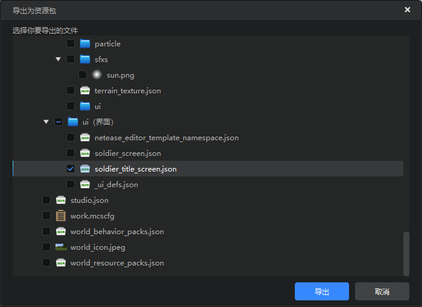
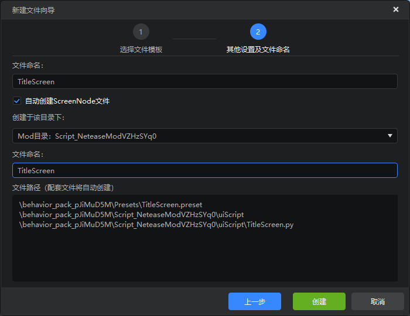
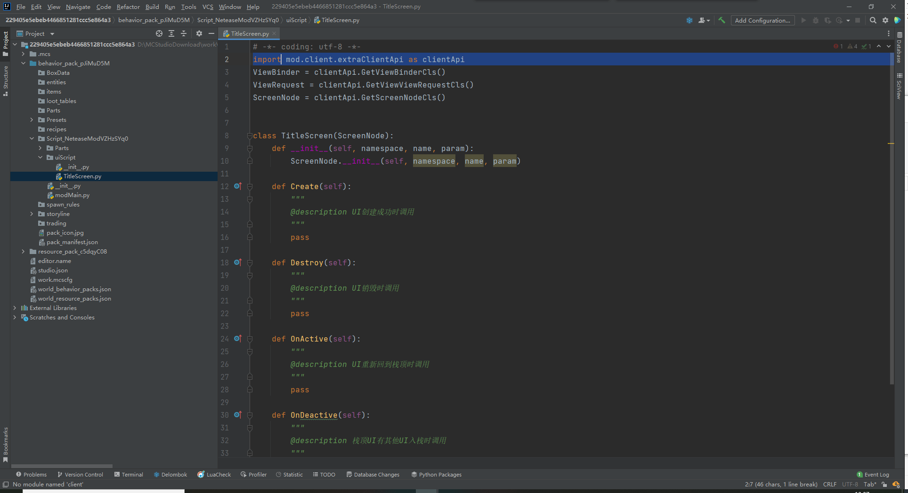
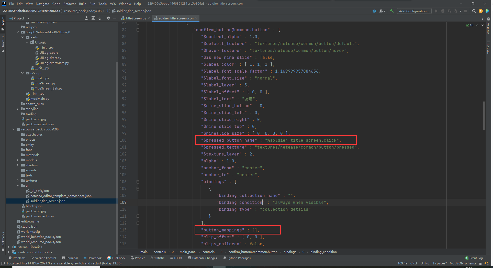

# Use Python to write interface logic

In the previous chapter, we have used the logic editor to create a simple pop-up interface to send title messages.

In this section, we will continue to use the interface json file created last time and use Python component development to re-implement the function.

<iframe src="https://cc.163.com/act/m/daily/iframeplayer/?id=6328682ee6c041f2578ca826" width="800" height="600" allow="fullscreen"/>

Before starting to write, we need to find the project edited when using the logic editor to create the interface logic in the previous chapter, then select Export Resources, find the resource package, ui folder, and the file edited at that time.



Export and save to a location that can be found, then create a blank additional package and import the interface file just imported.

After the import is complete, you can modify the namespace by yourself. Continue to create a new interface preset and name it `TitleScreen`. After the creation is completed, check the preload and switch to the PushScreen mode to open the interface.



The operation here is exactly the same as the previous use of the logic editor.

Next, we can open PyCharm, open the folder of this project, and edit the code. The first time you open it, you need to set `Sources Root`. No screenshots are shown here.



Find `Script Folder/uiScript/TitleScreen.py`, which is our UI logic file.

The default second line of code is

```python
import client.extraClientApi as clientApi
```

We can modify it here to

```python
import mod.client.extraClientApi as clientApi
```

In this way, the completion function can be used normally to solve the error of automatic prompts.

Observing this class, we can see that the functions that can be rewritten are basically the same as those of the blueprint parts in the logic editor, and it also has 4 functions. Among them, `OnActivate` and `OnDeactive` are functions that will only be called when the interface is created by PushScreen.

There are two ways to write logic for UI created with Python code. One is to add a callback function binding to the button during initialization, just like the logic editor. Another is to use data binding, define the Python file to be called in advance in the Json file, and bind it to the functions and variables in the code.

## Method 1


Let's first introduce the first method

So now we can define some constants in the `__init__` function during initialization. For example, the path of the UI control we need to use.

```python
def __init__(self, namespace, name, param):
ScreenNode.__init__(self, namespace, name, param)
self.mMainPanel = "/main_panel"
self.mTitleText = self.mMainPanel + "/title_text"
self.mConfirmButton = self.mMainPanel + "/confirm_button"
```

This defines the paths of all the controls we may need, which is convenient for subsequent calls.

Next, rewrite the `Create` function and add a callback function for the button.

```python
def Create(self):
"""
@description Called when UI is created successfully
"""
buttonControl = self.GetBaseUIControl(self.mConfirmButton).asButton()
buttonControl.AddTouchEventParams({"isSwallow": True})
buttonControl.SetButtonTouchUpCallback(self.OnConfirmButtonClick)

def OnConfirmButtonClick(self, args):
pass
```

This way, when the button is clicked, the `OnConfirmButtonClick` function will be triggered

Next, we return to the preset editor, create a new empty part, name it `UILogic`, and attach it to the `TitleScreen` interface preset.

In this part, we listen for the send Title event sent by the client. First, we need to give this part a memorable name, here it is called `Interface Server Listener`, because we will need to get the example of this part by name in the interface logic file later to send notification messages to our server. At the same time, when initializing the server, listen to the `TitleEvent` event and send the Title command.

The code reference is as follows:

```python
@registerGenericClass("UILogicPart")
class UILogicPart(PartBase):
def __init__(self):
PartBase.__init__(self)
self.name = "Interface server listening"

def OnRecvTitle(self, args):
self.SetCommand("/title @a title {}".format(args["text"]))

def InitServer(self):
"""

@description Server-side component object initialization entry
"""
self.ListenSelfEvent("TitleEvent", self, self.OnRecvTitle)
```

After writing the `Interface server-side listening` component, we can return to the interface logic code file and modify the button callback function.

At the beginning of the py file, first introduce the preset API

```python
import Preset.Controller.PresetApi as presetApi
```

Then modify the button callback function, first get the `TitleScreen` preset, then get its component `Interface server-side listening`, and then call the `NotifyToServer` function to send our event.

Close this interface after sending.

```python
def OnConfirmButtonClick(self, args):
text = self.GetBaseUIControl(self.mTitleText).asTextEditBox().GetEditText()
        presetApi.GetPresetByName("TitleScreen").GetPartByName("Interface server monitoring").NotifyToServer("TitleEvent", {"text": text})
        clientApi.PopScreen()
```

The complete code is as follows:

```python
# -*- coding: utf-8 -*-
import Preset.Controller.PresetApi as presetApi
import mod.client.extraClientApi as clientApi

ViewBinder = clientApi.GetViewBinderCls()
ViewRequest = clientApi.GetViewViewRequestCls()
ScreenNode = clientApi.GetScreenNodeCls()


class TitleScreen(ScreenNode):
    def __init__(self, namespace, name, param):
        ScreenNode.__init__(self, namespace, name, param)
        self.mMainPanel = "/main_panel"
        self.mTitleText = self.mMainPanel + "/title_text"
        self.mConfirmButton = self.mMainPanel + "/confirm_button"

    def Create(self):
        """
        @description Called when UI is created successfully
        """
        buttonControl = self.GetBaseUIControl(self.mConfirmButton).asButton()
        buttonControl.AddTouchEventParams({"isSwallow": True})
        buttonControl.SetButtonTouchUpCallback(self.OnConfirmButtonClick)


def OnConfirmButtonClick(self, args):
text = self.GetBaseUIControl(self.mTitleText).asTextEditBox().GetEditText()
presetApi.GetPresetByName("TitleScreen").GetPartByName("Interface Server Listener").NotifyToServer("TitleEvent", {"text": text})
clientApi.PopScreen()
```

## Method 2

Next, we will introduce how to get the data of the text box and bind the callback function of the button through data binding.

After following the steps of method 1, the difference between method 2 is mainly in the interface logic file `uiScript/TitleScreen.py`.

The official description document of data binding <a href="../../../../mcguide/18-界面与互動/70-UI数据绑定.html?catalog=1">点我</a> can be used in conjunction with this tutorial.

We consult the UI documentation, find the interface controls we use, and view their detailed Json parameters.

For example, we use <a href="../../../../mcguide/18-界面与互動/30-UI说明文档.html?catalog=1#image-button">button</a> and <a href="../../../../mcguide/18-界面与互動/30-UI说明文档.html?catalog=1#texteditbox">text edit box</a>.

### Button

We mainly look at the last few parameter explanations in the document.

You can see that the parameter `$pressed_button_name` corresponds to the Python class name and the corresponding function. `button_mappings` represents the specific mapping.

| $pressed_button_name | fpsBattle represents the Python class name for writing UI logic, and click represents the click function of the Python class that will be executed when the button is pressed. You can also use API AddTouchEventHandler to dynamically register button callbacks |
| --------------------------- | ------------------------------------------------------------ |
| is_handle_button_move_event | Indicates whether the button can respond to button move events, set to true to use with API AddTouchEventHandler |
| button_mappings | Indicates button event response mapping network, set to [] to use with API AddTouchEventHandler |

We open the file `resource package/ui/soldier_title_screen.json` again, search for `common.button`, and find our button control.



You can see that these two values already exist in the json configuration of the button. Next, we modify it as required, delete the item `button_mappings`, and change `$pressed_button_name` to `%file name.function name`. Specifically, it is modified to

````json
"$pressed_button_name" : "%TitleScreen.OnConfirmButtonClick",
````

**After editing this file, it is recommended not to open this interface again with the interface editor. Otherwise, it may be automatically overwritten, and you need to delete `button_mappings` again after overwriting**

Next, go back to `TitleScreen.py`, add a binding for `OnConfirmButtonClick`, and add `@ViewBinder.binding(ViewBinder.BF_ButtonClickUp)` on the line above the function.

At the same time, delete the related functions of the button monitoring.

```python
def Create(self):
"""
@description Called when the UI is successfully created

        """
        pass

    @ViewBinder.binding(ViewBinder.BF_ButtonClickUp)
    def OnConfirmButtonClick(self, args):
        text = self.GetBaseUIControl(self.mTitleText).asTextEditBox().GetEditText()
        presetApi.GetPresetByName("TitleScreen").GetPartByName("Interface server monitoring").NotifyToServer("TitleEvent", {"text": text})
        clientApi.PopScreen()
```

### Text Edit Box

Next, let's look at the binding of the text edit box.

The binding parameters are mainly `$text_edit_box_content_binding_name` and `$text_box_name`.

Refer to Note 1 in the document and define a variable to store the real-time content in the text box.

Then define two functions, one for assignment and one for return, and modify the callback function of the button so that the button can get the text content from the variable we defined.

```python
class TitleScreen(ScreenNode):
def __init__(self, namespace, name, param):
ScreenNode.__init__(self, namespace, name, param)
self.mText = ""

@ViewBinder.binding(ViewBinder.BF_EditChanged | ViewBinder.BF_EditFinished)
def TextBox(self, args):
self.mText = args["Text"]
return ViewRequest.Refresh

    @ViewBinder.binding(ViewBinder.BF_BindString)
    def ReturnTextString(self):
        return self.mText

    @ViewBinder.binding(ViewBinder.BF_ButtonClickUp)
    def OnConfirmButtonClick(self, args):
        presetApi.GetPresetByName("TitleScreen").GetPartByName("Interface server monitoring").NotifyToServer("TitleEvent", {"text": self.mText}) clientApi.PopScreen()
```

It is not difficult to find that data binding is just binding a function to a corresponding type and reflecting it in json.

For example, `ReturnTextString` returns a variable of type str, and the type in binding is also `BF_BindString`, a text variable.

Similarly, if the variable of type int needs to be filled in json, we can also define an int variable, and then use binding to bind `BF_BindInt`, then return this value, and modify the corresponding function in the json file.

Next, we modify Json to match the corresponding configuration with our class and function.

```json

"$text_box_name" : "%TitleScreen.TextBox",
"$text_edit_box_content_binding_name" : "#TitleScreen.ReturnTextString",
```

Some important json configurations are captured above. After modification, it should be like this.

As of now, the modification is complete.

The complete code of the interface can be downloaded here [https://g79.gdl.netease.com/Cpp_AddOn_PartUI.zip], where `behavior package/uiScript/TitleScreen_V1.py` is the code of method 1 for your reference.